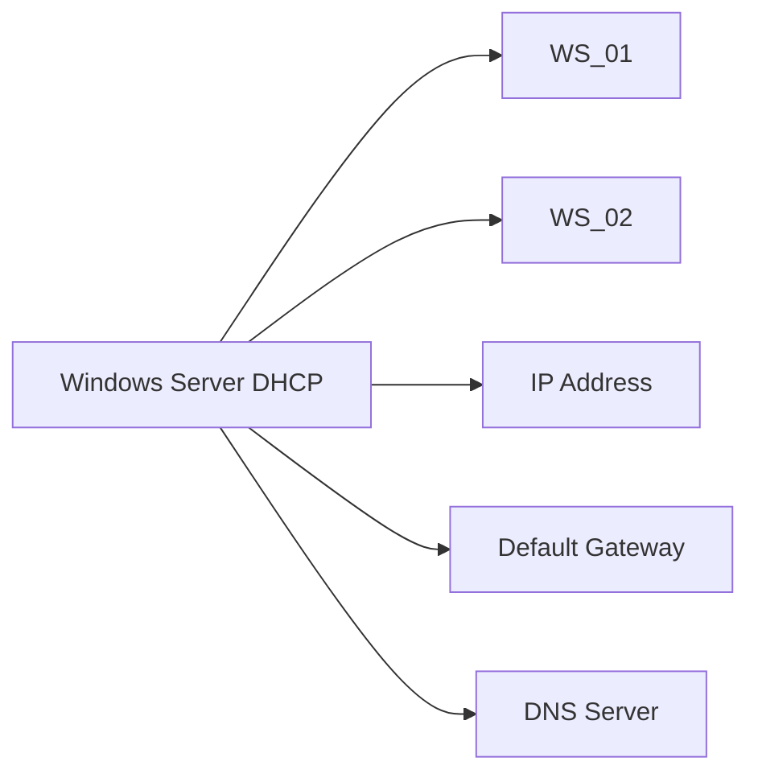
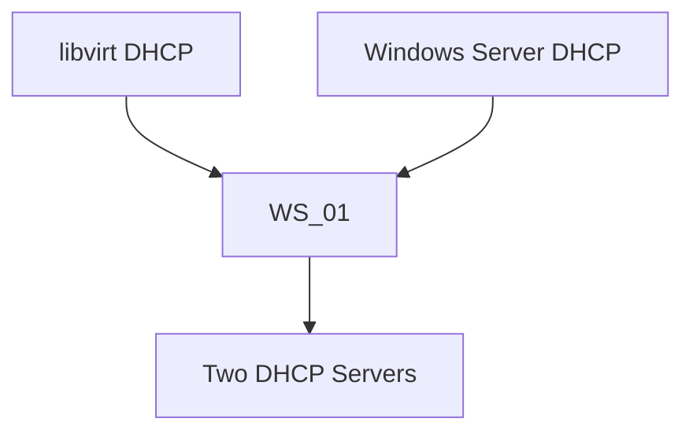
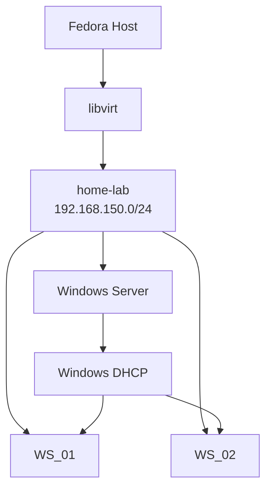
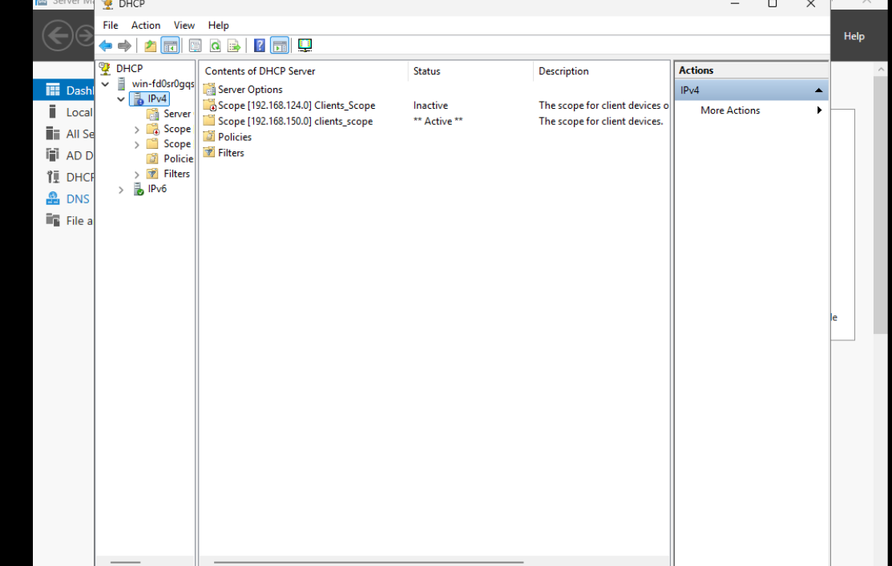
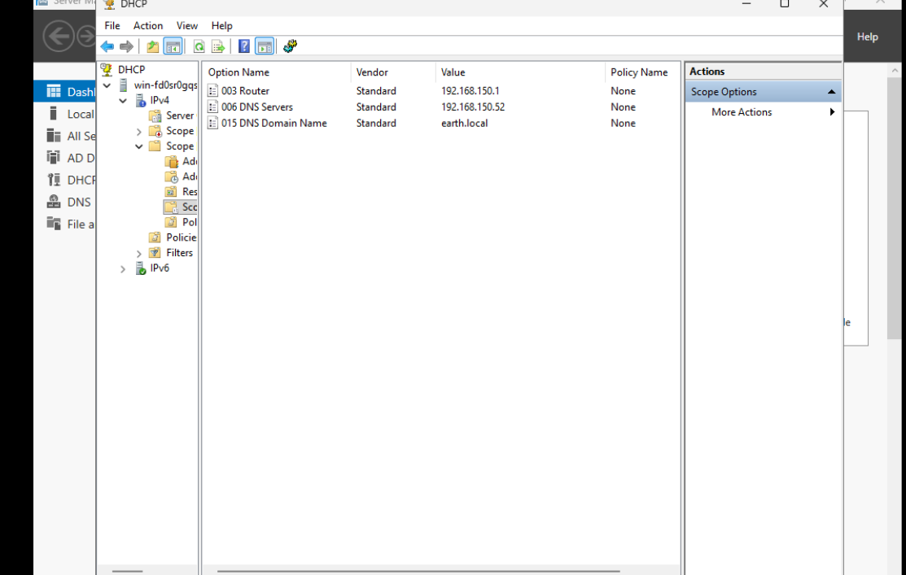
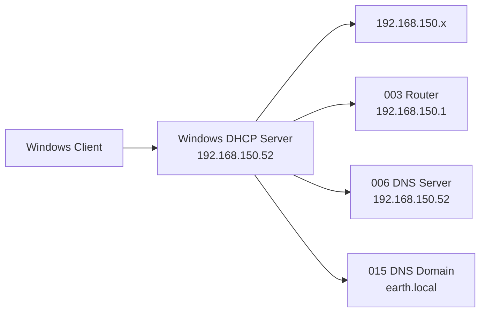
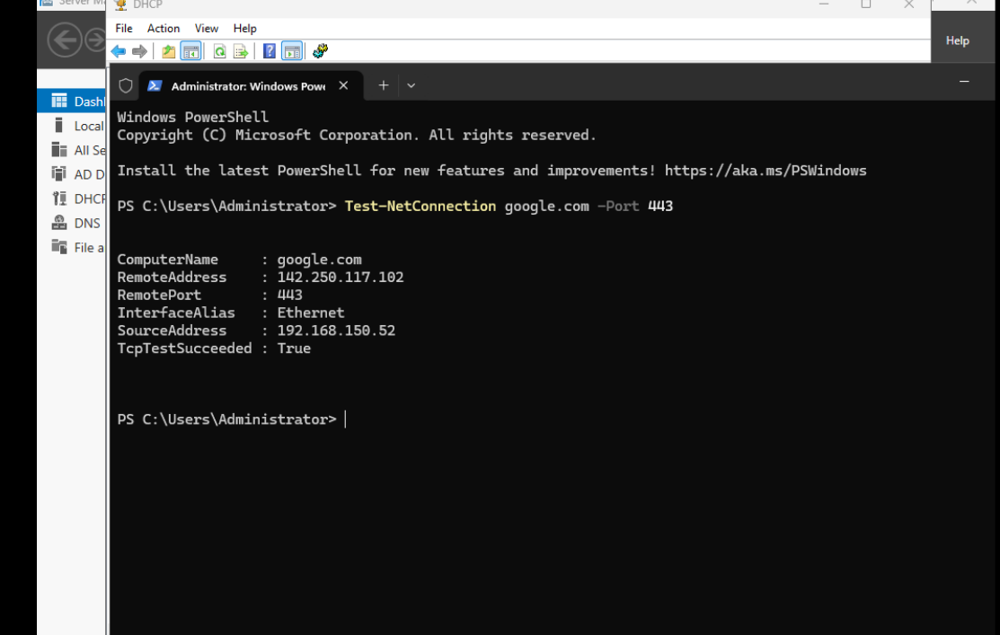
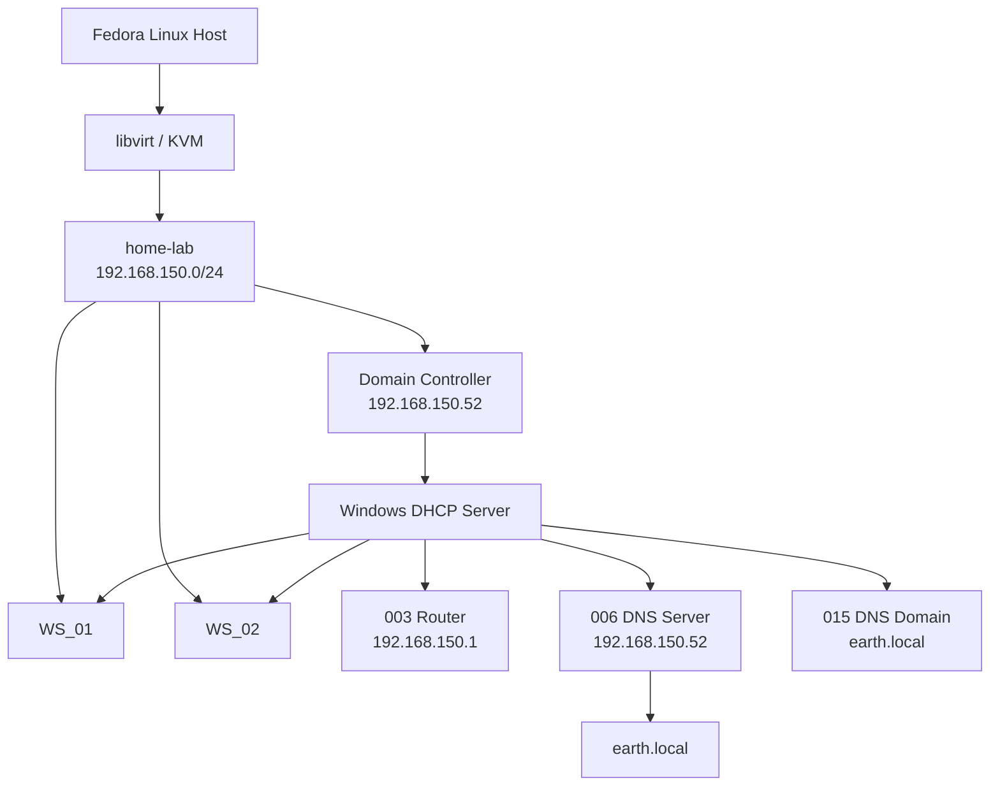
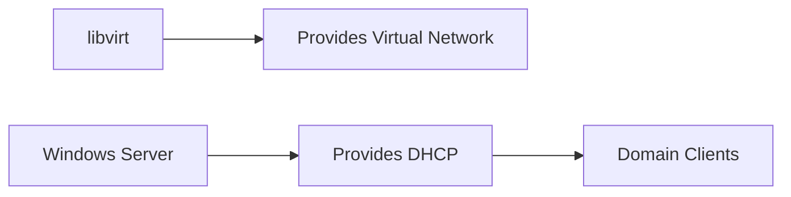

# DHCP Server

DHCP was configured on the Windows Server to automatically provide network configuration to the Windows client machines in the lab.

The final design uses Windows Server as the authoritative DHCP server for the dedicated `home-lab` virtual network.

---

## Role in the Lab

Rather than manually configuring each workstation, DHCP provides clients with the network information required to communicate with the rest of the lab and locate Active Directory services.

The intended DHCP flow is:



---

# Initial DHCP Configuration

## Step 1: Install the DHCP Server Role

From **Server Manager**, I opened:

```text
Add Roles and Features
```

and selected:

```text
DHCP Server
```

I then proceeded through the installation wizard.

---

## Step 2: Complete DHCP Post-Deployment Configuration

After the role was installed, Server Manager displayed a notification indicating that DHCP post-deployment configuration still needed to be completed.

I opened the notification and completed the DHCP configuration wizard.

This also created the standard DHCP administrative groups.

---

## Step 3: Open DHCP Manager

After restarting the server, I opened the DHCP management console.

```text
Windows + R
```

Then:

```text
dhcpmgmt.msc
```

This opened DHCP Manager, where I could configure the address scope for the Windows clients.

---

# Create the Initial DHCP Scope

I created an initial DHCP scope containing approximately:

```text
100 IP addresses
```

The exact original address range is not recorded in my notes.

This scope was later replaced when I moved the lab onto the dedicated `home-lab` network.

Once the initial scope was configured, I activated it.

---

# DHCP Conflict with libvirt

The initial DHCP setup appeared to be working until I created the first Windows 11 workstation.

After creating `WS_01` with virt-manager, I noticed that the workstation had received an IP address that was outside the DHCP scope configured on the Windows Server.

This suggested that another DHCP server was responding to the client.

---

## Investigating the Unexpected IP Address

On the Fedora host, I inspected the libvirt default network:

```bash
sudo virsh net-dumpxml default
```

The default libvirt virtual network had its own DHCP service.

This meant that both libvirt and Windows Server were capable of responding to DHCP requests from the client.

The situation was effectively:



The client could therefore receive its network configuration from libvirt rather than the Windows Server DHCP service.

---

# Creating a Dedicated Home Lab Network

Rather than allowing two DHCP services to operate on the same virtual network, I created a separate libvirt network specifically for the Active Directory lab.

The goal was to separate responsibilities:

> **libvirt provides the virtual network. Windows Server provides DHCP.**

The dedicated network became:

```text
Network: home-lab
Bridge: virbr-homelab
Subnet: 192.168.150.0/24
Gateway: 192.168.150.1
```

---

## Step 1: Create the Network XML

On the Fedora host:

```bash
sudo nano ~/home-lab-net.xml
```

I defined the new virtual network inside this file.

Importantly, I did **not** include a `<dhcp>` block.

This meant libvirt would create the virtual network and bridge without operating its own DHCP service on that network.

The intended design became:



---

## Step 2: Define the Network

I registered the new network with libvirt:

```bash
sudo virsh net-define ~/home-lab-net.xml
```

---

## Step 3: Start the Network

I attempted to start the network with:

```bash
sudo virsh net-start home-lab
```

My first chosen subnet used:

```text
192.168.124.x
```

but this conflicted with the subnet already being used by the existing libvirt network.

I therefore removed the conflicting configuration and changed the new network to:

```text
192.168.150.0/24
```

After changing to the non-overlapping subnet, I defined and started the network again.

---

## Step 4: Enable Network Autostart

I configured the `home-lab` network to start automatically with the Fedora host:

```bash
sudo virsh net-autostart home-lab
```

---

## Step 5: Verify the Network

I checked the available libvirt networks:

```bash
sudo virsh net-list --all
```

I then inspected the new network configuration:

```bash
sudo virsh net-dumpxml home-lab
```

This allowed me to confirm that the `home-lab` network existed and that its configuration matched what I had defined.

---

# Move the Virtual Machines

I shut down the Windows virtual machines and changed their virtual network adapters to use:

```text
home-lab
```

rather than the original libvirt network.

Because the virtual machines were now connected to a different subnet, the Windows Server network and DHCP configuration also needed to be updated.

---

# Reconfigure the Domain Controller

The Domain Controller was configured with a static address on the new subnet.

The final relevant network values were:

| Setting | Value |
|---|---|
| Network | `home-lab` |
| Subnet | `192.168.150.0/24` |
| Gateway | `192.168.150.1` |
| DNS Server / DC | `192.168.150.52` |
| DNS Domain | `earth.local` |

The Domain Controller remained statically addressed so that infrastructure services such as DNS and DHCP were available at a predictable address.

---

# Rebuild the DHCP Scope

Because the lab had moved to the `192.168.150.0/24` subnet, the original DHCP scope was no longer appropriate.

I therefore:

1. Inactivated the original `.124` scope.
2. Created a replacement scope for the `192.168.150.0/24` network.
3. Configured the scope for the new network.
4. Activated the replacement `.150` scope.



The original `.124` scope was retained but inactive, while the replacement `.150` scope became the active DHCP scope for the home lab.

---

## Configure the Final DHCP Scope Options

The active `.150` scope was configured with the network information required by the Windows clients.

The configured scope options included:

- **003 Router** — provides the default gateway.
- **006 DNS Servers** — directs clients to the Domain Controller for DNS resolution.
- **015 DNS Domain Name** — provides the `earth.local` DNS domain name.



These options allow DHCP clients to receive the appropriate gateway while using the Domain Controller for DNS resolution within the `earth.local` environment.

The resulting DHCP flow was:



The precise start and end addresses of the replacement DHCP pool are not recorded in my notes, so they are not included here.

---

# Verify the Client Configuration

After moving the client onto the new network, I restarted it and checked its network configuration using:

```powershell
ipconfig /all
```

This allowed me to verify that the workstation had received the expected network configuration from the Windows Server DHCP service.

The important distinction was that the client should now receive its DHCP configuration from **Windows Server rather than libvirt**.

---

# Verify External Connectivity

I also tested connectivity from the Windows client using PowerShell:

```powershell
Test-NetConnection google.com -Port 443
```



This provided an additional check that the client could resolve an external hostname and communicate beyond the internal lab network.
---

## Checklist to Run Through Whenever Creating a New Network/Subnet:

After troubleshooting the networking issues in the lab, I created the following checklist to use whenever creating a new network or subnet.

### 1. Define and Start the Network

Define and start the network, then confirm that there is no subnet overlap with existing networks.

```bash
virsh net-list --all
```

Check that the new subnet does not collide with any existing networks.

### 2. Check the firewalld Zone Assignment

Check which `firewalld` zone the new network bridge has been assigned to:

```bash
sudo firewall-cmd --get-active-zones
```

Confirm that the new bridge is in the expected zone, commonly `libvirt`.

### 3. Confirm Masquerading Is Enabled

Enable masquerading explicitly rather than assuming it is enabled by default for custom networks.

First, check the current configuration:

```bash
sudo firewall-cmd --zone=<zone> --query-masquerade
```

If required, enable masquerading permanently and reload the firewall configuration:

```bash
sudo firewall-cmd --zone=<zone> --add-masquerade --permanent
sudo firewall-cmd --reload
```

### 4. Move the VMs to the New Network

Move or attach the VMs to the new network.

Update any static IP addresses and the DHCP scope so that they match the new subnet.

### 5. Test Connectivity in Layers

Test connectivity progressively rather than skipping directly to web browsing.

**Test the gateway:**

```powershell
ping <gateway>
```

This confirms the basic link and NAT path.

**Test raw internet connectivity:**

```powershell
ping 8.8.8.8
```

This confirms internet routing without relying on DNS.

**Test external DNS resolution:**

```powershell
nslookup google.com
```

This confirms that external DNS resolution is working.

**Test the TCP/HTTPS path:**

```powershell
Test-NetConnection google.com -Port 443
```

Check `TcpTestSucceeded`, rather than relying only on `PingSucceeded`.

Finally, open a web browser as a real-world connectivity test.

### 6. Troubleshoot DNS Resolution Separately

If internal DNS names resolve but external names do not, check the forwarders configured on the DNS server.

Using the GUI:

`dnsmgmt.msc` → **Properties** → **Forwarders**

Or using PowerShell:

```powershell
Get-DnsServerForwarder
```

### 7. Document the Working Configuration

Once connectivity is confirmed, document the working configuration immediately.

Record:

- Subnet
- Gateway
- DNS forwarders

This provides a known-good baseline that can be referenced when creating future networks instead of rediscovering the same configuration and troubleshooting steps.

---

# Final DHCP Architecture



The final design gave each component a clear responsibility:

```text
libvirt
    Virtual networking

Windows Server DHCP
    Client IP configuration

Windows Server DNS
    Active Directory name resolution

Fedora / libvirt
    Connectivity outside the virtual network
```

---

# Key Learning

The most important lesson from this part of the build was that a network should have a clear authoritative DHCP service.

When the first Windows client received an unexpected IP address, the problem was not simply the Windows Server DHCP configuration.

Two services were capable of providing DHCP configuration:

```text
libvirt DHCP
        +
Windows Server DHCP
```

Inspecting the libvirt network with:

```bash
sudo virsh net-dumpxml default
```

helped identify the competing DHCP service.

Creating a dedicated libvirt network without its own DHCP configuration separated the responsibilities cleanly:



The final architecture therefore allowed libvirt to provide the underlying virtual network while Windows Server controlled the DHCP and DNS configuration used by the Active Directory clients.

This also reinforced an important troubleshooting principle:

> If a DHCP client receives a valid-looking address that does not match the expected scope, verify which DHCP server actually issued the lease before changing the DHCP configuration.
