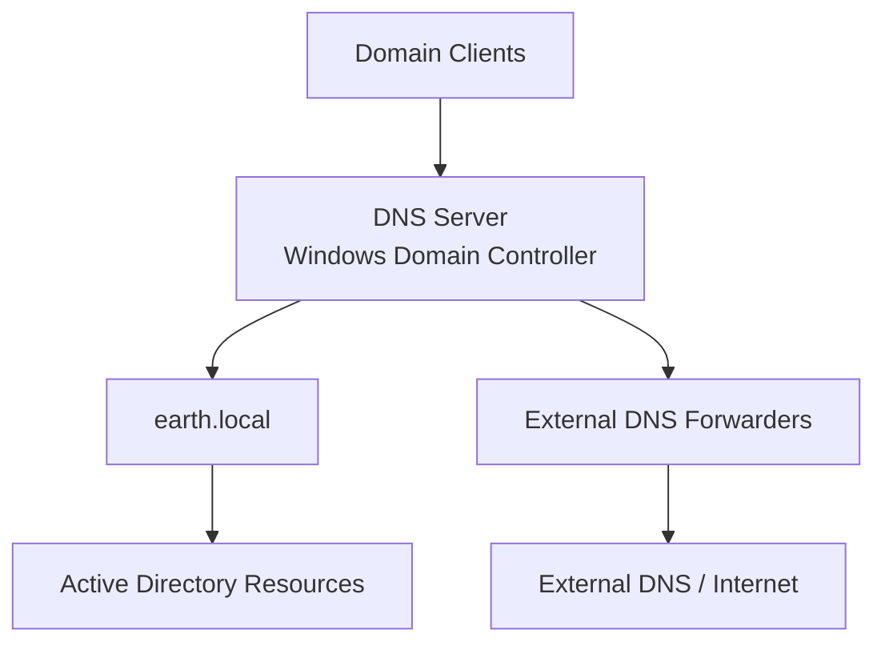
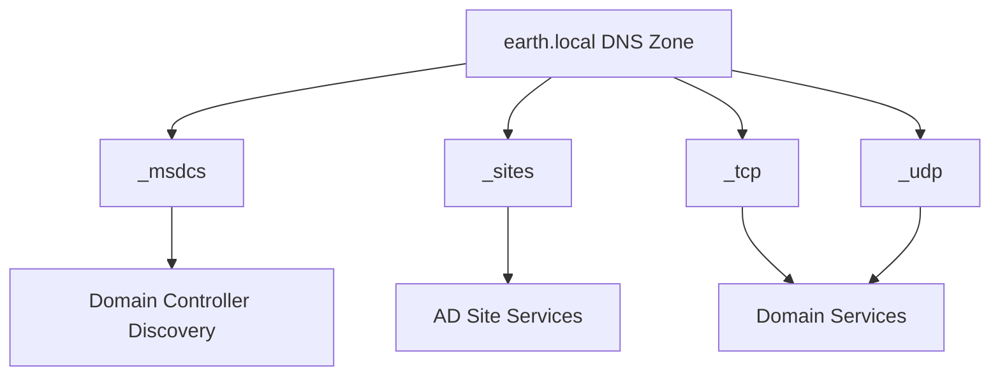
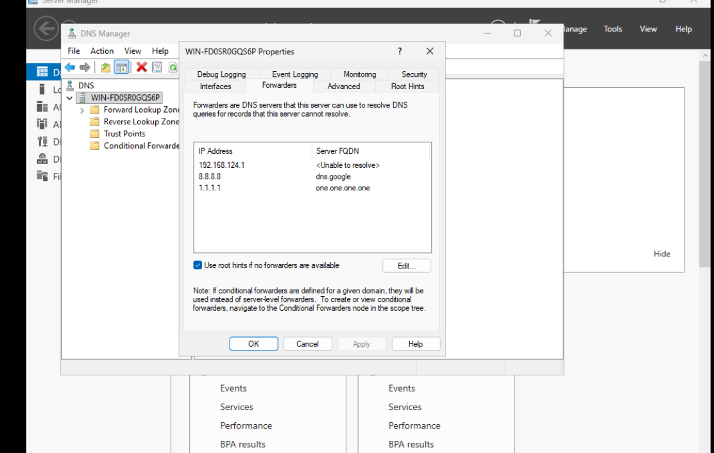
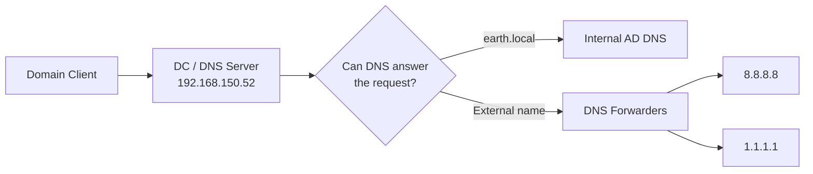
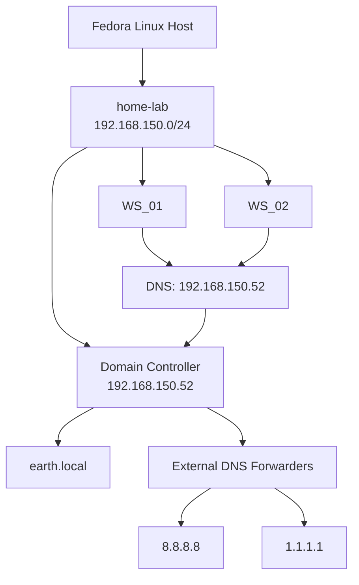

# DNS Server

DNS is a critical component of the Active Directory environment.

When the Windows Server was promoted to a Domain Controller for `earth.local`, the DNS Server role was installed automatically as part of the promotion process.

The DNS server would provide name resolution for the internal Active Directory domain and later act as the DNS server used by the Windows clients.

---

## Role in the Lab

The basic DNS architecture is:



For internal domain resources, the Domain Controller answers queries for:

```text
earth.local
```

Queries that the DNS server cannot answer locally can later be forwarded to external DNS servers.

---

## DNS Installation

I did not install the DNS Server role separately.

During the Active Directory Domain Services promotion wizard, the DNS Server role was selected automatically and installed as part of the Domain Controller promotion.

On the **DNS Options** page, I left `Create DNS delegation` unchecked.

There was no parent DNS zone above `earth.local` from which a delegation needed to be created.

---

## Step 1: Open DNS Manager

After the Domain Controller had restarted, I verified that the DNS role had been configured correctly.

Open DNS Manager with:

```text
Windows + R
```

Then run:

```text
dnsmgmt.msc
```

This opens the DNS management console.

---

## Step 2: Verify the Forward Lookup Zone

In DNS Manager, I checked that a Forward Lookup Zone existed for:

```text
earth.local
```

A forward lookup zone allows DNS to translate names such as:

```text
server.earth.local
```

into IP addresses.

The presence of the `earth.local` zone confirmed that DNS had been integrated with the new Active Directory domain.

---

## Step 3: Verify the Domain Record

Within the DNS zone, I verified that an **A record** existed for the domain.

An A record maps a DNS hostname to an IPv4 address.

This confirmed that the DNS server contained a record that could be used to resolve the domain.

---

## Step 4: Verify Active Directory DNS Records

I also checked that the Active Directory-specific DNS folders had been created.

These included:

```text
_msdcs
_sites
_tcp
_udp
```

These records are important because Active Directory clients use DNS to locate domain services such as Domain Controllers and Kerberos services.



Their presence provided another indication that the DNS configuration created during Domain Controller promotion had completed successfully.

---

## Step 5: Test DNS Resolution

I performed a basic DNS lookup for the new domain:

```powershell
nslookup earth.local
```

This was used to confirm that the domain name could be resolved through DNS.

At this stage, internal DNS resolution for `earth.local` was working.

---

## Initial DNS Result

The initial DNS checks confirmed that:

- The DNS Server role had been installed.
- A Forward Lookup Zone existed for `earth.local`.
- The domain had an A record.
- Active Directory DNS folders were present.
- `earth.local` could be resolved using `nslookup`.

The internal Active Directory DNS service was therefore operational.

---

# Later DNS Configuration

The DNS configuration changed later in the project after I created a dedicated libvirt network for the home lab.

The new network used:

```text
Network: home-lab
Bridge: virbr-homelab
Subnet: 192.168.150.0/24
Gateway: 192.168.150.1
```

The Domain Controller's DNS server address became:

```text
192.168.150.52
```

After moving the virtual machines to the new network, I reconfigured the Domain Controller's static IP, gateway and DNS configuration.

The dedicated network, DHCP conflict and underlying connectivity troubleshooting are documented in [DHCP Server](dhcp.md#creating-a-dedicated-home-lab-network).

---

## Internal vs External DNS Resolution

Once the new network was in use, the Domain Controller could resolve internal Active Directory names, but external DNS resolution was not initially working.

This exposed an important difference between:

```text
Internal DNS
```

and:

```text
External DNS
```

The Domain Controller is authoritative for the internal:

```text
earth.local
```

namespace.

However, it does not automatically know the answer to queries such as:

```text
google.com
```

Those requests need to be forwarded to another DNS server.

---

## Configure DNS Forwarders

To allow the Domain Controller to resolve names outside the `earth.local` domain, I configured external DNS forwarders.

The configured forwarders were:

- `8.8.8.8` — Google DNS
- `1.1.1.1` — Cloudflare DNS



This allows the Domain Controller to answer internal `earth.local` queries itself while forwarding external DNS requests to upstream resolvers.

Forwarders can be reviewed through:

```text
DNS Manager
→ Server Properties
→ Forwarders
```

They can also be checked from PowerShell with:

```powershell
Get-DnsServerForwarder
```

The resulting DNS flow became:



---

## DNS Troubleshooting Lesson

The external name-resolution failure involved two separate layers.

The underlying network first required working routing and masquerading. That investigation is documented in [DHCP Server](dhcp.md#creating-a-dedicated-home-lab-network).

Once external network connectivity was available, the Domain Controller still required DNS forwarders before it could resolve names outside `earth.local`.

This demonstrated that successful network connectivity does not automatically provide successful DNS resolution. Each layer needed to be tested independently:


---

## DNS Validation Commands

Several commands became useful for checking DNS during later troubleshooting.

### Test an Internal DNS Name

```powershell
Resolve-DnsName WS_01
```

This can be used to confirm that a domain workstation resolves through the internal DNS server.

---

### Test External DNS Resolution

```powershell
nslookup google.com
```

This tests whether an external hostname can be resolved.

---

### Review DNS Forwarders

```powershell
Get-DnsServerForwarder
```

This displays the DNS servers used when the Domain Controller cannot resolve a query locally.

---

### Review Client DNS Configuration

```powershell
ipconfig /all
```

This is useful for confirming that a client is using the expected Domain Controller as its DNS server.

---

## Final DNS Configuration

After the dedicated lab network was established, the working DNS configuration was:

| Setting | Configuration |
|---|---|
| DNS Domain | `earth.local` |
| DNS Server | `192.168.150.52` |
| DNS Role | Windows Server / Domain Controller |
| External Forwarder | `8.8.8.8` |
| External Forwarder | `1.1.1.1` |

The resulting architecture was:



---

## Key Learning

This part of the lab demonstrated why Active Directory is heavily dependent on DNS.

Domain clients do not use DNS only for standard hostname lookups. They also use DNS records to locate Active Directory services and Domain Controllers.

The testing also demonstrated that internal and external DNS resolution are separate concerns. The Domain Controller could correctly provide DNS for `earth.local` while external names still failed until the underlying network path and DNS forwarders were configured.

This layered troubleshooting approach was reused throughout later stages of the lab.
