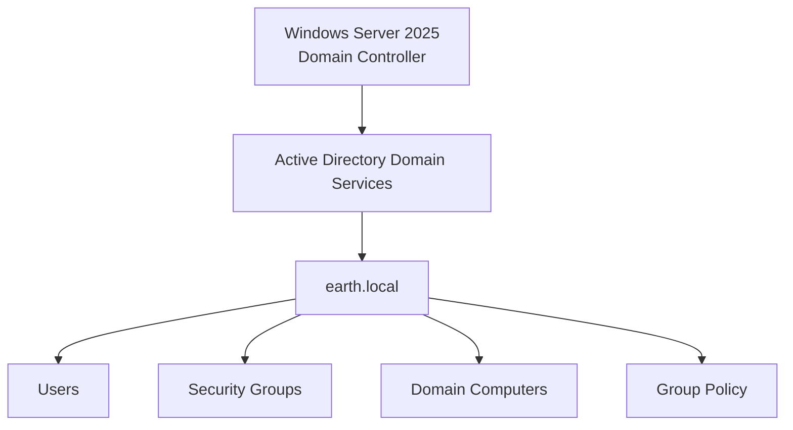
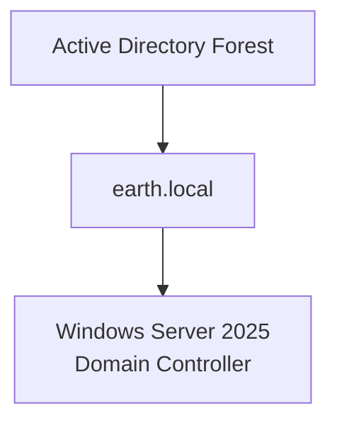
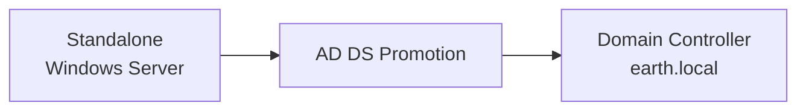
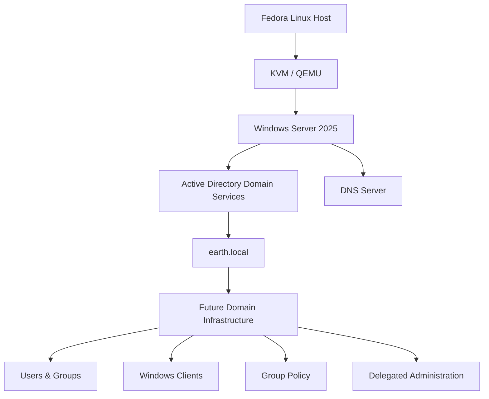

# Domain Controller Configuration

With the Windows Server 2025 VM installed, the next stage was to configure it as the first Domain Controller for the home lab.

The new Active Directory forest and domain would be:

```text
earth.local
```

The Domain Controller would become the central authentication and management system for the Windows environment.

---

## Role in the Lab

The Windows Server would provide the foundation for the Windows infrastructure:



Later stages of the lab would add DNS, DHCP, organisational units, Windows clients, Group Policy and delegated administration around this domain.

---

## Step 1: Configure the Preferred DNS Server

Before promoting the server to a Domain Controller, I configured the network adapter's preferred DNS server.

Open the Windows network adapters:

```text
Windows + R
```

Then run:

```text
ncpa.cpl
```

From the Network Connections window:

1. Right-click the network adapter.
2. Select **Properties**.
3. Open **Internet Protocol Version 4 (TCP/IPv4)**.
4. Configure the preferred DNS server.

At this stage of the build, I used the gateway IP address as the preferred DNS server.

!!! note
    This reflects the configuration at this point in my original lab build. The network configuration was changed later when I created a dedicated libvirt network for the Active Directory environment.

---

## Step 2: Install Active Directory Domain Services

I used **Server Manager** to install Active Directory Domain Services.

From the Server Manager dashboard:

```text
Add Roles and Features
```

I selected:

```text
Active Directory Domain Services
```

The required dependencies were automatically selected by the wizard.

I then completed the installation.

---

## Step 3: Promote the Server to a Domain Controller

After the AD DS role installation completed, Server Manager displayed a notification flag indicating that additional configuration was required.

From this notification I selected the option to:

```text
Promote this server to a domain controller
```

Because this was the first Domain Controller in the lab, I created a new forest.

The root domain name was:

```text
earth.local
```

The resulting structure was:



---

## Step 4: Configure the New Forest

During the promotion wizard, I configured the settings required for the new Active Directory forest.

### Domain Name

The domain was configured as:

```text
earth.local
```

This domain was created specifically for the isolated home-lab environment.

---

### Directory Services Restore Mode

I configured a **Directory Services Restore Mode (DSRM)** password.

DSRM provides a recovery mode for Active Directory and can be used when maintenance or recovery of the directory database is required.

The password itself is not included in the documentation.

---

## Step 5: DNS Options

During Domain Controller promotion, the DNS Server role was included automatically.

On the **DNS Options** page, I left the `Create DNS delegation` option unchecked.

There was no parent DNS zone for `earth.local` from which a delegation needed to be created.

DNS itself was installed as part of the Domain Controller promotion.

!!! info
    DNS configuration and verification are covered separately in the **DNS Server** section of the documentation.

---

## Step 6: Confirm the NetBIOS Name

During the promotion wizard, I confirmed that the automatically generated NetBIOS name matched the new domain.

The domain was:

```text
earth.local
```

and the NetBIOS domain name was:

```text
EARTH
```

This would later appear when authenticating with domain accounts.

For example:

```text
EARTH\Administrator
```

---

## Step 7: Active Directory Database Paths

The wizard provided configuration options for the Active Directory database, log files and SYSVOL.

I retained the default locations.

The two important components are:

### NTDS

The **NTDS** database stores Active Directory information such as:

- Users
- Computers
- Groups
- Directory objects

---

### SYSVOL

**SYSVOL** stores files that need to be available to domain members, including:

- Group Policy files
- Logon scripts
- Other domain-wide configuration files

For this lab, the default paths were sufficient.

---

## Step 8: Complete the Promotion

After reviewing the configuration, I started the installation.

Once the promotion completed, Windows Server required a restart.

After rebooting, the login screen reflected the new Active Directory domain:

```text
EARTH\Administrator
```

This confirmed that the server was now operating as a Domain Controller for:

```text
earth.local
```

The core Windows infrastructure had now changed from:



---

## Step 9: Take a Domain Controller Snapshot

Before making further changes to Active Directory, I created a snapshot of the Domain Controller VM from the Fedora host.

The command used was:

```bash
virsh snapshot-create-as <vm_name> <snapshot_name> --disk-only
```

The VM disk images were stored under:

```text
/var/lib/libvirt/images
```

This provided a recovery point before continuing with the remainder of the Active Directory configuration.

!!! tip
    Taking a snapshot at major milestones makes it much easier to recover a home lab after configuration mistakes or experiments.

---

## Result

At the end of this stage:

- Windows Server 2025 was running as a Domain Controller.
- Active Directory Domain Services was installed.
- A new forest had been created.
- The domain was `earth.local`.
- The NetBIOS domain name was `EARTH`.
- DNS had been installed as part of Domain Controller promotion.
- A DSRM password had been configured.
- The server successfully restarted into the new domain.
- A VM snapshot was taken before further configuration.



The next stage was to verify and configure the [DNS Server](dns.md) role.
