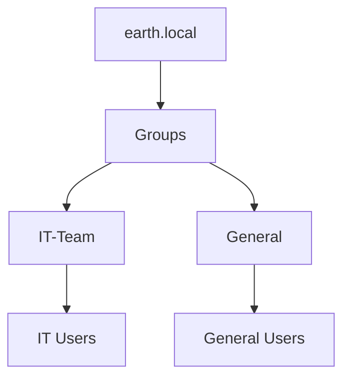
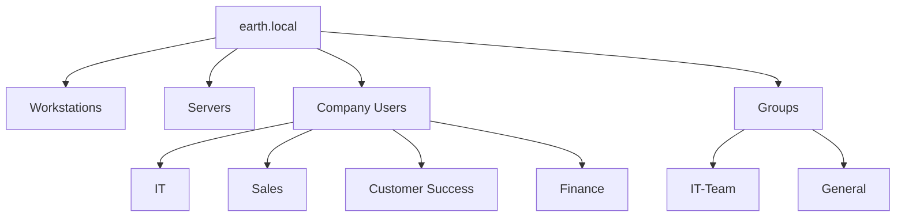

# Organizational Units, Users & Security Groups

With the Windows clients connected to the `earth.local` domain, I began organising Active Directory into a simple structure for users, computers, servers, and security groups.

!!! note
    This was the initial Active Directory structure used in the lab. The OU structure and security groups were redesigned later as the environment became more complex.

---

## Initial OU Structure

I wanted to start with a simple Organizational Unit (OU) structure that would separate client computers, servers, company users, and security groups.

The initial structure was:

```text
earth.local
├── Workstations
├── Servers
├── Company Users
│   ├── IT
│   ├── Sales
│   ├── Customer Success
│   └── Finance
└── Groups
```

The **Workstations** OU had already been created while adding the Windows clients to the domain, so this stage expanded the structure around it.

The purpose of the initial structure was straightforward:

- **Workstations** — domain-joined client computers.
- **Servers** — intended for future server objects.
- **Company Users** — parent OU for user accounts organised by department.
- **Groups** — security groups used to organise users and later control access and policy targeting.

This gave the lab a basic organisational structure without making the design unnecessarily complex at this stage.

---

## Creating the Organizational Units

I used **Active Directory Users and Computers (ADUC)** to create the OU structure.

To open ADUC:

```powershell
dsa.msc
```

I then created the required OUs by:

1. Right-clicking `earth.local`.
2. Selecting **New → Organizational Unit**.
3. Entering the required OU name.
4. Clicking **OK**.

For the departmental OUs, I instead right-clicked **Company Users** and followed the same process so that they were nested beneath the parent OU.

At this stage, I left **Protect container from accidental deletion** unchecked because I expected the lab structure to change while I experimented with Active Directory.

!!! note
    In a production environment, protecting important OUs from accidental deletion would normally be preferable. In this lab, leaving the option disabled made it easier to modify or remove OUs while the design was still evolving.

---

## Creating Test Users

Once the OU structure was in place, I created several user accounts that could later be used to test Group Policy and other Active Directory functionality.

!!! note
	Initially, I created the accounts through the ADUC GUI. Later in the lab I shifted to primarily using PowerShell for Active Directory administration.

To create a user through ADUC:

1. Right-click the appropriate departmental OU.
2. Select **New → User**.
3. Enter the user's name and logon name.
4. Configure the password.
5. Complete the user creation wizard.


For this lab, I kept the user logon naming convention simple.

I also disabled **User must change password at next logon** for these initial accounts. This reduced unnecessary interruptions while repeatedly logging into test accounts during the lab.

!!! note
    These choices were made for convenience within an isolated lab environment rather than as a recommended production account policy.

---

## Creating Security Groups

After creating the users, I created security groups under the **Groups** OU.

The initial groups were:

- `IT-Team`
- `General`

To create each security group:

1. Right-click the **Groups** OU.
2. Select **New → Group**.
3. Enter the group name.
4. Set **Group scope** to **Global**.
5. Set **Group type** to **Security**.
6. Click **OK**.


I used **Global Security Groups** so that users within the domain could be grouped according to their role.

At this stage, the grouping model was intentionally simple:



This provided a basic way of separating IT users from the wider set of company users.

---

## Adding Users to Security Groups

With the security groups created, I added the appropriate users to each group.

From ADUC:

1. Double-click the required security group.
2. Open the **Members** tab.
3. Click **Add**.
4. Enter the user's name.
5. Select **Check Names**.
6. Add the resolved account to the group.

The `IT-Team` group contained the users representing the IT department.


The `General` group contained the users representing the wider company departments.


This gave me two groups that could later be used when testing policies and applying different configurations to different sets of users.

---

## Initial Active Directory Structure

At this point, the lab had a basic Active Directory organisational model:



This was deliberately a **simple first version** of the directory structure.

As the lab progressed and I began working with more granular administrative roles and delegated permissions, both the OU structure and security-group design were revisited and expanded.

---

## What I Learned

This stage introduced the relationship between three important Active Directory concepts:

- **Organizational Units** provide a logical structure for organising Active Directory objects.
- **User accounts** represent the identities that interact with the domain.
- **Security groups** allow multiple users to be treated as a group when assigning access or targeting configurations.

The most useful part of this stage was establishing a simple working structure first rather than trying to design the final Active Directory hierarchy immediately.

As the requirements of the lab became more advanced, this initial design gave me a baseline that I could later evaluate and improve.
