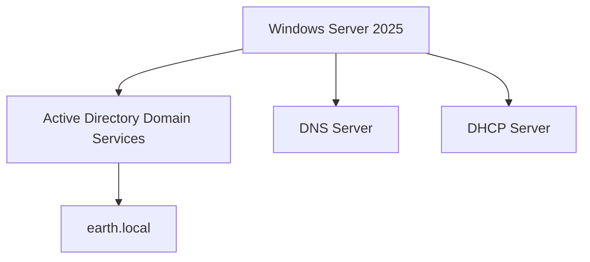

# Windows Server Installation

The first Windows system built for the lab was a Windows Server 2025 virtual machine.

This server would later become the Domain Controller for the `earth.local` Active Directory environment and provide core infrastructure services including DNS and DHCP.

---

## Purpose of the Server

The Windows Server VM was created to provide the central infrastructure services for the Windows portion of the home lab.

Its planned responsibilities included:

- Active Directory Domain Services
- Domain Controller
- DNS
- DHCP
- Group Policy management
- Centralised user and computer administration

At this stage, however, the goal was simply to install the base operating system and prepare the VM for later configuration.

---

## VM Creation

I created the Windows Server VM using the graphical `virt-manager` interface on the Fedora host.


The Windows Server installation media was attached to the VM and the operating system was installed through the normal Windows setup process.

---

## Windows Server Edition

The server was initially installed using a Windows Server 2025 evaluation installation.

The edition was later changed to Windows Server Standard using DISM:

```powershell
DISM /online /Set-Edition:ServerStandard /ProductKey:XXXXX-XXXXX-XXXXX-XXXXX-XXXXX /AcceptEula
```

The product key is intentionally omitted from the documentation.

---

## Initial Configuration

After installation, I performed the initial operating-system configuration.

The system time and regional format were configured for:

```text
UTC 00:00
```

At this point the base Windows Server VM was operational and ready to be configured for its infrastructure role.

---

## Planned Server Role

The next stage of the lab was to convert the standalone Windows Server into the primary Domain Controller for the environment.

The planned architecture was:



The installation and configuration of Active Directory Domain Services is documented separately in the [Domain Setup](domain_setup.md) section.
