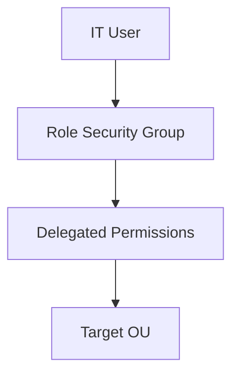
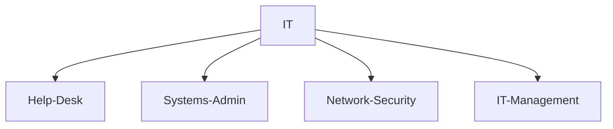
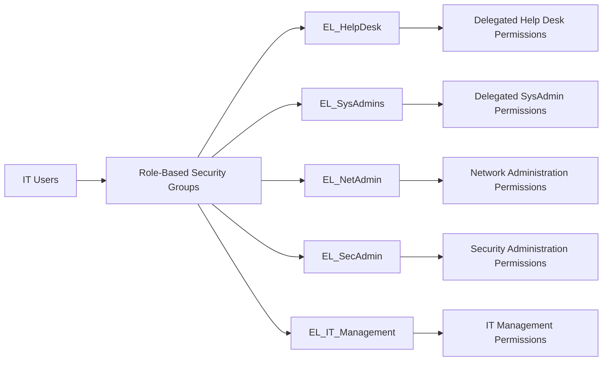
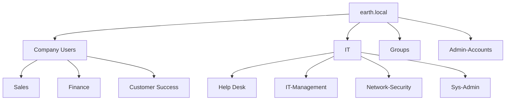
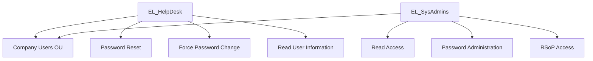
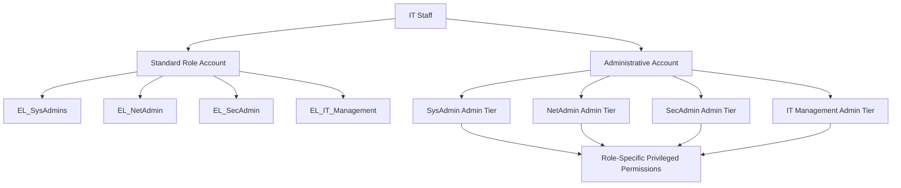
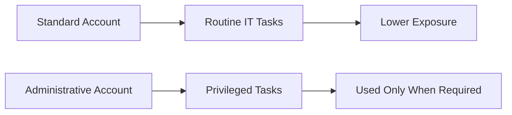
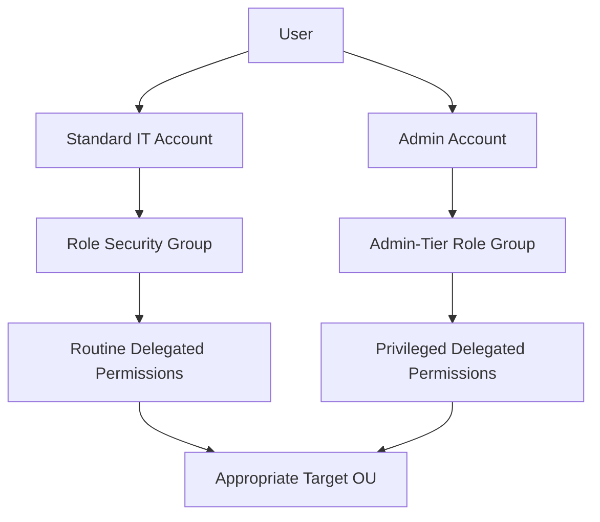

# Active Directory Delegation & RBAC

After establishing the main Active Directory OU and security group structure, I wanted to move beyond simply organising users and begin controlling **what different IT roles were actually allowed to do**.

The goal was to implement a more realistic administrative model based around:

- **Principle of Least Privilege**
- **Role-Based Access Control (RBAC)**
- Separate standard and administrative accounts
- Delegated permissions rather than giving every IT user broad administrative access

This section documents how that design evolved as I tested the permissions and identified weaknesses in the original structure.

---

## Initial Delegation Goal

The next stage of the lab was to use **Delegation of Control** so that selected IT users could perform only the tasks required for their role.

Rather than making every IT user a Domain Administrator, permissions would be assigned through security groups and delegated against specific OUs.

The initial model was therefore:



This would allow administrative rights to be granted according to job function rather than directly to individual user accounts.

## Updating the IT OU Structure

Before configuring delegation, I decided that the existing IT structure needed to be expanded.

Originally, IT users were contained within a single IT OU and the original security groups were broad.

The updated IT structure introduced separate OUs for each technical function:



This gave each technical role its own organisational boundary and provided a clearer foundation for security groups and delegated administration.

## Creating Administrative Accounts

I also introduced separate administrative accounts for selected IT staff.

Not every member of the IT team required an administrative account. Some users would instead perform their responsibilities through explicitly delegated permissions.

Administrative accounts were created for:

* Aiden Pearce — IT Manager
* Rache Bartmoss — Network Security
* Kate Libby — Systems Administrator
* David Lightman — Systems Administrator

No Help Desk users were given separate administrative accounts.


Administrative accounts followed the format:
xxxx.admin@earth.local

The intention was to separate normal day-to-day user activity from privileged administrative work.

!!! note "Why separate accounts?"
A standard account can be used for normal workstation activity, while the administrative account is reserved for tasks that genuinely require elevated privileges.
This reduces the amount of time privileged credentials are exposed during normal use.

## Role-Based Security Groups

I then created security groups for the different IT roles.

The naming convention used was:

EL_GroupName

Where EL represents the earth.local domain.

The main groups were:

* EL_HelpDesk
* EL_SysAdmins
* EL_NetAdmin
* EL_SecAdmin
* EL_IT_Management

Before removing the original broad IT group, users were assigned to the new security groups according to their actual roles.

The intended model was:


!!! note "During the initial creation of these groups I accidentally used EE_ rather than EL_ for some names. The visible group names were corrected shortly afterwards. A later test revealed that some legacy `SAMAccountName` values still contained the original names; that troubleshooting is documented in the [delegated-permission testing section](permission-testing/helpdesk.md/#test-4-modify-privileged-group-membership)."

## Initial Help Desk Delegation

I began with the Help Desk role.

Using Active Directory Users and Computers:
Right-click OU
→ Delegate Control
→ Add
→ EL_HelpDesk
→ Select delegated tasks

The first permission assigned was the ability to:

Reset user passwords
Require the user to change their password at the next logon

I then decided that Help Desk users should also be able to read user information.

To practise using custom delegation, I repeated the Delegation of Control Wizard and selected:
Create a custom task to delegate
→ Only the following objects in the folder
→ User objects
→ Read all properties

The resulting permissions could be reviewed through:
OU Properties
→ Security
→ Advanced


This provided a way to verify the access control entries created by the Delegation of Control Wizard.

## Initial SysAdmin Delegation

For the SysAdmin group, I initially took a broader approach using custom delegated permissions.

The first design included:

Read all properties
Write all properties
Create selected objects
Delete selected objects
Reset passwords
Change passwords
Read account restrictions
Write account restrictions

At this stage, the intention was for SysAdmins to perform significantly more Active Directory administration than the Help Desk team.

However, testing this design exposed an important problem.

## Discovering a Delegation Scope Problem

When I later attempted to test the SysAdmin permissions using Kate Libby's SysAdmin account, I discovered that she could not create the intended user objects.

Reviewing the advanced permissions showed that the required create/delete permissions were not present in the way I expected.

More importantly, this exposed a larger design issue.

I had delegated SysAdmin permissions against the Sys-Admin OU, and Help Desk permissions against the Help Desk OU.

That did not match the actual administrative requirements.

The intended access was:

SysAdmins should be able to administer users across the company.
Help Desk should be able to perform selected support tasks for non-IT users.

The problem was therefore not simply a missing checkbox in the Delegation Wizard.

The scope of delegation itself was wrong.

!!! warning "Design issue discovered"
Delegated permissions apply according to where they are assigned in the Active Directory hierarchy.

Giving `EL_SysAdmins` permissions on the `Sys-Admin` OU does not automatically give that group administrative rights over users located in Sales, Finance, Customer Success, or other OUs.

This required another change to the OU structure.

## Revising the OU Structure

At the time, the IT OU was located inside Company Users.

That made it difficult to delegate permissions over all non-IT users at the Company Users level without also affecting IT accounts.

I therefore moved the IT OU outside Company Users.

The revised user structure became:




This created a much cleaner administrative boundary.

Company Users now represented the non-IT workforce, while IT accounts existed separately.

Before moving the OU, I temporarily disabled Protect object from accidental deletion, moved the OU, and then enabled the protection again.

## Verifying GPO Impact After the OU Move

Because the OU hierarchy had changed, I wanted to ensure that the move had not unintentionally broken Group Policy application.

I checked GPO inheritance using PowerShell:

* `Get-GPInheritance -Target "OU=IT,DC=earth,DC=local"`
* `Get-GPInheritance -Target "OU=Sys-Admin,OU=IT,DC=earth,DC=local"`
* `Get-GPInheritance -Target "OU=Company Users,DC=earth,DC=local"`
* `Get-GPInheritance -Target "OU=Sales,OU=Company Users,DC=earth,DC=local"`


The checks showed that the expected GPOs were still linked to the correct OUs.

I then performed an additional user-level validation: `gpupdate /force`
After signing out and back in: `gpresult /r /scope:user`

The expected policies were still being applied.

I also logged in as a non-IT user and confirmed that the previously configured desktop restrictions were still present.

This provided a useful sanity check before continuing with the delegation changes.

## Re-Delegating Permissions at the Correct Scope

With the revised OU hierarchy in place, the delegation model could now be aligned with the actual access requirements.

Permissions for Help Desk and SysAdmin staff were delegated against: `OU=Company Users,DC=earth,DC=local`

This meant the delegated permissions applied to the non-IT workforce without automatically extending those rights over IT accounts.

The resulting model became:

The exact permissions would later be validated through dedicated testing.

## Reconsidering the SysAdmin Permission Model

During the redesign, I also reconsidered how much access the standard SysAdmin account should actually have.

My first approach had given the SysAdmin role permissions such as:

Create users
Delete users
Write all properties

However, I then considered the impact of a standard SysAdmin account being compromised.

If the account were phished or otherwise compromised, did it really need the ability to immediately:

Create users?
Delete users?
Modify all user properties?
Change group membership?
Manage GPO links?

The answer was no.

I therefore deliberately separated standard operational permissions from privileged administrative permissions.

The standard SysAdmin account was reduced to:

Read access
Reset password permissions
User and computer object support
RSoP Planning
RSoP Logging

Higher-risk administrative operations would instead require the user's separate administrative account.

## Separating Administrative Roles

At this point I identified another weakness in the design.

I originally had a single administrative security group covering the privileged IT accounts.

That still granted overly broad access.

A Network Administrator does not automatically require the same Active Directory permissions as a Systems Administrator, and a Security Administrator does not necessarily require the same permissions as either.

I therefore created separate admin-tier security groups aligned to each role.

Conceptually:


This avoided a blanket: `All admins → All administrative permissions` model. Instead, privileged rights could be assigned according to the administrator's actual role.

## Standard vs Administrative Accounts

The final design therefore distinguished between two levels of access.

Account Type	Intended Use	Example Permissions
Standard IT account	Everyday support and administration	Read access, password resets, RSoP, role-specific delegated tasks
Administrative account	Higher-risk privileged operations	Create/delete objects, write properties, change group membership, manage GPO links

The administrative account therefore becomes an elevation boundary rather than something used continuously.



## Final RBAC Design

The resulting Active Directory administration model was considerably different from my initial implementation.



## Lessons Learned

This part of the lab changed my understanding of Active Directory delegation considerably.

OU design affects security design

An OU structure is not only an organisational hierarchy.

Because Group Policy and delegated permissions are applied against OUs, the position of an object in the directory directly affects how easily permissions can be scoped.

My original structure worked visually, but did not properly support the administrative boundary I wanted.

## Delegation must be applied at the correct scope

A permission can be configured correctly but still fail to achieve the intended result if it is delegated against the wrong OU.

The key question is not only:

What should this group be allowed to do?

It is also:

Where should this group be allowed to do it?

## Standard and privileged administration should be separated

A Systems Administrator may need powerful permissions, but that does not mean their everyday account should have those permissions continuously.

Separating normal operational access from admin-tier access reduces the impact of a compromised standard account.

## Administrative access should still be role based

Creating separate admin accounts alone is not sufficient.

Giving every administrative account identical privileges simply creates another overly broad security group.

Admin-tier permissions should also align with job responsibilities.

## Test the security boundary, not just successful actions

The goal of delegated administration is not simply to prove that an authorised action works.

It is equally important to confirm that unauthorised actions fail.

The next stage of the lab therefore focused on validating the resulting RBAC model using both Help Desk and SysAdmin accounts.


## Current State

At this stage, the Active Directory delegation model has been re-scoped to match the final OU structure, and the security group memberships have been reviewed.

The environment now separates standard day-to-day accounts from elevated administrative accounts using separate security groups:

- Standard-tier groups use the `EL_` prefix.
- Administrative-tier groups use the `EL_Adm_` prefix.
- Standard user accounts are assigned only to standard-tier groups.
- Elevated `-adm` accounts are assigned separately to the corresponding administrative-tier groups.

For example, the SysAdmin role is separated between:

- `EL_SysAdmins` — standard day-to-day SysAdmin permissions.
- `EL_Adm_SysAdmins` — elevated administrative permissions used by the separate `-adm` account.

The delegation for `EL_Adm_SysAdmins` has now been configured across the relevant OUs. This includes permissions for user and computer object administration, group membership modification, RSoP operations, and GPO link management.

The next stage is to validate that these permissions behave as intended.

---

## Next: Delegated Permission Testing

Testing will be performed from the perspective of the delegated users rather than relying solely on the configured permissions shown in Active Directory.

The objective is to verify both sides of the RBAC model:

1. A role **can perform** the administrative tasks it has been delegated.
2. The same role is **denied access** to operations outside its delegated responsibilities.

Testing will begin with the narrowest role and progress toward accounts with broader privileges.

### Help Desk

The `EL_HelpDesk` role will be tested first.

Planned validation includes:

- Resetting user passwords.
- Unlocking user accounts.
- Viewing user information.
- Confirming restricted user attributes cannot be modified.
- Confirming users cannot be created or deleted.

This provides a relatively simple baseline before testing the more complex SysAdmin delegation.

### SysAdmin — Standard Tier

The standard `EL_SysAdmins` role represents the permissions available to a SysAdmin during normal day-to-day administration.

Testing will verify that the standard account can:

- Read user information.
- Reset passwords.
- Perform read-only RSoP operations.

It will also verify that the standard account cannot:

- Create or delete users.
- Modify unrestricted user properties.
- Modify group membership.
- Manage GPO links.
- Perform administrative actions reserved for the elevated tier.

### SysAdmin — Administrative Tier

The `EL_Adm_SysAdmins` role contains the broader administrative permissions and is used only through the corresponding `-adm` account.

Testing will cover:

- Creating and deleting user objects.
- Modifying user properties.
- Modifying group membership.
- Creating and deleting computer objects.
- Resetting computer account passwords.
- Managing GPO links.
- RSoP Planning and Logging.

A key part of this test will be performing the same privileged operation using both account tiers.

For example:

```text
Standard account → administrative operation should fail
Admin account    → same administrative operation should succeed
```

This succeed/deny comparison will provide practical evidence that the tiered administration model is functioning rather than simply being configured on paper.

---

## Remaining Role Validation

Once Help Desk and both SysAdmin tiers have been validated, testing will expand to the remaining roles.

These include:

- `EL_NetAdmin`
- `EL_SecAdmin`
- `EL_ITManagement`

Network Administration testing will include access to the DNS and DHCP management tools through the appropriate group memberships.

Security Administration and IT Management will initially focus on validating their intended read-only and reporting permissions while confirming that administrative write operations remain restricted.

The corresponding administrative-tier groups will be expanded and tested as those roles are developed further.

---

## Additional Validation

A small number of related items remain to be validated as the RBAC model develops.

These include:

- Confirming Password Settings Objects (PSOs) apply to the revised security groups.
- Testing network-share permissions for the delegated SysAdmin role.
- Verifying both share-level and NTFS permissions where access differs from the expected result.
- Confirming that account sign-in sessions are refreshed after security group membership changes.

The testing will also reinforce several important Active Directory concepts encountered while building the lab:

- **OU delegation and security group membership are separate configuration steps.**
- **`Write all properties` does not automatically grant permission to create or delete objects.**
- **Standard and elevated administrative permissions should remain separated between standard and `-adm` accounts.**
- **Successful delegation testing requires verifying both permitted and denied operations.**

!!! note "Lab status"
    The RBAC and delegation model is still being actively developed and tested. This page documents the configuration completed so far. Test results, access-denied validation, and any troubleshooting encountered will be added as each role is validated.
