## Testing Administrative SysAdmin Permissions

After testing the standard SysAdmin role, I moved on to the privileged Administrative SysAdmin role.

The purpose of this testing is to confirm that the Administrative SysAdmin accounts can perform the higher-risk operations intentionally denied to standard SysAdmins. This page will be expanded as I complete each test.

### User Objects

#### Step 1: Create a User Object

I first attempted to create a test user in the Company Users OU:
```Powershell
New-ADUser -Name "Test User" `
    -SamAccountName "tuse" `
    -Path "OU=Company Users,DC=earth,DC=local" `
    -Enabled $true `
    -AccountPassword (ConvertTo-SecureString "Password1!" -AsPlainText -Force)
```
The command returned no error.

I verified that the user had been created successfully:
```Powershell
Get-ADUser -Identity "tuse"
```
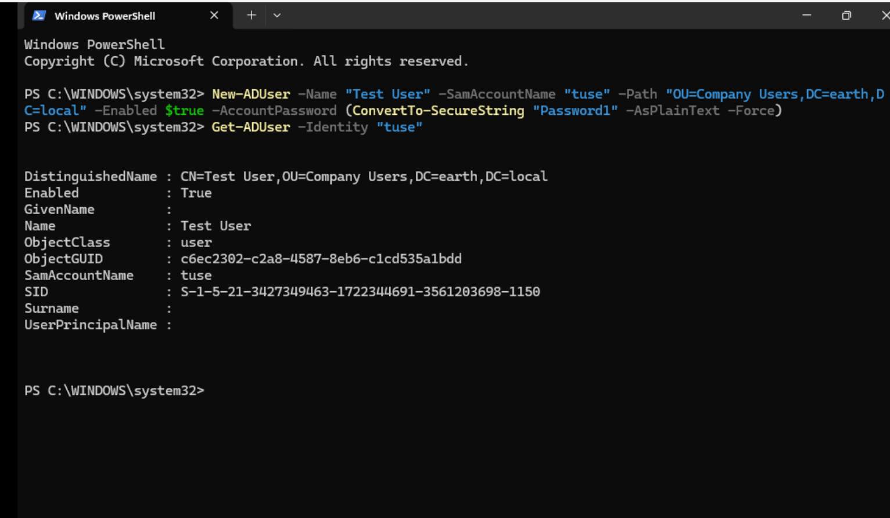

The query returned the new account, confirming that the Administrative SysAdmin role could create user objects in Company Users.

However, I had not supplied GivenName or Surname, so those attributes were not populated.

I created a second account with the additional attributes:
```Powershell
New-ADUser -Name "Test2 User2" `
    -GivenName "Test2" `
    -Surname "User2" `
    -SamAccountName "tuse2" `
    -Path "OU=Company Users,DC=earth,DC=local" `
    -Enabled $true `
    -AccountPassword (ConvertTo-SecureString "Password1!" -AsPlainText -Force) `
    -Verbose
```
I then verified that tuse2 had been created.

!!! success "User creation confirmed"
The Administrative SysAdmin role could create user objects in the delegated Company Users scope.

!!! note "Name attributes"
The Name parameter creates the object's display name but does not automatically populate GivenName and Surname. Those attributes must be supplied separately when required.

#### Step 2: Delete a User Object

I next attempted to delete the second test account:
```Powershell
Remove-ADUser -Identity "tuse2"
```
The deletion initially returned Access is denied.

I reviewed Effective Access for the Administrative SysAdmin account. The interface showed permission to create and delete user objects.

I had encountered a similar discrepancy while testing Write all properties for the standard SysAdmin role. My first troubleshooting step was therefore to use the Delegation of Control Wizard and select the relevant predefined task rather than relying on the earlier custom permission selection.

After applying the predefined delegation, I reran the deletion command. It completed without an error.

I confirmed that the account no longer existed:
```Powershell
Get-ADUser -Identity "tuse2"
```
The query could no longer find the user, validating the deletion.

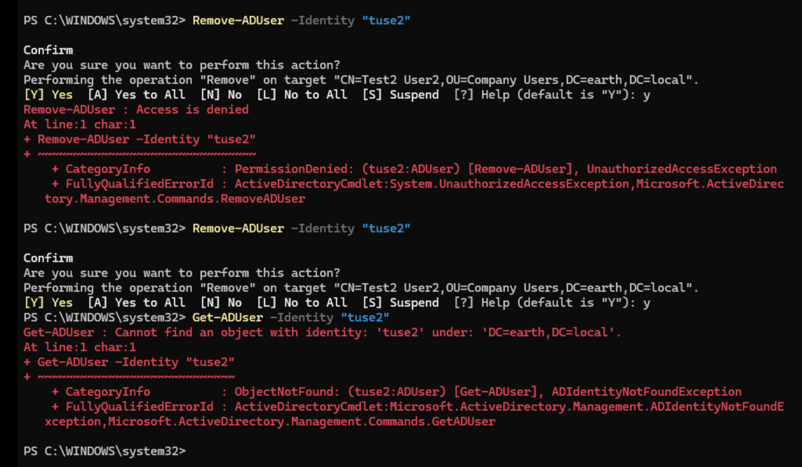

!!! success "User deletion confirmed"
After correcting the delegation, the Administrative SysAdmin role could delete user objects within the intended scope.

!!! tip "Validate effective permissions operationally"
Effective Access is useful for investigation, but the final validation should be the real administrative operation. The initial deletion test exposed a difference between the displayed permissions and the permission set required by the command.

#### Step 3: Modify User Attributes

I tested whether the Administrative SysAdmin role could modify user attributes by updating the remaining test account:
```Powershell
Set-ADUser -Identity "tuse" `
    -Department "Finance" `
    -Title "Test Man" `
    -Description "Angela"
```
The command completed successfully.

I verified the updated attributes:
```Powershell
Get-ADUser -Identity "tuse" `
    -Properties Department, Title, Description
```
The query returned the new department, title and description values.

!!! success "User-property modification confirmed"
The delegated Write all properties permission allowed the Administrative SysAdmin role to modify user attributes in Company Users.

#### Step 4: Modify Group Membership

I attempted to add the test user to EL_HelpDesk:
```Powershell
Add-ADGroupMember -Identity "EL_HelpDesk" `
    -Members "tuse"
```
The command initially returned:

<div class="error-message">
Insufficient access rights to perform the operation.
</div>

The account had broad permissions over Company Users, but the error identified EL_HelpDesk as the target ADGroup. This directed the investigation towards the permissions on the "Groups" OU containing the security groups.

I reviewed the Groups OU and found delegated entries for the standard SysAdmin role, but none for the Administrative SysAdmin role.

Permissions on Company Users did not extend to group objects stored in a separate OU. I therefore granted the Administrative SysAdmin role the intended management permissions over the Security Groups OU.

After applying the change, I reran Add-ADGroupMember and it completed successfully.

I verified the membership through the test user's MemberOf attribute:
```Powershell
Get-ADUser -Identity "tuse" -Properties MemberOf |
    Select-Object Name, MemberOf
```
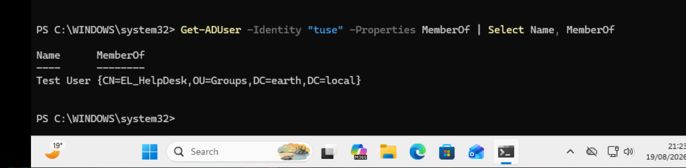

!!! success "Group-membership management confirmed"
The Administrative SysAdmin role could manage group membership after permissions were applied to the OU containing the group objects.

!!! info "Permission scope matters"
Permission to modify a user object does not automatically grant permission to modify a group object. Add-ADGroupMember changes the target group's membership attribute, so the required delegation must apply to the group and its OU.

!!! note "Interpreting denial messages"
Access is denied and Insufficient access rights should not be treated as reliable measurements of how close an account is to being authorised. The wording can vary between tools and APIs. The target object, requested operation and applicable ACL provide stronger diagnostic evidence.

---

### Computer Objects

#### Step 1: Create Computer Objects

I next tested whether my Administrative SysAdmin account could create computer objects in the Workstations OU.

I initially ran:

```powershell
New-ADComputer `
    -Name "TEST-PC01" `
    -SamAccountName "TEST-PC01$" `
    -Path "OU=Workstations,DC=earth,DC=local" `
    -Description "Administrative SysAdmin delegation test" `
    -Enabled $true `
    -Verbose
```

The command reached the correct target location but failed.

!!! failure "Computer-object creation failed"

```text
VERBOSE: Performing the operation "New" on target
"CN=TEST-PC01,OU=Workstations,DC=earth,DC=local".

New-ADComputer : A required attribute is missing
At line:1 char:1
+ New-ADComputer
+ ~~~~~~~~~~~~~~
    + CategoryInfo          : NotSpecified:
                              (CN=TEST-PC01,OU...=earth,DC=local:String)
                              [New-ADComputer], ADException
    + FullyQualifiedErrorId : ActiveDirectoryServer:8316,
                              Microsoft.ActiveDirectory.Management.Commands.NewADComputer
```

##### Isolating the Cause

To determine whether one of the optional parameters was causing the error, I repeated the test using a minimal command:

```Powershell
New-ADComputer `
    -Name "TEST-PC01" `
    -Path "OU=Workstations,DC=earth,DC=local" `
    -Verbose
```

The minimal command produced the same error. This confirmed that the problem was not caused by the additional attributes in the original command.

##### Reviewing the Delegated Permissions

I reviewed the permissions assigned to EL_Adm_SysAdmins on the Workstations OU.

The Administrative SysAdmin permissions had previously been configured for the Company Users and security-groups OUs. However, the required computer-object permissions had not been correctly delegated on the Workstations OU.

I corrected the delegation by granting EL_Adm_SysAdmins the following permissions over computer objects within the Workstations OU:

* Create computer objects
* Delete computer objects
* Read all properties
* Write all properties
* Reset password
* Validated write to DNS host name
* Validated write to service principal name


##### Retesting Computer-Object Creation

After correcting the delegation, I repeated the computer-object creation command:

```Powershell
New-ADComputer `
    -Name "TEST-PC01" `
    -Path "OU=Workstations,DC=earth,DC=local" `
    -Description "Administrative SysAdmin delegation test" `
    -Enabled $true `
    -Verbose
```
!!! success "Computer object created successfully"

This time, the command completed successfully without producing an error.

I verified that the new computer object existed in the expected OU:
```Powershell
Get-ADComputer -Identity "TEST-PC01" `
    -Properties Description |
    Select-Object Name, Enabled, Description, DistinguishedName
```
The query returned TEST-PC01 under:

OU=Workstations,DC=earth,DC=local

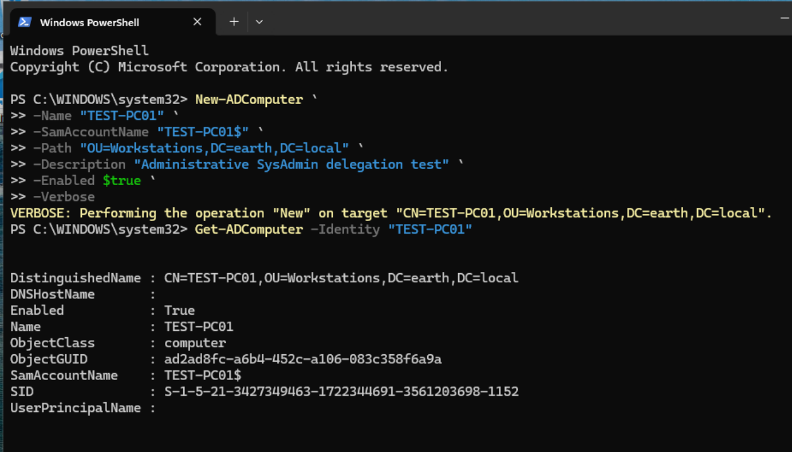

#### Step 2: Delete computer objects:

I Wanted to test deleting computer objects, so created a second test computer object with name TEST-PC02

Then I Deleted the newly created computer object:
```powershell
    Remove-ADComputer -Identity "TEST-PC02"
```
I Verified deletion via a `Get-ADComputer` command and checked off another test.

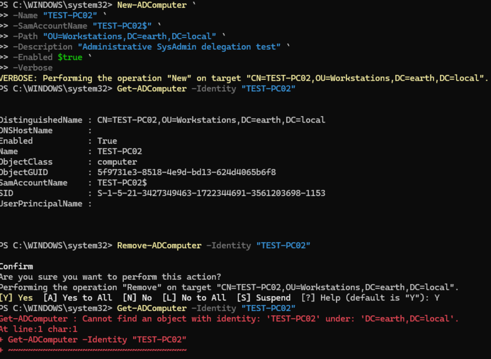

#### Step 3: Reset computer account password:

!!! note "Why does this permission matter if users log in with user passwords, what are computer object passwords for? - ***Computer Object passwords allow workstations to prove their identity to Domain Controllers***."

##### Scenario: 
A domain-joined client goes offline for an extended period. In the meantime, Windows automatically rotates the computer account's password in AD (roughly every 30 days by default). 
When the client comes back online, its locally-stored password no longer matches AD's record, and the two sides fall out of sync.

The affected machine can still be pinged and is reachable on the network, but no domain account can log into it. The user sees: ***"The trust relationship between this workstation and the primary domain failed."***

Real-world fix for this involves two separate halves:

* Reset the password on the AD side: Set-ADAccountPassword -Identity "WS_01$" -Reset
* Reset the password on the client side to match, run locally on the affected machine using a local admin account: Reset-ComputerMachinePassword -Server "WIN-FD0SR0GQS6P" -Credential (Get-Credential)
* Restart the client, then confirm a normal domain login succeeds

An alternative some sysadmins use instead: simply unjoin and rejoin the machine to the domain which may be more disruptive, but sometimes faster than chasing a stubborn password mismatch.
This is genuinely why the standard Sysadmin/Help Desk delegation includes computer account password reset rights: it's a common, real fix for a common, real problem not just a theoretical permission.

Moving on to actually testing the delegated right itself against TEST-PC01.
Before resetting, checked the current password timestamp as a baseline:
```Powershell
  Get-ADComputer -Identity "TEST-PC01" -Properties PasswordLastSet | Select Name, PasswordLastSet
```

Ran the reset: ```Powershell Set-ADAccountPassword -Identity "TEST-PC01$" -Reset -NewPassword (ConvertTo-SecureString "R4nd0m!C0mputerPW#2026xz" -AsPlainText -Force)```

Then validates by re-running the ```Get-ADComputer``` command I had just ran.


#### Step 4: Write all properties on computer objects:

To test this, I wanted to select some properties to modify.

I ran a command to see the full list of available properties on the object:
```powershell
  Get-ADComputer -Identity "TEST-PC01" -Properties * | Format-List *
```
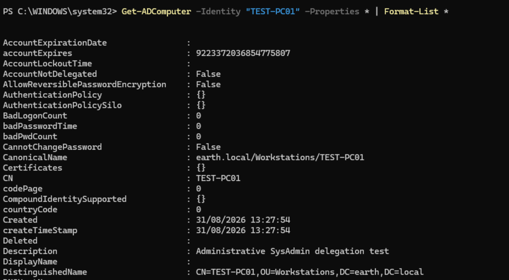
From the list, I selected `Description, DisplayName, ManagedBy and OperatingSystem` as the properties to modify.

Starting with Description, I ran:
```powershell
  Set-ADComputer -Identity "TEST-PC01" -Description "Mic check 2, 1, 2"
```
This returned no error. To quickly validate, I ran:
```powershell
  Get-ADComputer -Identity "TEST-PC01" -Properties Description | Select Description
```
Which printed the desired updated description.
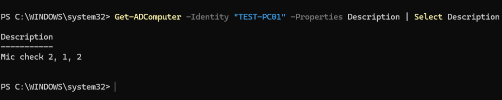

I then decided to update the remaining properties in a single command:
```powershell
  Set-ADComputer -Identity "TEST-PC01" -DisplayName "TestMe!" -ManagedBy "Kate Libby Admin" -OperatingSystem "Windows 11"
```
This produced an error:

!!! failure "ManagedBy identity could not be resolved"

    ```text
    Set-ADComputer : Identity info provided in the extended attribute:
    'ManagedBy' could not be resolved.

    Reason: Cannot find an object with identity:
    'Kate Libby Admin' under: 'DC=earth,DC=local'.
    ```

I quickly understood this was due to the Kate Libby Admin entry, and corrected the command to use her `SamAccountName` instead, `klib.admin`:
```powershell
  Set-ADComputer -Identity "TEST-PC01" -DisplayName "TestMe!" -ManagedBy "klib.Admin" -OperatingSystem "Windows 11"
```
No error was returned. I validated via:
```powershell
  Get-ADComputer -Identity "TEST-PC01" -Properties Description, DisplayName, ManagedBy, OperatingSystem | Select Description, DisplayName, ManagedBy, OperatingSystem
```
This returned output confirming all writes were successful.
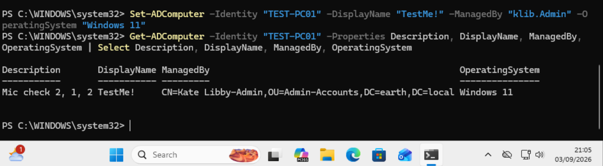

To add some extra testing, I logged in to Kate Libby's standard account to run the same command and validate that I would get an error.

I ran:
```Poweshell 
Get-ADComputer -Identity "TEST-PC01" -Properties Description, DisplayName, ManagedBy, OperatingSystem | Select Description, DisplayName, ManagedBy, OperatingSystem
```
This was successful, as desired. I then tested the write permissions:
```powershell
  Set-ADComputer -Identity "TEST-PC01" -Description "Should fail"
```
This unexpectedly succeeded, with no error returned, revealing that the standard EL_SysAdmins account had write access to computer objects it should never have had.
Root cause: the permission had been granted as part of a combined Access Control Entry (ACE) from earlier delegation, bundled together with other rights rather than as separate. 
AD doesn't allow surgically stripping a single right out of a combined ACE.

Fix: removed the combined permission entry entirely from the Workstations OU(s) where EL_SysAdmins was delegated, then re-ran delegation from scratch, this time selecting only Read, Read all properties, and Reset password, deliberately leaving out Write/Create/Delete.
Retested as k.libby (standard):
```powershell
  Set-ADComputer -Identity "TEST-PC01" -Description "Should fail" -ErrorAction Stop
```
This time it correctly returned an access denied error, confirming the fix.
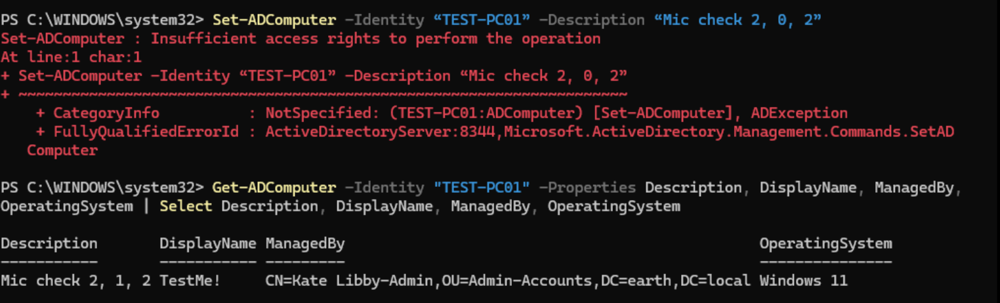

### Common tasks

#### Manage GPO Links:

To test this I wanted to first allow my admin to be able to create GPOs, then manage them.
I had to enable that permission as currently only my DC could create new GPOs.
To enable on my DC, I ran:
`Win + R > gpmc.msc`
Then I navigated to the delegation tab of Group Policy Objects. I added `EL_Adm_SysAdmins` to the delegation and then immediately ran: ```Powershell New-GPO -Name "Admin Test"```
This was successful.
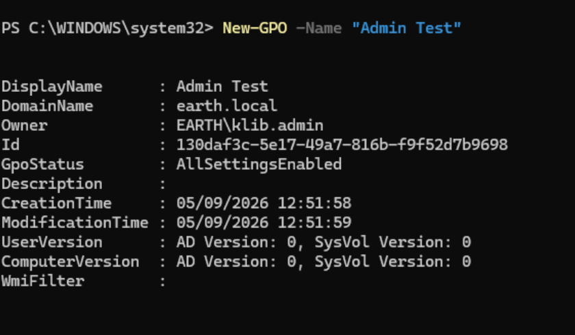

I then proceeded to link this new GPO to Company Users.
```Powershell New-GPLink -Name "Admin Test" -Target "OU=Company Users,DC=earth,DC=local"```
Which was successful, running: `Get-GPInheritance -Target "OU=Company Users,DC=earth,DC=local"` validated this.
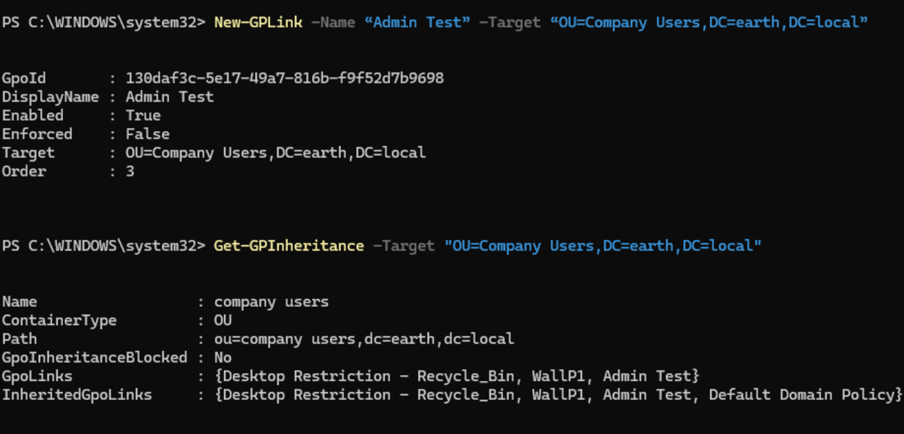
Then I simply unlinked and validated using the respective commands:
```Powershell
Remove-GPLink -Name "Admin Test" -Target "OU=Company Users,DC=earth,DC=local"
```
```Powershell
Get-GPInheritance -Target "OU=Company Users,DC=earth,DC=local"
```
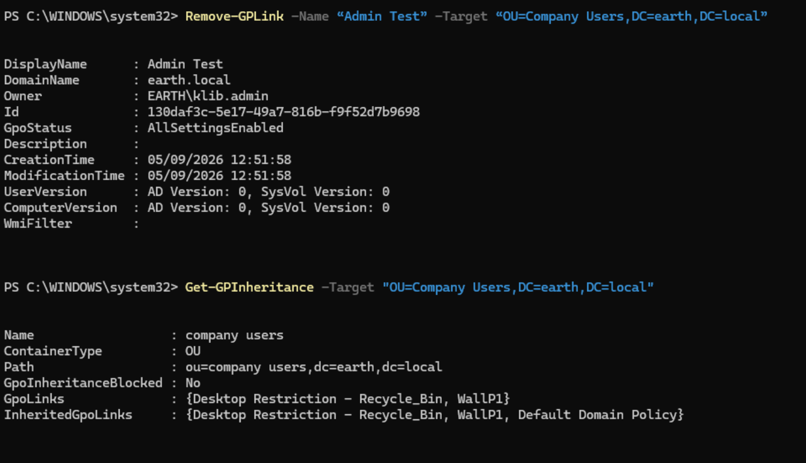

Then I deleted the test GPO using: ```Powershell Remove-GPO -Name "Admin Test"```
Validating via: ```Powershell Get-GPO -Name "Admin Test"```
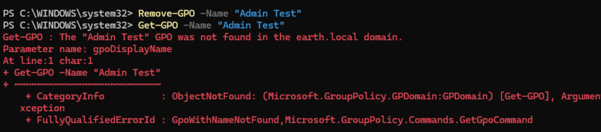

#### RSoP Planning and Logging

##### Logging
I ran gpresult /r /user EARTH\msco — the same command I ran with Kate Libby’s standard tier, just to confirm it worked. It did, so logging was validated.

##### RSoP Planning

Ran the Group Policy Modeling Wizard as `k.libby-adm`, targeting a domain user and WS_01.
Reached the summary of selections page successfully, but received the following error on
generation:

!!! failure "Group Policy error"
    The wizard was unable to generate the computer's data due to insufficient permissions.

    Only the user's data will be displayed.

This narrowed the problem to the computer-side RSoP computation specifically, since the
user-side data generated correctly.

Compared delegation directly against the standard-tier account, which was already working:

```powershell
dsacls "CN=WS_01,OU=Workstations,DC=earth,DC=local" | Select-String "EL_Adm_SysAdmins"
dsacls "CN=WS_01,OU=Workstations,DC=earth,DC=local" | Select-String "EL_SysAdmins"
```

`EL_SysAdmins` had explicit `Generate Resultant Set of Policy (Planning)` and `(Logging)`
entries directly on the WS_01 computer object. `EL_Adm_SysAdmins` had none, despite already
holding the general RSoP extended right delegated at the domain root.

!!! note "Finding"
    RSoP Planning/Logging rights need to be delegated at two potentially different levels:
    a general extended right covers user-side computation, but computer-side RSoP data
    specifically requires the same extended right delegated on the computer object or its
    containing OU.

Fixed by delegating `Generate Resultant Set of Policy (Planning)` and `(Logging)` to
`EL_Adm_SysAdmins` directly on the Workstations OU. Retested and the wizard generated both
computer and user data successfully with no error.

!!! note "Further Testing of neccessary permissions for planning"

Further tested whether the earlier DCOM/WMI permission changes were actually required for this
to work: removed both from `EL_Adm_SysAdmins`, retested, still worked; logged out and back in
to rule out a cached result, retested again, still worked. Confirmed the AD delegation alone
was the actual fix, both here and for the original `EL_SysAdmins` issue. See the correction
note on the [SysAdmin](sysadmin.md/#identify-the-missing-remote-dcom-permissions) page for the full detail.

The decisive difference from the standard SysAdmin investigation was scope, not mechanism:

1. A general RSoP extended right delegated at the domain root was sufficient for user-side computation.
2. Computer-side computation required the same right delegated specifically on the computer object's OU.
3. The DCOM/WMI configuration inherited from the earlier SysAdmin troubleshooting played no actual role here, confirmed by removing it and retesting successfully.

---

### Final Validation Summary

| Test                                          | Expected result | Actual result                                                                 | Status |
| ---------------------------------------------- | ---------------- | ------------------------------------------------------------------------------ | ------ |
| Create user objects                            | Allowed           | User created successfully (after supplying GivenName/Surname)                  | Pass   |
| Delete user objects                            | Allowed           | Initially denied; corrected via predefined delegation task, then succeeded     | Pass   |
| Modify user attributes                         | Allowed           | Department, Title, and Description updated successfully                        | Pass   |
| Modify group membership                        | Allowed           | Initially denied; corrected by delegating on the Groups OU, then succeeded     | Pass   |
| Create computer objects                        | Allowed           | Initially failed with a generic error; corrected by delegating on Workstations OU, then succeeded | Pass   |
| Delete computer objects                        | Allowed           | Deletion completed and verified                                                | Pass   |
| Reset computer account password                | Allowed           | Password reset completed; `PasswordLastSet` confirmed the change               | Pass   |
| Write all properties on computer objects       | Allowed           | Description, DisplayName, ManagedBy, and OperatingSystem all updated successfully | Pass   |
| Standard SysAdmin cannot write computer properties | Denied        | Initially succeeded unexpectedly (misconfigured ACE); corrected, then correctly denied | Pass   |
| Manage GPO links (create, link, unlink, delete) | Allowed          | Test GPO created, linked, unlinked, and deleted successfully                    | Pass   |
| RSoP Logging                                   | Allowed           | Applied GPO data returned for `msco`, matching standard-tier result            | Pass   |
| RSoP Planning                                  | Allowed           | Initially failed on computer-side data; corrected by delegating RSoP rights on the Workstations OU, then succeeded | Pass   |

---

### Key Takeaways

This exercise reinforced several important lessons:

- Displayed or "effective" permissions are not a substitute for testing the actual administrative operation; the deletion test exposed a gap between what Effective Access showed and what the command required.
- Permissions granted together as part of one combined Access Control Entry cannot be selectively removed; a misconfigured or overly broad grant has to be removed and rebuilt from scratch, not surgically trimmed.
- Object-level delegation can differ from OU-level or domain-level delegation for the same right; RSoP Planning required the extended right on the specific computer object's OU, not just a broader grant that already covered user-side computation.
- Resolving an issue after making several changes does not confirm all of those changes were responsible; the DCOM/WMI permissions applied during the original SysAdmin RSoP Planning investigation were later proven unnecessary once tested independently.
