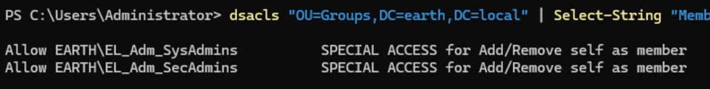
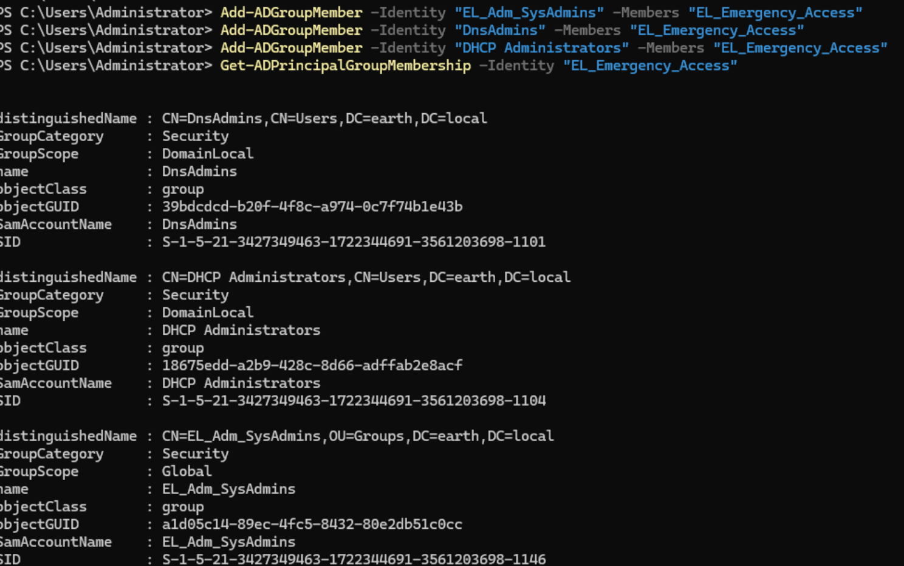
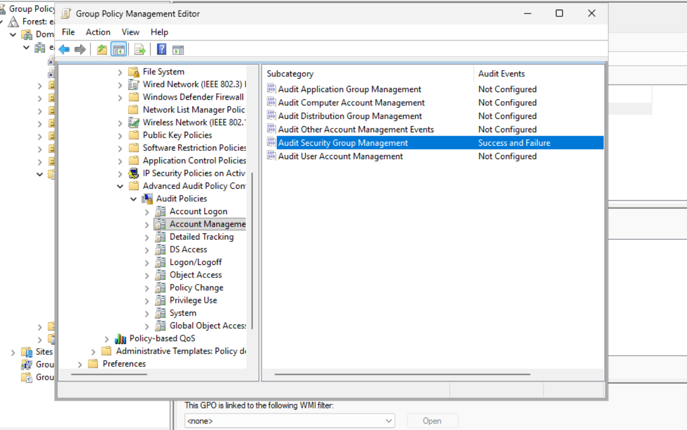
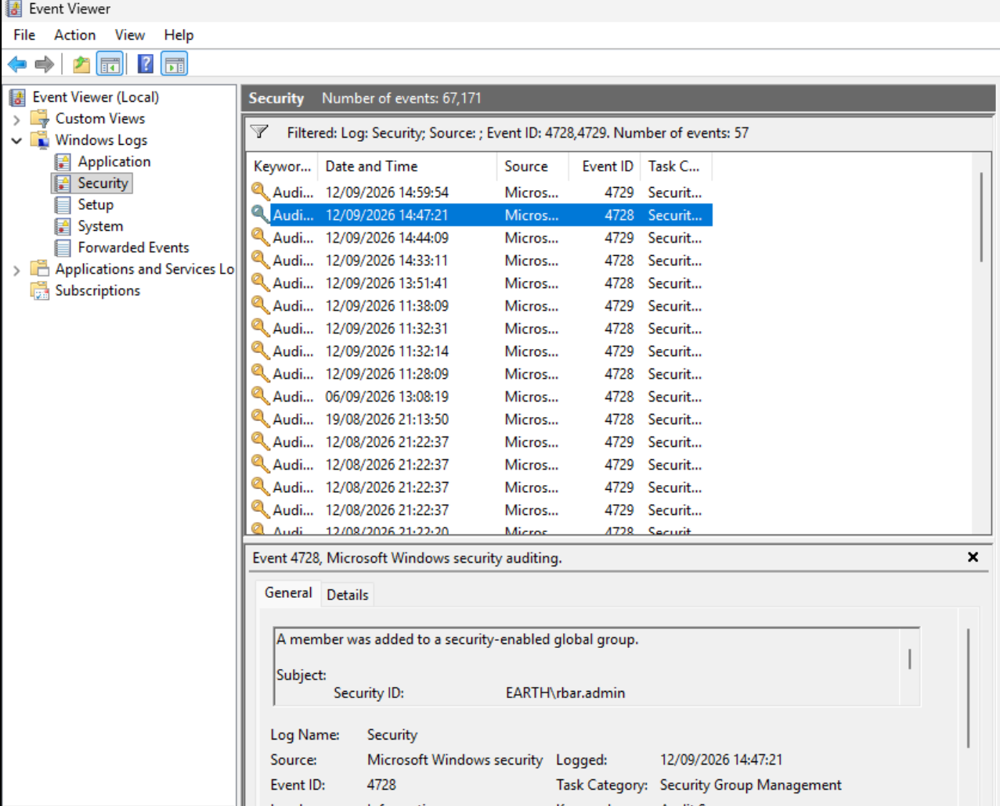
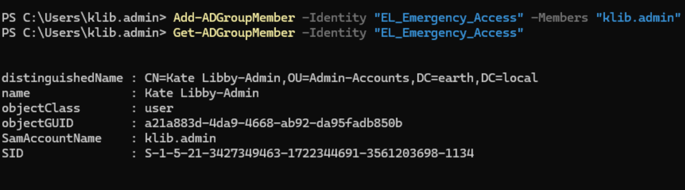
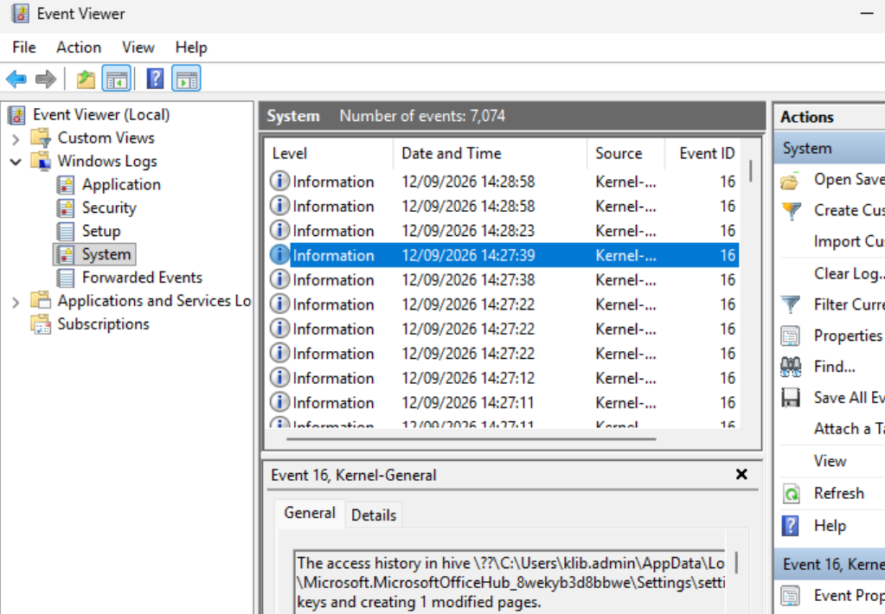
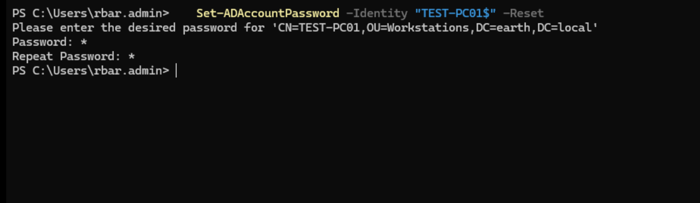
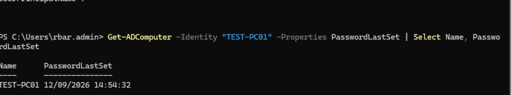

## Testing — Emergency Access

The purpose of this role was to create a security group that could fulfil some of the other groups' tasks in an emergency.

!!! note "Design decision — no Admin Tier IT Manager"
    Initially I planned for an Admin Tier IT Manager to fulfil this role, but decided against that, as it would have created almost a "god" role, breaking least privilege.

The group would have no standing members by default, but when required, a user can be assigned to the group to complete the required tasks, then removed. Only `EL_Adm_SysAdmins` and `EL_Adm_SecAdmins` would have the ability to move a user in and out of `EL_Emergency_Access`, and they are primarily the groups who would use `EL_Emergency_Access`.

By running:

```powershell
dsacls "OU=Groups,DC=earth,DC=local" | Select-String "Member"
```

I was able to confirm that only `EL_Adm_SysAdmins` and `EL_Adm_SecAdmins` could modify group membership.



**Design**: `EL_Emergency_Access` is nested into the same existing admin-tier groups the other roles already use, rather than being granted a separate, parallel permission set.

Accomplished via:

```powershell
Add-ADGroupMember -Identity "EL_Adm_SysAdmins" -Members "EL_Emergency_Access"
Add-ADGroupMember -Identity "DnsAdmins" -Members "EL_Emergency_Access"
Add-ADGroupMember -Identity "DHCP Administrators" -Members "EL_Emergency_Access"
# EL_Adm_SecAdmin nesting once that group's rights are fully finalised (patch/deployment rights still deferred)
```

Validated via:



### Logging

I wanted to set up simple logging, so that whenever users are added to groups I could see who did what (the auditing of this can be improved once a SIEM is built). This way the `EL_Emergency_Access` group could be audited cleanly.

To do this I ran: `Win + R > gpmc.msc > Computer Configuration > Policies > Windows Settings > Security Settings >
Advanced Audit Configuration > Audit Policies > Account Management`

I then enabled **Audit Security Group Management** for **Success** and **Failure** events, and ran `gpupdate /force` on the domain controllers to apply the changes.



---

After the next section "Validating", where I validated the access, I came back here to check the logs.

I ran: `Win + R > eventvwr > Windows Logs > Right-click Security > Filter Current Log >
entered 4728, 4729 in the <All Event IDs> section > OK`


I was able to confirm the group addition and removal of both users I tested with.



### Validating

I logged in to Kate Libby's admin account to move this same account into the `EL_Emergency_Access` group via:

```powershell
Add-ADGroupMember -Identity "EL_Emergency_Access" -Members "klib.admin"
```

Verified the move via:

```powershell
Get-ADGroupMember -Identity "EL_Emergency_Access"
```



I then tried to read an event log, as the `EL_Adm_SecAdmins` group could do this. I was able to review some logs to validate.



I then removed her from the Emergency group and signed in as Rache Bartmoss to test with a SecAdmin.

With Rache, I ran:

```powershell
Set-ADAccountPassword -Identity "TEST-PC01$" -Reset
```

Which would work for an elevated SysAdmin. Initially it failed even after I signed out and back in before running the command. After restarting the machine and running the same command, I saw no error output.

!!! note "Sign-out/sign-in did not refresh the token, a restart did"
    A stale Kerberos token was not resolved by signing out and back in, but was resolved by a full restart. Worth remembering for future testing: if a permission change doesn't appear to take effect after a normal logoff/logon, a full restart is a more reliable way to force a genuinely fresh security context before concluding the underlying delegation itself is wrong.




I then removed Rache from Emergency Access, re-ran the same command, and saw an error.

!!! success "Emergency Access confirmed working and correctly revocable"
    Both `EL_Adm_SysAdmins` and `EL_Adm_SecAdmins` staff were able to gain the intended elevated capability once added to `EL_Emergency_Access`, and correctly lost that capability once removed. Group additions and removals were both captured in the Security event log (4728/4729), confirming the access is auditable without requiring a SIEM.
---

### Final Validation Summary

| Test                                                      | Expected result | Actual result                                                                 | Status |
| ------------------------------------------------------------ | ---------------- | ------------------------------------------------------------------------------ | ------ |
| Only `EL_Adm_SysAdmins`/`EL_Adm_SecAdmins` can modify group membership | Confirmed        | `dsacls` on Groups OU showed only these two groups with Member write access     | Pass   |
| `EL_Emergency_Access` nested into `EL_Adm_SysAdmins`, DnsAdmins, DHCP Administrators | Allowed | Confirmed via `Get-ADGroupMember`                                              | Pass   |
| Security Group Management auditing enabled                | Allowed           | Configured via GPO, applied with `gpupdate /force`                             | Pass   |
| Group addition logged (Event ID 4728)                      | Logged            | Confirmed in Security event log for both test users                            | Pass   |
| Group removal logged (Event ID 4729)                        | Logged            | Confirmed in Security event log for both test users                            | Pass   |
| SysAdmin-tier account via Emergency Access: read event logs | Allowed           | Kate Libby's admin account successfully reviewed logs                          | Pass   |
| SecAdmin-tier account via Emergency Access: reset computer password | Allowed  | Rache Bartmoss's account succeeded after a full restart (see note on stale token) | Pass   |
| Access correctly revoked after removal from Emergency Access | Denied          | Same computer password reset failed once Rache was removed from the group      | Pass   |

---

### Key Takeaways

This exercise reinforced several important lessons:

- Not every gap in a permission model should be filled by expanding an existing role. Rather than granting an IT Manager broad standing rights to cover emergencies, a separate, purpose-built, membership-empty group kept the least-privilege design intact while still solving the real problem.
- A break-glass or emergency access mechanism is meaningful only if it is auditable and revocable, not just grantable. Enabling Security Group Management auditing and confirming both the addition and removal of a test account in the event log made this a genuinely reviewable control, not just a standing elevated account with a reassuring name.
- Restricting who can add members to a sensitive group is itself a security control worth verifying explicitly; confirming via `dsacls` that only the intended admin-tier groups could modify group membership ensured the emergency access mechanism could not be granted by an unauthorised account.
- A stale Kerberos token can survive a normal sign-out and sign-in in some cases; a full restart is a more reliable way to force a fresh security context when a permission change doesn't appear to take effect, worth trying before concluding the underlying delegation is wrong.
