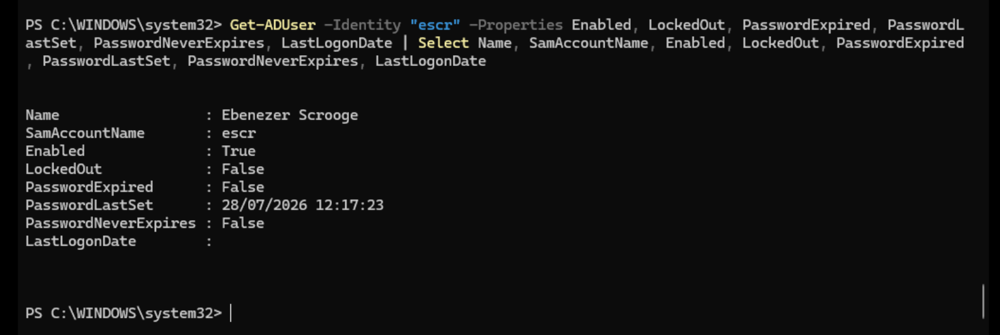
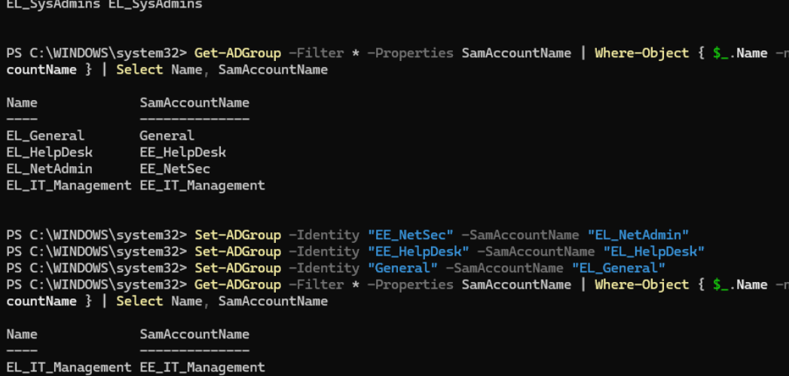
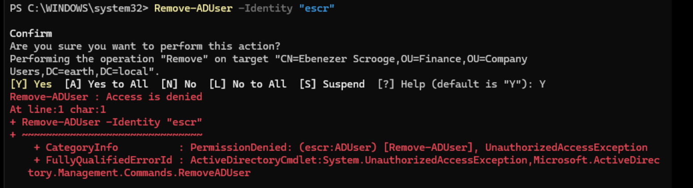
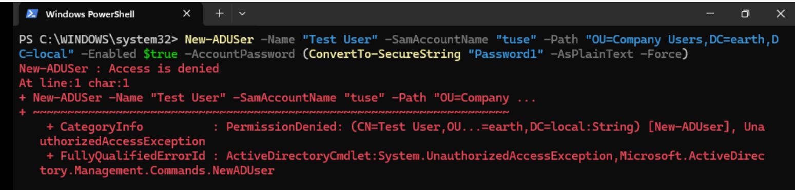

## Help Desk Testing

I began the delegation testing with the Help Desk role, using **Thomas Anderson's** Help Desk account.

The objective was to verify that Help Desk could perform its expected day-to-day support tasks against users in the `Company Users` OU, while confirming that more privileged administrative operations remained unavailable.

### Selecting a Test User

Before making any changes, I queried the `Company Users` OU to select an account for testing:

```powershell
Get-ADUser -Filter * -SearchBase "OU=Company Users,DC=earth,DC=local"
```

I selected Ebenezer Scrooge, a Finance user with the SamAccountName escr.

I then checked the account's current state before beginning the tests:

```
Get-ADUser -Identity "escr" `
    -Properties Enabled, LockedOut, PasswordExpired, PasswordLastSet, PasswordNeverExpires, LastLogonDate |
Select Name, SamAccountName, Enabled, LockedOut, PasswordExpired,
       PasswordLastSet, PasswordNeverExpires, LastLogonDate
```
This gave me a baseline against which I could validate the changes made during testing.



#### Test 1 — Reset User Password

The first test was to confirm that Help Desk could reset a user's password and require the user to change it at their next logon.

Using the Help Desk account, I ran:
Set-ADAccountPassword -Identity "escr" `
    -Reset `
    -NewPassword (ConvertTo-SecureString "Password1" -AsPlainText -Force)
```
Set-ADUser -Identity "escr" -ChangePasswordAtLogon $true
```

Both commands completed successfully.

I then signed in as Ebenezer using the temporary password. Windows immediately prompted the user to change the password, confirming that both the reset and change password at next logon settings had been applied successfully.

  

As an additional check, I queried pwdLastSet before and after the user changed the password:
```
Get-ADUser -Identity "escr" -Properties pwdLastSet |
Select Name, pwdLastSet
```

Before the password change, pwdLastSet was blank. After the user completed the password change, the attribute contained a timestamp.

Result: PASS

Help Desk could reset a user's password and require a password change at next logon as intended.

#### Test 2 — Unlock a User Account

I next tested whether Help Desk could unlock a locked user account.

First, I checked the domain's account lockout threshold:
`
Get-ADDefaultDomainPasswordPolicy |
Select LockOutThreshold
`

I deliberately entered the wrong password enough times to lock Ebenezer's account and then queried the account again to verify its state:
Get-ADUser -Identity "escr" `
    -Properties Enabled, LockedOut, PasswordExpired, PasswordLastSet, PasswordNeverExpires, LastLogonDate |
Select Name, SamAccountName, Enabled, LockedOut, PasswordExpired,
       PasswordLastSet, PasswordNeverExpires, LastLogonDate 
`

The account showed as locked.

I then attempted to unlock it:
`Unlock-ADAccount -Identity "escr"`

This failed with an insufficient access rights error.

**Investigating the Failed Test**

This showed that my original Help Desk delegation was incomplete.

I had delegated password-reset permissions and read access, but resetting a password and unlocking an account are separate operations in Active Directory. Because Help Desk had read access, it could see that the account was locked, but it did not have permission to modify the attribute responsible for the lockout state.

After investigating the required permission, I identified lockoutTime as the relevant attribute.

I returned to the Delegation of Control configuration for the Company Users OU and added:

Custom task → User objects → Property-specific permissions → Write lockoutTime

I then immediately re-ran: `Unlock-ADAccount -Identity "escr"`

This time the command completed successfully.

A final `'Get-ADUser'` query confirmed that the account was no longer locked, and I was able to sign in as Ebenezer again.

Result: FAIL → REMEDIATED → PASS

!!! note "Found during testing: Password reset and account unlock are separate delegated permissions. My initial delegation allowed Help Desk to read the user's lockout state but not modify it. Testing exposed the missing `Write lockoutTime` permission, which I added before successfully re-testing the operation."

#### Test 3 — Read User Information

Help Desk should be able to view user information without having unrestricted ability to modify user attributes.

This had already been demonstrated throughout the previous tests. The Help Desk account could successfully query users with commands such as: `Get-ADUser -Identity "escr"`

I could also browse user objects through Active Directory Users and Computers `(dsa.msc)`.

However, fields requiring write permissions remained unavailable for modification through ADUC.

Result: PASS

Help Desk had the required visibility into user objects without receiving unrestricted write access.

#### Test 4 — Modify Privileged Group Membership

I next tested whether the Help Desk account could add a user to the SysAdmin security group.

I attempted: `Add-ADGroupMember -Identity "EL_SysAdmins"
    -Members "escr"
    -ErrorAction Stop
`
My initial attempt produced an unexpected error stating that EL_SysAdmins could not be found.

At first, I suspected that Help Desk lacked read access to the security group. However, before treating this as a delegation problem, I tested the group directly:
`Get-ADGroup -Identity "EL_SysAdmins"`

This also failed.

I then ran the same query from the Domain Controller session and received the same result, ruling out the Help Desk account's permissions as the cause.

Interestingly, querying another group worked: `Get-ADGroup -Identity "EL_Admins"`

#### Investigating the Group Identity Problem

During the earlier RBAC restructuring, several security groups had originally been created using the EE_ prefix before being renamed to the correct EL_ convention.

Although the visible group name had been changed, I discovered that the pre-Windows 2000 group name (SamAccountName) still contained the old value.

For example:

Current group name: EL_SysAdmins
Existing SamAccountName: EE_SysAdmins

I corrected the value: ``Set-ADGroup -Identity "EE_SysAdmins"
    -SamAccountName "EL_SysAdmins"``

I then verified the result:
``
Get-ADGroup -Identity "EL_SysAdmins" -Properties SamAccountName
Select Name, SamAccountName
``
Rather than assuming this was an isolated issue, I checked every AD group for mismatches between its current name and `SamAccountName`:
```
Get-ADGroup -Filter * -Properties SamAccountName |
Where-Object { $_.Name -ne $_.SamAccountName } |
Select Name, SamAccountName
```

The query identified four additional mismatches, which I corrected using the same method.


With the naming issue resolved, I returned to the original Help Desk permission test:
`Add-ADGroupMember -Identity "EL_SysAdmins"
    -Members "escr"
    -ErrorAction Stop
`

This time Active Directory located the group correctly but returned insufficient access rights.

That was the expected result.

Result: PASS

Help Desk could not add users to the SysAdmin security group.

!!! note "Found during testing: Renaming an AD group's visible name did not automatically leave the group's SamAccountName aligned with my new naming convention."
The delegation test exposed several groups where the current name used the `EL_` prefix while `SamAccountName` retained the previous `EE_` value.

I corrected the affected groups and used a domain-wide query to verify that no further naming mismatches remained.

### Test 5 — Delete a User

Help Desk should not have permission to delete user objects.

I attempted to delete the test user:
`Remove-ADUser -Identity "escr"`

After confirming the deletion prompt, Active Directory returned an Access Denied error.


Result: PASS

Help Desk could not delete user objects.

### Test 6 — Create a User

Finally, I tested whether Help Desk could create a new user in the Company Users OU:

`New-ADUser 
    -Name "Test User" 
    -SamAccountName "tuse" 
    -Path "OU=Company Users,DC=earth,DC=local" 
    -Enabled $true
    -AccountPassword (ConvertTo-SecureString "Password1" -AsPlainText -Force)
`

Active Directory returned:
`Access is denied`



Result: PASS

Help Desk could not create user objects.


| Test                                | Expected | Result                   |
| ----------------------------------- | -------- | ------------------------ |
| View user information               | Allowed  | PASS                     |
| Reset user password                 | Allowed  | PASS                     |
| Force password change at next logon | Allowed  | PASS                     |
| Unlock locked account               | Allowed  | FAIL → REMEDIATED → PASS |
| Modify unrestricted user attributes | Denied   | PASS                     |
| Add user to SysAdmin group          | Denied   | PASS                     |
| Delete user                         | Denied   | PASS                     |
| Create user                         | Denied   | PASS                     |


## Key Takeaways

The testing confirmed that the Help Desk role had the permissions required for routine account support while remaining restricted from higher-risk administrative operations.

The tests also exposed two issues that were not apparent from the delegation configuration alone:

* The Help Desk delegation was missing the `Write lockoutTime` permission required to unlock user accounts.
* Several renamed security groups retained their previous `SamAccountName`, resulting in inconsistent group identities.

Both issues were corrected and successfully re-tested before the Help Desk validation was completed.

This demonstrated the importance of validating delegated permissions through real administrative operations rather than relying solely on the configured access-control entries.
