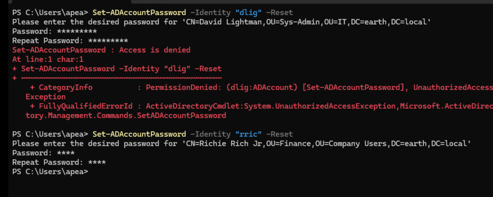
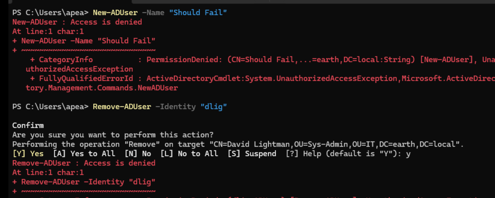

## Testing — IT Management

I wanted IT Management to be able to read all user information, use RSoP Planning and Logging, and I also gave them the ability to reset passwords for normal Company Users, if required.

!!! note "Revision to original design"
    This is a deliberate revision from the original design decision, which specified no password reset or object creation rights for this role at all, on the basis that the role is purely strategic and oversight-level. On reflection, limited password-reset capability for non-IT staff is a reasonable, low-risk addition for an IT Manager to hold, distinct from broader object creation/deletion rights, which remain excluded.

I ran the same tests I had just run with the Admin Tier SecAdmin user:

```powershell
Get-ADUser -Filter * -Properties Department, Title | Select Name, Department, Title
```
```Powershell
gpresult /r /user EARTH\msco
```
`Win + R > gpmc.msc > Group Policy Modeling > Group Policy Modeling Wizard > using Michael Scott and WS_01`

All were successful.

I then tested the password delegation. I tried to reset the password of both David Lightman (IT) and Richie Rich (General):

```powershell
Set-ADAccountPassword -Identity "dlig" -Reset
Set-ADAccountPassword -Identity "rric" -Reset
```

As expected, I was only successful when resetting Richie Rich's password. Validated by trying to log in as Richie Rich with the original password, which failed, and then using the updated password, which worked.



I then validated a few should-fails:

- Create a new user:
```powershell
  New-ADUser -Name "Should Fail"
```
  Failed.
- Delete a user:
```powershell
  Remove-ADUser -Identity "dlig"
```
  Failed.



- I then confirmed a GPO link should-fail, running:

```powershell
New-GPLink -Name "Test GPO" -Target "OU=HelpDesk,OU=IT,DC=earth,DC=local"
```

Failed as expected.

!!! success "IT Management scope confirmed"
    IT Management can read user information, run RSoP Planning and Logging, and reset passwords for Company Users only, correctly scoped away from IT staff accounts. Object creation, deletion, and GPO link management all remain correctly denied, consistent with the role's oversight-only design.
---

### Final Validation Summary

| Test                                              | Expected result | Actual result                                                                 | Status |
| --------------------------------------------------- | ---------------- | ------------------------------------------------------------------------------ | ------ |
| Read all user information                         | Allowed           | Returned full results including Department and Title                          | Pass   |
| RSoP Logging                                      | Allowed           | Applied GPO data returned for `msco`                                           | Pass   |
| RSoP Planning                                     | Allowed           | Modelling Wizard succeeded for Michael Scott / WS_01                           | Pass   |
| Reset password — Company User (Richie Rich)       | Allowed           | Reset succeeded; login confirmed with new password, old password rejected      | Pass   |
| Reset password — IT staff (David Lightman)        | Denied            | `Set-ADAccountPassword -Reset` failed                                          | Pass   |
| Create a user                                     | Denied            | `New-ADUser` failed                                                            | Pass   |
| Delete a user                                     | Denied            | `Remove-ADUser` failed                                                         | Pass   |
| Manage GPO links                                  | Denied            | `New-GPLink` failed                                                            | Pass   |

---

### Key Takeaway

`EL_Adm_ITManagement` was not built. Instead a separate, purpose-built **emergency/break-glass access** role is now planned, kept distinct from ordinary role tiering rather than folded into IT Management's own account.
