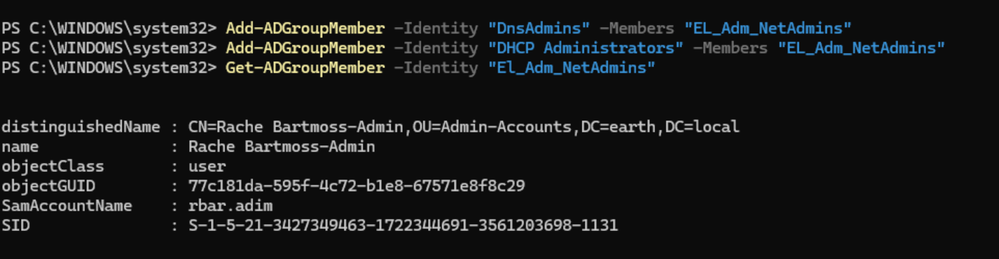
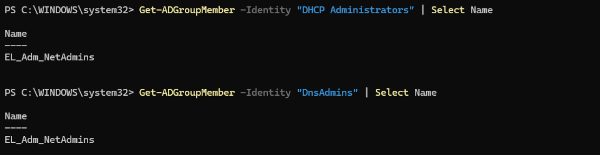
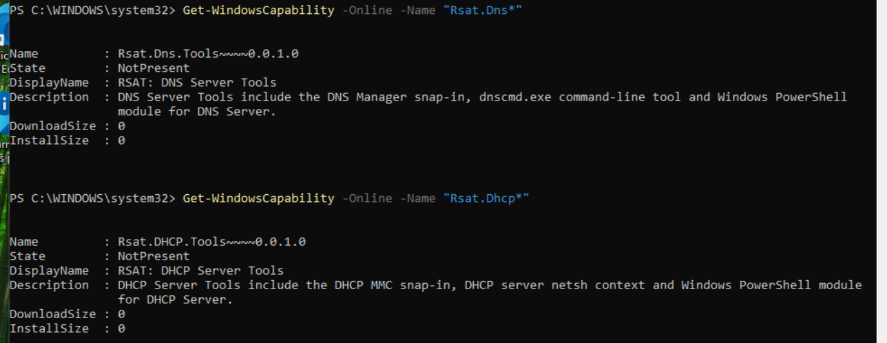
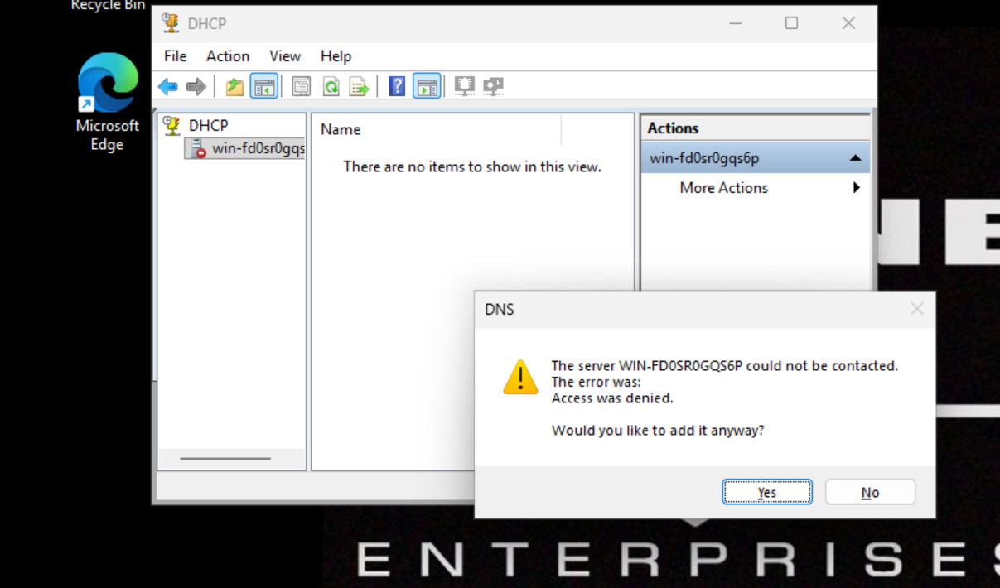

### NetAdmin 

For this role, and its Admin Tier variant, I did not see useful reasoning for a read-only DNS/DHCP role in the manner of the SysAdmins tiering. To even configure such a role may have been more work than any usefulness.

!!! note "Design decision"
    The split here is purpose-based, not capability-based. One role for regular duties (email, browsing, attending meetings, research, writing documentation) and another for NetAdmin tasks such as the creation and modification of DNS zones.

`EL_NetAdmin` was therefore simply a group for the users to access, but with no privileged actions at all, in the ilk of the normal Company Users. `EL_Adm_NetAdmin` was added to both **DnsAdmins** and **DHCP Administrators**, the preconfigured groups created automatically when the DHCP and DNS roles are added to the DC.

The following commands were used to achieve this:

```powershell
Add-ADGroupMember -Identity "DnsAdmins" -Members "EL_Adm_NetAdmins"
Add-ADGroupMember -Identity "DHCP Administrators" -Members "EL_Adm_NetAdmins"
```

I verified Rache Bartmoss, the Admin-tiered user, was the only user in the group.



I then validated the move via:

```powershell
Get-ADGroupMember -Identity "DnsAdmins" | Select Name
Get-ADGroupMember -Identity "DHCP Administrators" | Select Name
```



I then logged in as Rache's admin account to confirm he could access DNS Manager and DHCP via:
`Win + R > dnsmgmt.msc`


But it could not be found.

!!! failure "Console not found"
    DNS Manager could not be opened. I suspected it was likely not installed on the workstation.

I ran:

```powershell
Get-WindowsCapability -Online -Name "Rsat.Dns*"
Get-WindowsCapability -Online -Name "Rsat.DHCP*"
```

to validate the absence of both required tools and the output confirmed both were not present.



So I installed both via:

```powershell
Add-WindowsCapability -Online -Name "Rsat.Dns.Tools~~~~0.0.1.0"
Add-WindowsCapability -Online -Name "Rsat.DHCP.Tools~~~~0.0.1.0"
```

After installation I tried:
`Win + R > dnsmgmt.msc`
and `Win + R > dhcpmgmt.msc`


and both were successful for Rache's admin user.

!!! success "NetAdmin admin tier confirmed"
    With `EL_Adm_NetAdmin` nested inside DnsAdmins and DHCP Administrators, and RSAT tools installed on the workstation, Rache's admin account could open and use both DNS Manager and DHCP console.

I then confirmed the negative path, logging in as the standard-tier identity to verify no privileged access existed.

Both consoles opened successfully, since the RSAT tools themselves were installed here too, and simply launching a console is a local action requiring no AD permissions.

However:

- In the DHCP console, no scopes or leases were visible, only the ability to add a server name. Nothing beyond that would load.
- In DNS Manager, selecting the server returned **Access Denied**.



!!! success "NetAdmin standard tier confirmed correctly restricted"
    This confirmed that having the RSAT tools installed and being able to open the consoles is not the same as having rights to use them. The standard-tier identity could launch both tools, since that's a local action, but every actual query against the DNS/DHCP servers was correctly denied, since this identity was never added to DnsAdmins or DHCP Administrators.
