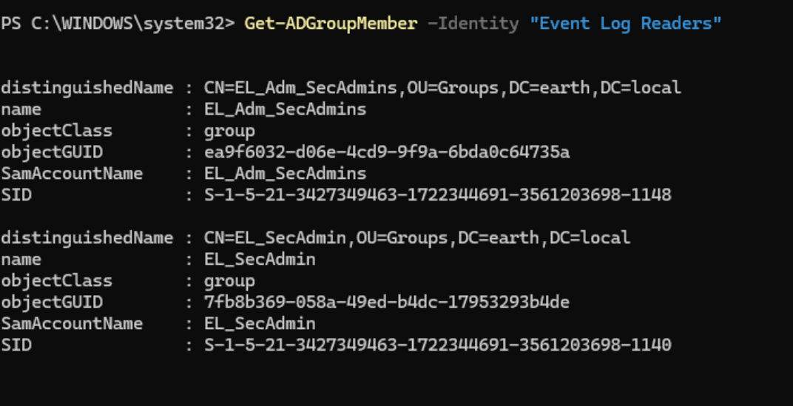
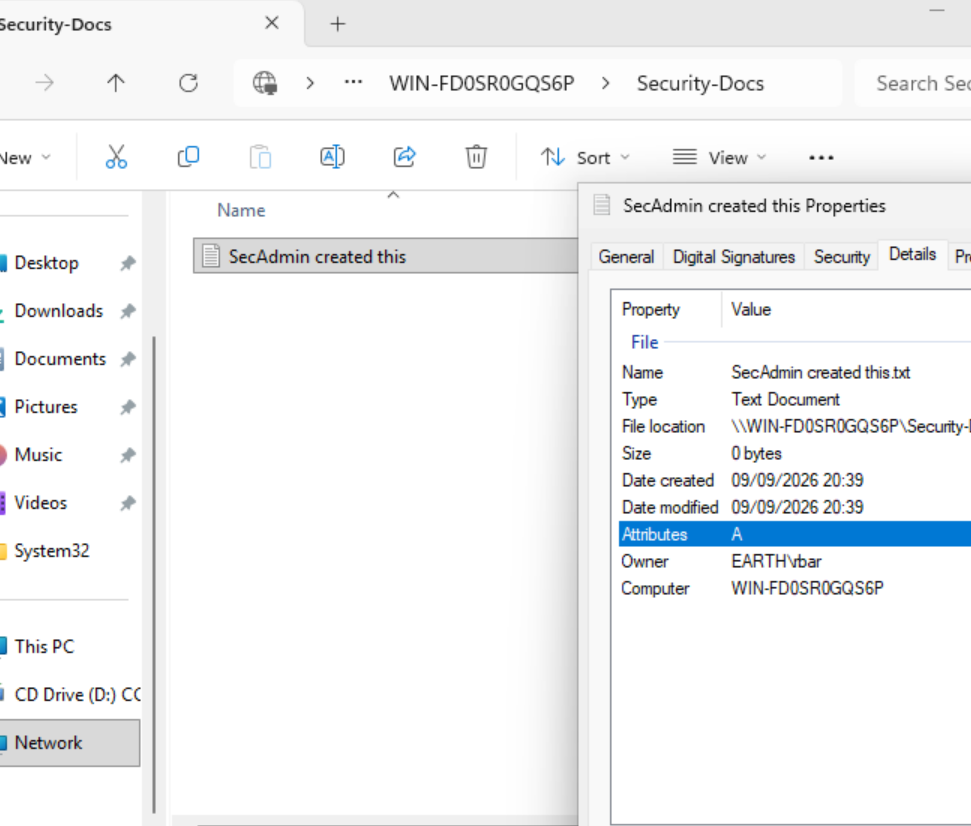
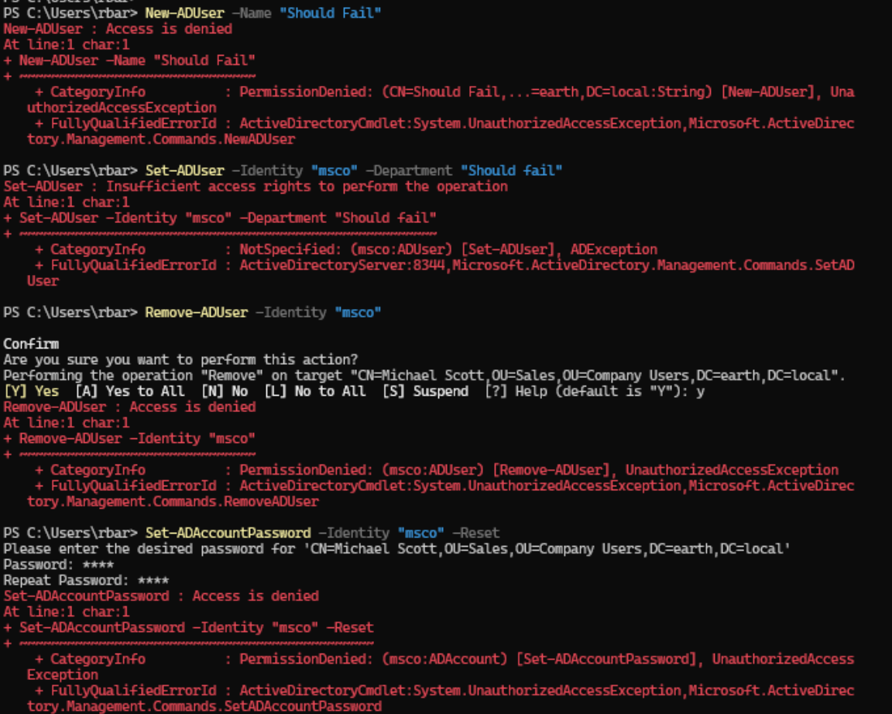
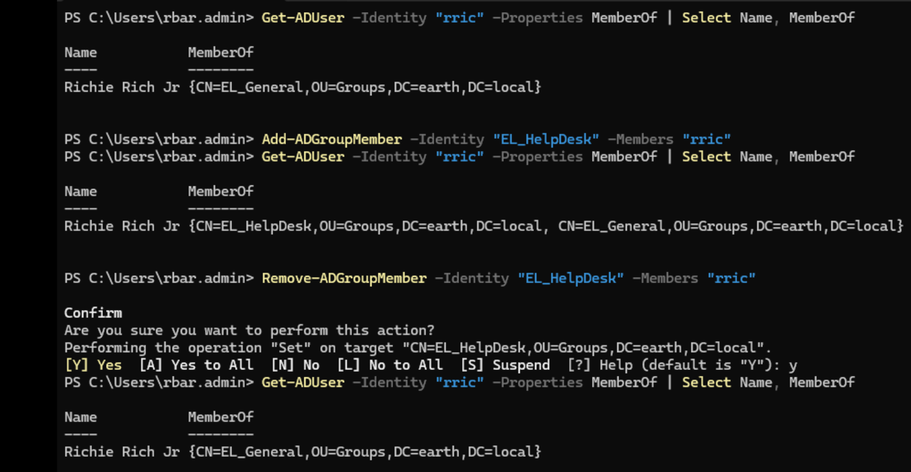

## Testing — SecAdmin and Admin Tier SecAdmin

I wanted SecAdmins to be able to read all user information, run RSoP Logging and Planning, and read event logs.

When delegating the permissions, I added both the standard and admin tier to the same flow to add permissions concurrently.

I ran:

```powershell
Add-ADGroupMember -Identity "Event Log Readers" -Members "EL_SecAdmin", "EL_Adm_SecAdmins"
```

to give both tiers access to view event logs.

I validated via:

```powershell
Get-ADGroupMember -Identity "Event Log Readers"
```

which showed the two groups now as Event Log Readers members.



I then created a shared directory named `Security-Docs` and gave the standard tier **Change** share permissions.

In the Security tab, I added `EL_SecAdmin` and gave them **Modify** permissions, allowing them to write to the directory.

I then created a test file named "SecAdmin created this" as `EL_SecAdmin`, and this was successful.



I tested with `EL_Adm_SecAdmins` and verified that this group could not create files in the directory, as per my design choice: the admin tier is scoped to state-changing actions such as deployment and patch scheduling, not documentation writing, so it deliberately has no write access to this share.

!!! note "I fixed the naming consistency between SecAdmin and Admin SecAdmins"
	Going forward `EL_SecAdmin` has been updated fully to be `EL_SecAdmins`. So this will be reflected in any notes and screenshots after this point.

!!! success "SecAdmin standard/admin tier write access confirmed correctly scoped"
    `EL_SecAdmin` can write to the documentation share as intended. `EL_Adm_SecAdmins` correctly cannot, consistent with the role's design: standard tier covers observational and documentation work, admin tier covers state-changing actions only.

### Standard Tier: Remaining Validation

I then tested that my SecAdmin could read all properties via:

```powershell
Get-ADUser -Filter * -Properties Department, Title | Select Name, Department, Title
```

This was successful.

I tested RSoP Logging permissions in similar fashion to the SysAdmin role by running:

```powershell
gpresult /r /user EARTH\msco
```

This was successful.

I tested RSoP Planning permissions once again, in a similar fashion to the SysAdmin role, via:
`Win + R > gpmc.msc > Group Policy Modeling > Group Policy Modeling Wizard > using Michael Scott and WS_01`

This was successful.

Then I ran some quick should-fail validation checks:

```powershell
Set-ADUser -Identity "<test-user>" -Department "Should fail"
New-ADUser -Name "Should Fail"
Remove-ADUser -Identity "<test-user>"
Set-ADAccountPassword -Identity "<test-user>" -Reset
```



All failed as desired.

!!! success "SecAdmin standard tier fully closed"
    No permission bleeding from other roles or misconfigurations here. Least privilege ideology in action.

### Admin Tier — SecAdmin Testing

I wanted `EL_Adm_SecAdmin` to be able to modify group membership, so this was delegated.

I decided to move Richie Rich into the Help Desk group, tested via:

```powershell
Add-ADGroupMember -Identity "EL_HelpDesk" -Members "rric"
```

This was successful. I removed him from the Help Desk group shortly afterwards.



!!! note "Remaining admin tier tasks deferred pending lab development"
    Two further admin tier responsibilities were identified for this role: patch scheduling and cancellation, and deployment/build rights. Neither can be meaningfully tested yet.

    Patch scheduling depends on WSUS, which is not yet built in the lab, this is a WSUS console permission rather than an Active Directory object permission, so it will be tested once WSUS is in place.

    Deployment/build rights depend on having a concrete target to delegate against, such as a monitoring or SIEM-style tool. No such tool currently exists in the lab, so testing this artificially against nothing real would not be a meaningful validation. Both will be revisited once the relevant infrastructure exists.

!!! success "SecAdmin admin tier group membership modification confirmed"
    `EL_Adm_SecAdmin` can modify group membership as intended, consistent with the role's design: state-changing actions belong to the admin tier, not the standard tier.

---

### Final Validation Summary

| Test                                                    | Expected result | Actual result                                                                 | Status |
| -------------------------------------------------------- | ---------------- | ------------------------------------------------------------------------------ | ------ |
| Standard tier: read all user information                | Allowed           | Returned full results including Department and Title                          | Pass   |
| Standard tier: RSoP Logging                              | Allowed           | Applied GPO data returned for `msco`                                           | Pass   |
| Standard tier: RSoP Planning                             | Allowed           | Modelling Wizard succeeded for Michael Scott / WS_01                           | Pass   |
| Standard tier: read event logs (Event Log Readers)       | Allowed           | Nested into built-in Event Log Readers group, confirmed via `Get-ADGroupMember` | Pass   |
| Standard tier: write to documentation share               | Allowed           | Test file created successfully in Security-Docs                                | Pass   |
| Standard tier: modify a user attribute                  | Denied            | `Set-ADUser -Department` failed                                                | Pass   |
| Standard tier: create a user                             | Denied            | `New-ADUser` failed                                                            | Pass   |
| Standard tier: delete a user                             | Denied            | `Remove-ADUser` failed                                                         | Pass   |
| Standard tier: reset a password                          | Denied            | `Set-ADAccountPassword -Reset` failed                                          | Pass   |
| Admin tier: write to documentation share                 | Denied            | Initially misconfigured via a conflicting parent-folder permission; corrected, then correctly denied | Pass   |
| Admin tier: modify group membership                      | Allowed           | Test user added to and removed from EL_HelpDesk successfully                   | Pass   |
| Admin tier: patch scheduling/cancellation                | Not yet testable | Deferred — depends on WSUS (Stage 4), not yet built                            | Deferred |
| Admin tier: deployment/build rights                      | Not yet testable | Deferred — no concrete deployment target exists in the lab yet                 | Deferred |

---

### Key Takeaways

This exercise reinforced several important lessons:

- Not every role fits the same standard/admin split used for Sysadmin; SecAdmin's tiering is capability-based, separating observational work (logs, monitoring, documentation) from state-changing work (deployment, patch control), rather than separating identity-and-purpose as with NetAdmin.
- Built-in groups such as Event Log Readers provide a clean, minimal way to grant a specific, narrow capability (reading logs) without needing broader administrative rights, the same pattern already seen with DnsAdmins and DHCP Administrators.
- Not all planned testing can be completed on the same schedule; some administrative rights depend on infrastructure that doesn't exist yet in the lab. Recording these as explicitly deferred, rather than silently skipped or forced through an artificial test, keeps the documentation honest about what has and has not actually been validated.
