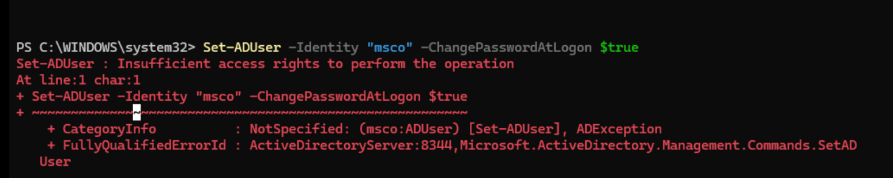
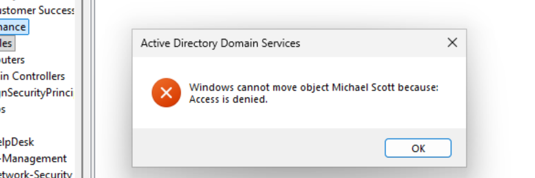
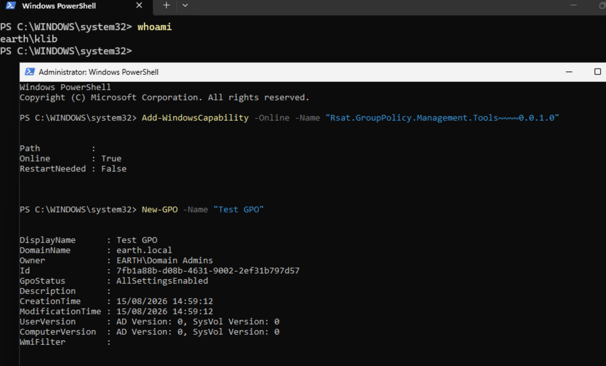
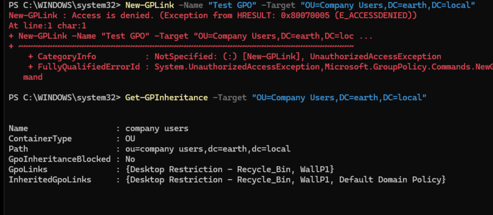
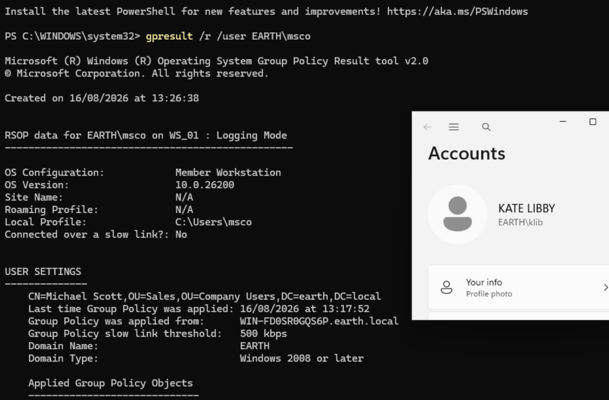
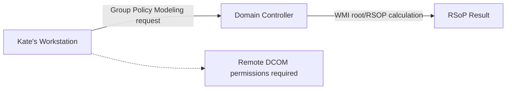
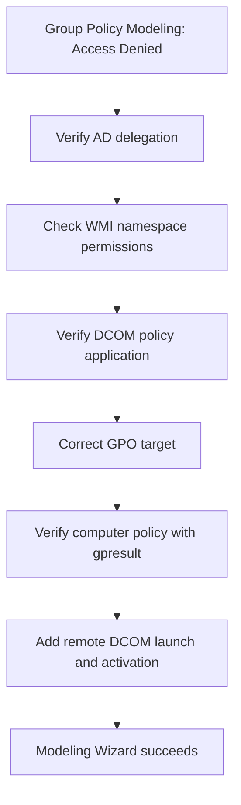

## Testing Delegated SysAdmin Permissions

After completing the Help Desk permission testing, I moved on to the standard SysAdmin role using **Kate Libby**, a member of `EL_SysAdmins`.

The purpose of this testing was to confirm that standard SysAdmins could complete approved support tasks while higher-risk actions remained restricted to the privileged `EL_Adm_SysAdmins` tier.

The tests covered:

- Reading user information
- Resetting passwords
- Requiring a password change at next logon
- Creating and deleting users
- Changing group membership and moving users between OUs
- Viewing Group Policy inheritance
- Creating GPO links
- Running RSoP Logging
- Running RSoP Planning through Group Policy Modeling

---

### Step 1: Verify Read Access to User Information

I first queried Michael Scott's account. Michael Scott (`msco`) is located in the `Sales` OU beneath `Company Users`.

```powershell
Get-ADUser -Identity "msco" `
    -Properties LockedOut, PasswordExpired, PasswordLastSet, `
                PasswordNeverExpires, LastLogonDate
```

The command completed successfully and returned the requested account information.

I repeated the test against Aiden Pearce, the IT Manager, and could also view his user information. This confirmed that the delegated **Read all properties** permission was working across the intended scope.

!!! success "User information could be read"
    Kate could retrieve user properties for accounts within both the `Company Users` and `IT` structures, as intended.

---

### Step 2: Test Password Reset Permissions

I reset Michael Scott's password:

```powershell
Set-ADAccountPassword -Identity "msco" -Reset `
    -NewPassword (ConvertTo-SecureString "Password1!" -AsPlainText -Force)
```

The password reset completed without an error.

I then attempted to require Michael to change the password at his next logon:

```powershell
Set-ADUser -Identity "msco" -ChangePasswordAtLogon $true
```

This command initially returned an **insufficient access rights** error.



*The password reset succeeded, but Kate initially lacked permission to require a password change at the next logon.*

Help Desk could already perform this action, and the visible permissions on the `Company Users` OU appeared similar for both groups.

On the Domain Controller, I reran the Delegation of Control Wizard. Instead of using a custom task, I selected the built-in option:

```text
Reset user passwords and force password change at next logon
```

After saving the change, I returned to Kate's workstation and reran the command. It completed successfully.

I then signed in as Michael Scott and received the password-change prompt, confirming that the corrected delegation worked end to end.

!!! success "Password delegation corrected"
    `EL_SysAdmins` could reset passwords and require users to change them at the next logon after the correct built-in delegation task was applied.

!!! tip "Delegation lesson"
    Two permissions that appear closely related in the interface may still be represented by different access-control entries. Testing each operation independently exposed the missing permission.

---

### Step 3: Confirm SysAdmins Cannot Create Users

I attempted to create a test user in the `Company Users` OU:

```powershell
New-ADUser -Name "Test User" `
    -SamAccountName "tuse" `
    -Path "OU=Company Users,DC=earth,DC=local" `
    -Enabled $true `
    -AccountPassword (ConvertTo-SecureString "Password1!" -AsPlainText -Force)
```

PowerShell returned:

<div class="error-message">
Access is denied.
</div>

This was the expected result. User creation remained reserved for the privileged `EL_Adm_SysAdmins` role.

!!! success "User creation remained restricted"
    Standard SysAdmins could not create Active Directory user objects.

---

### Step 4: Confirm SysAdmins Cannot Delete Users

I attempted to delete Michael Scott's account:

```powershell
Remove-ADUser -Identity "msco"
```

PowerShell asked me to confirm the action. After selecting **Yes**, the deletion failed with **Access is denied**.

This confirmed that standard SysAdmins could not delete user objects.

!!! success "User deletion remained restricted"
    The confirmation prompt did not indicate that the operation was authorised. Active Directory performed the permission check and denied the deletion.

---

### Step 5: Test Group Membership and OU Move Restrictions

I attempted to add Ebenezer Scrooge (`escr`) to the SysAdmin group:

```powershell
Add-ADGroupMember -Identity "EL_SysAdmins" `
    -Members "escr" `
    -ErrorAction Stop
```

The command returned **insufficient access rights**, as expected.

I also opened Active Directory Users and Computers with:

```text
dsa.msc
```

I attempted to drag Michael Scott from the `Sales` OU into the `Finance` OU. Active Directory returned an access-denied error.



These results confirmed that standard SysAdmins could not alter protected group membership or move users between departmental OUs.

!!! success "Object-management boundaries worked"
    Kate could support user accounts without being able to promote users into administrative groups or reorganise the OU structure.

---

### Step 6: Install the Group Policy Management Tools

Before testing Group Policy permissions, I needed to install the relevant RSAT component on the administrative workstation.

```powershell
Add-WindowsCapability -Online `
    -Name "Rsat.GroupPolicy.Management.Tools~~~~0.0.1.0"
```

After installation, I could open Group Policy Management with `gpmc.msc` and use the Group Policy PowerShell cmdlets.

Using an elevated administrative PowerShell session, I created a temporary GPO for link testing:

```powershell
New-GPO -Name "Test GPO Link"
```



*The Group Policy RSAT capability was installed and the temporary test GPO was created from the administrative session.*

!!! note "Separating setup from permission testing"
    The temporary GPO was created with an administrative session. Kate's delegated permissions were tested separately by attempting to link that existing GPO.

---

### Step 7: Verify GPO Inheritance and Link Restrictions

I first checked whether Kate could view Group Policy inheritance for `Company Users`:

```powershell
Get-GPInheritance `
    -Target "OU=Company Users,DC=earth,DC=local"
```

The first query returned no links. The GPOs had previously been linked to individual departmental OUs, such as `Sales`, because the `IT` OU had originally been located beneath `Company Users`.

I confirmed the previous configuration by querying the `Sales` OU:

```powershell
Get-GPInheritance `
    -Target "OU=Sales,OU=Company Users,DC=earth,DC=local"
```

This returned the expected links.

The revised OU structure placed IT outside `Company Users`, so I could now link the relevant user GPOs at `Company Users` without affecting IT accounts. After updating the links administratively, I ran:

```powershell
gpupdate /force
```

I then queried `Company Users` again and confirmed that the expected GPO inheritance was visible.


*`Get-GPInheritance` displayed the GPOs linked to `Company Users`.*

To test whether Kate could create a new link, I ran:

```powershell
New-GPLink -Name "Test GPO Link" `
    -Target "OU=Company Users,DC=earth,DC=local"
```

PowerShell returned:

<div class="error-message">
Access is denied.
</div>

I reran `Get-GPInheritance` and verified that the temporary GPO had not been linked.



!!! success "GPO permissions matched the design"
    Kate could inspect GPO inheritance but could not create a link. Visibility and configuration authority remained separate.

---

### Step 8: Run RSoP Logging

I wanted to confirm that SysAdmins could retrieve Resultant Set of Policy logging data for a user.

While signed in as Kate on a workstation previously used by Michael Scott, I ran:

```powershell
gpresult /r /user EARTH\msco
```

The workstation choice was important because RSoP logging data is generated by previous user activity. A workstation Michael had not used would not contain the required data.



*The command returned Michael Scott's applied Group Policy information.*

I signed out and repeated the command as Thomas Anderson, the Help Desk user. The command returned:

```text
The user "EARTH\msco" does not have RSoP data.
```

This aligned with the intended separation between the two roles. Thomas did not have access to Group Policy Management, whereas Kate could retrieve RSoP logging information.

!!! success "RSoP Logging confirmed"
    The standard SysAdmin role could retrieve applied Group Policy data for troubleshooting.

---

### Step 9: Test RSoP Planning

I then tested RSoP Planning through the Group Policy Modeling Wizard.

I opened:

```text
Win + R
└── gpmc.msc
    └── Group Policy Modeling
        └── Group Policy Modeling Wizard
            └── This domain controller
```

The wizard initially returned **Access is denied**.

#### Investigate Active Directory Delegation

After researching the error, I identified DCOM as a probable cause. I created a GPO called `DCOM Grants` and initially linked it to the `Sys-Admin` OU.

The policy was configured through:

```text
Computer Configuration
└── Windows Settings
    └── Security Settings
        └── Local Policies
            └── Security Options
```

I added `EL_SysAdmins` to the relevant DCOM access, launch and activation settings. The Modeling Wizard still failed.

I then attempted to verify the delegated RSoP rights with:

```powershell
dsacls "OU=Sys-Admin,OU=IT,DC=earth,DC=local" |
    Select-String "Result Set of Policy"
```

The command returned no matching output. However, RSoP Logging was already working and did not appear in the filtered output either.

This indicated that the text search was not reliably surfacing the delegated entries, likely because the permissions were represented by GUIDs rather than friendly names. The empty result was therefore a **false negative**, not proof that the rights were absent.

To remove any doubt about scope, I explicitly delegated RSoP Logging and Planning at the domain root. The Modeling Wizard still failed.

!!! tip "Do not over-trust a filtered diagnostic"
    A command that returns no text is not always proof that a permission is absent. Its output format and the search term must also be validated.

#### Investigate WMI Namespace Security

With AD delegation applied at the broadest relevant scope, I returned to the DCOM/WMI layer.

DCOM grants permission to invoke a service remotely, but the WMI provider performs a separate access check within its namespace.

Using `wmimgmt.msc`, I granted `EL_SysAdmins` the following permissions on `root\RSOP`:

- **Enable Account**
- **Remote Enable**
- **Execute Methods**

The issue persisted.

#### Identify the Incorrect GPO Target

I checked `dcomcnfg` directly on the Domain Controller. `EL_SysAdmins` did not appear in either **Edit Defaults** or **Edit Limits** for the DCOM access and launch permissions, despite the policy being configured.

This proved that the GPO had not applied to the Domain Controller.

The `DCOM Grants` GPO was linked to the `Sys-Admin` OU, which contained user accounts rather than computer objects. DCOM/WMI security governs access to the machine hosting the WMI provider. The policy therefore needed to target the Domain Controller computer, not the OU containing the users who required access.

I removed the incorrect link and linked `DCOM Grants` to the `Domain Controllers` OU.

On the Domain Controller, I ran:

```powershell
gpupdate /force
gpresult /r /scope:computer
```

`gpresult` now showed `DCOM Grants` as an applied computer policy. The Modeling Wizard still failed, but the policy-targeting problem had been corrected and independently verified.

#### Identify the Missing Remote DCOM Permissions

I reviewed the permissions applied through the GPO and found that **Local Launch** and **Local Activation** had been granted, but **Remote Launch** and **Remote Activation** had not.

The Group Policy Modeling Wizard ran on Kate's workstation while the RSoP calculation occurred on the Domain Controller. This made the operation a remote DCOM invocation.



Local-only launch and activation permissions could not authorise a caller on another machine.

I added **Remote Launch** and **Remote Activation** for `EL_SysAdmins` alongside the existing permissions.

After signing out and back in as Kate, I ran the Modeling Wizard again. This time it completed successfully.

!!! success "RSoP Planning confirmed"
    The Modeling Wizard worked after the DCOM policy was applied to the Domain Controller and the required remote launch and activation permissions were granted.

---

### Step 10: Understand the Troubleshooting Sequence

The RSoP Planning failure was not caused by one missing permission. The investigation exposed multiple independent layers.



The two decisive configuration issues were:

1. `DCOM Grants` targeted a user OU rather than the Domain Controller's computer object.
2. The DCOM configuration granted local permissions but omitted the remote permissions required by the workflow.

!!! info "Known-good baseline"
    The final configuration may grant more access than the strict minimum required. I retained the working baseline rather than immediately removing permissions and risking the loss of a known-good state.

A future hardening exercise could create a separate test group and add or remove the DCOM/WMI permissions individually to identify the minimum viable permission set.

---

### Final Validation Summary

| Test | Expected result | Actual result | Status |
| --- | --- | --- | --- |
| Read user properties | Allowed | User information returned | Pass |
| Reset user password | Allowed | Password reset completed | Pass |
| Require password change | Allowed | Initially denied; delegation corrected and retested successfully | Pass |
| Create users | Denied | Access denied | Pass |
| Delete users | Denied | Access denied | Pass |
| Change group membership | Denied | Insufficient access rights | Pass |
| Move users between OUs | Denied | Access denied | Pass |
| View GPO inheritance | Allowed | Linked GPOs returned | Pass |
| Create GPO links | Denied | Access denied and no link created | Pass |
| RSoP Logging | Allowed | Applied GPO data returned | Pass |
| RSoP Planning | Allowed | Successful after DCOM/WMI troubleshooting | Pass |

---

### Key Takeaways

This exercise reinforced several important lessons:

- Delegated permissions should be tested operation by operation rather than assumed from their labels.
- Read access does not imply permission to create, delete, move or modify objects.
- Group Policy visibility and GPO-link management are separate permissions.
- A GPO must target the computer that consumes a computer-side security policy.
- Configuration should be verified on the destination system rather than assumed to have applied.
- DCOM and WMI perform separate access checks.
- Remote administrative workflows may require different permissions from local workflows.
- A diagnostic command returning no output can be a false negative if the search does not match the underlying representation.
- Infrastructure troubleshooting is more reliable when each layer is isolated and tested independently.
