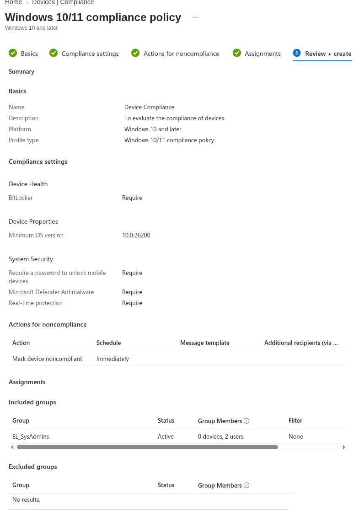
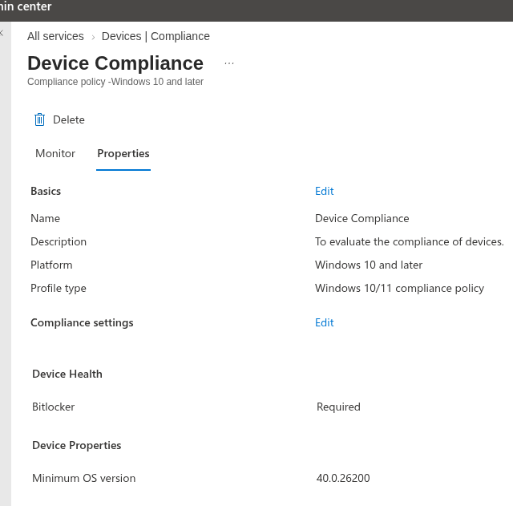
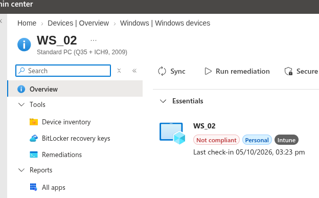
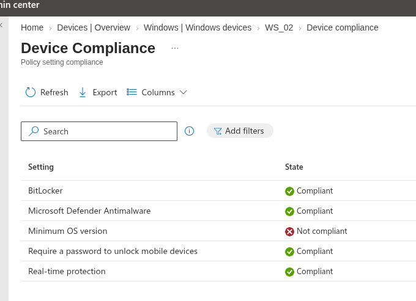
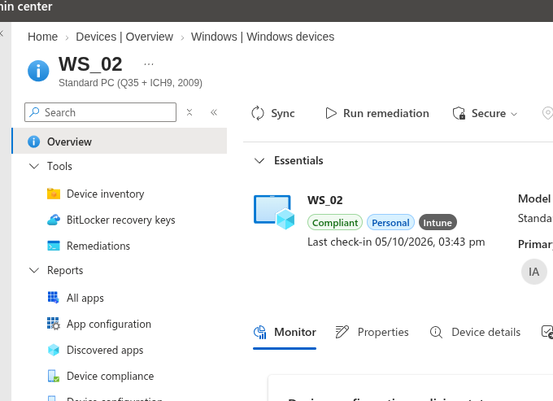

# Intune Compliance Policies

After the MFA exercise I wanted to go deeper into access policies. I wanted to create a policy that would determine whether a device/workstation is compliant with my company policy or not, then link it to a Conditional Access policy that would allow access only for devices which are compliant.

## Creating the Compliance Policy

**Intune admin center → Compliance (under "Manage devices") → Create Policy**

I selected the platform as **Windows 10 and later** and configured the desired compliance settings:

* BitLocker
* Minimum OS version — entered as the earliest version WS_01/WS_02 are currently running
* Require passwords
* Defender: Real-time protection

For non-compliance actions, **"Mark device noncompliant"** was automatically configured to **Immediately**.

The group I chose for testing was `EL_SysAdmins` — a user group with a sample size of 2 users. Then I clicked Create.



To test, I logged in to WS_01 as Administrator so I could sync with Entra before testing:

**Settings → Accounts → Access work or school → (Entra domain) → Info → Sync**

## First Test — Policy Not Reaching the Device

The compliance policy was assigned to `EL_SysAdmins`, a *user* group, but drilling into WS_01's device compliance status showed no real evaluation against my custom policy at all — instead it showed the **Default Device Compliance Policy** fallback, with:

```text
Has a compliance policy assigned
Error 65001 (Not applicable)
```

This is Intune's built-in fallback policy stepping in because, as far as the device is concerned, no custom compliance policy actually applies to it. The reason became clear once I thought about how WS_01 was enrolled and how my workstations are organised: on-prem, my workstations sit in their own OU, but **OUs have no equivalent in Entra/Intune** — every Intune assignment needs a real Entra security group, and a user-scoped group like `EL_SysAdmins` was never going to match a device-based evaluation regardless of who signed in in the process.

!!! failure "Wrong assignment type for a device policy"
    Assigning a device compliance policy to a *user* group only works reliably when the group's members are also the device's primary user. Since WS_01's primary user was set by whichever account completed enrolment (Administrator, not one of the actual named users), a user-group assignment was never going to reach it consistently. What the policy actually needed was a *device* group.

## Building a Device Group for the Workstations

I had to add the workstation to a group so the compliance policy could be applied to the *workstation* rather than a user. I created the group in Intune via:

**Groups → New Group**

* Group type: **Security**
* Name: `Intune Workstations`
* Membership type: **Dynamic Device**
* Rule: `(device.displayName -startsWith "WS_")`

So any device that follows my naming convention gets added to this group dynamically. After around 5 minutes, the workstations were added to the group.

!!! note "You cannot manually add members to a dynamically-membered group"
    I tried adding WS_01 to the group manually before the dynamic rule had picked it up, and got: *"Failed to add group member — Unable to add the selected members. This may be due to a permission or policy restriction."* Once a group's membership type is set to Dynamic Device, membership is computed exclusively by the rule engine — manual additions are blocked outright, regardless of whether the rule itself is correct. The fix isn't to force a member in; it's to wait for the rule to evaluate, or fix the rule if it isn't matching.

I then added the `Intune Workstations` group to the compliance policy's assignment, and removed `EL_SysAdmins`.

## Still Not Evaluating After the Reassignment

Even after reassigning to the device group, WS_01's device compliance status was still showing the same signal as before:

```text
Has a compliance policy assigned
Error 65001 (Not applicable)
Is active
Compliant
Enrolled user exists
Compliant
```

for the **Default Device Compliance Policy** — meaning the tenant was still falling back rather than evaluating my custom policy against WS_01. I worked through:

* Confirming the `Intune Workstations` group was genuinely listed under **Included groups** on the custom policy's Assignments tab, not just populated as a group on its own
* Checking the policy's **Monitor** tab for a device count, to see whether the assignment had registered at all
* Allowing for propagation delay — group membership and policy assignment changes don't apply to a device instantly, and a forced device Sync doesn't guarantee the backend has processed the reassignment yet

## Resolution — Onboarding to Microsoft Defender

The compliance policy includes the **Defender: Real-time protection** requirement, so the next step was onboarding the workstations to Microsoft Defender for Endpoint (see my [MS Defender](ms_defender.md) notes). After that, and after adding WS_02 to the domain, all devices showed as **compliant**.

!!! success "Compliance policy now evaluating and passing"
    With the device group assignment in place and the workstations onboarded to Defender, WS_01 and WS_02 both report as compliant against the custom policy.

## Testing That the Policy Detects Non-Compliance

I wanted to confirm that the compliance policy would update if a device was no longer compliant, so I changed the minimum OS version from `10.0.26200` to `40.0.26200` via:

**Intune → Devices → Compliance → (select the policy) → Properties → Edit "Compliance settings"**



!!! note "Why the OS version rather than turning off Defender"
    My first idea was to switch off real-time protection on a workstation, but the toggle was greyed out even when signed in as an admin, and a PowerShell attempt and a GPO couldn't change it either. That's most likely Tamper Protection, which stops real-time protection being changed locally once the device is managed and onboarded to Defender. Raising the minimum OS version tests the same thing (does the policy catch a failing rule and update the device's status) without touching the endpoint.

Then I checked the device list in Intune. (Note that I only powered on WS_02 for this test.) I could see that WS_02 was no longer compliant.



Drilling down on the non-compliance, by clicking the red **Not compliant** banner under WS_02's profile name and then the non-compliant policy, I could see that the only non-compliance was correctly showing as the minimum OS version.



After this verification, I reverted the OS version to the previous value and then synced WS_02 in Intune to verify that the device was compliant once again.



!!! success "Compliance policy confirmed working in both directions"
    The policy flagged WS_02 as non-compliant when a rule was no longer met, identified the exact failing setting, and returned the device to compliant once the setting was reverted and the device synced.

---

## Final Validation Summary

| Test | Result |
|---|---|
| Compliance policy created (BitLocker, min OS version, passwords, Defender) | ✅ Done |
| Initial assignment to `EL_SysAdmins` (user group) | ❌ Never evaluated against WS_01 — Default policy fallback (error 65001) |
| Root cause: OUs have no Entra equivalent, device policy needs a device group | ✅ Identified |
| Dynamic device group `Intune Workstations` created | ✅ Done |
| Manual add to dynamic group | ❌ Fails by design — dynamic groups don't accept manual membership |
| WS_01 added to dynamic group automatically | ✅ YES, after ~5 minutes |
| Compliance policy reassigned to device group | ✅ Done |
| Custom policy evaluating against WS_01 | ❌ Still showing Default Compliance Policy fallback after reassignment |
| Workstations onboarded to Microsoft Defender for Endpoint | ✅ Done (see MS Defender page) |
| WS_01 and WS_02 compliant against the custom policy | ✅ YES |
| Minimum OS raised to `40.0.26200`: WS_02 flips to non-compliant | ✅ YES |
| Drill-down shows only the minimum OS rule failing | ✅ YES |
| OS version reverted and WS_02 synced: back to compliant | ✅ YES |

---

## Key Takeaways

* **A device compliance policy needs a device-based assignment, not a user-based one.** A user group only reaches a device indirectly, through its primary user — and that primary user isn't always who you expect, especially if enrolment was done interactively under a different account.
* **OUs have no equivalent in Entra or Intune.** Any assignment — compliance policy, Conditional Access, configuration profile — needs an actual Entra security group. A dynamic device group with a naming-based rule is the practical substitute for an on-prem OU.
* **Dynamic groups compute membership exclusively from their rule.** Manual "Add member" attempts are rejected outright, which produces a generic permission-style error that has nothing to do with the rule's correctness.
* **A compliance policy is only as good as the signals behind it.** The Defender real-time protection requirement only became meaningful once the workstations were actually onboarded to Defender for Endpoint, and compliance came through after that.
* **A policy that only ever shows "compliant" hasn't proven anything.** Deliberately failing a rule (here, an unreachable minimum OS version) showed that the policy detects a failing setting, names the exact rule that failed, and recovers once the setting is reverted and the device syncs.
* **The Default Device Compliance Policy fallback (error 65001, "Has a compliance policy assigned — Not applicable") is a diagnostic signal, not just noise.** Seeing it persist after reassignment means the real policy still isn't reaching the device — worth checking assignment scope and propagation delay before assuming a settings problem.
