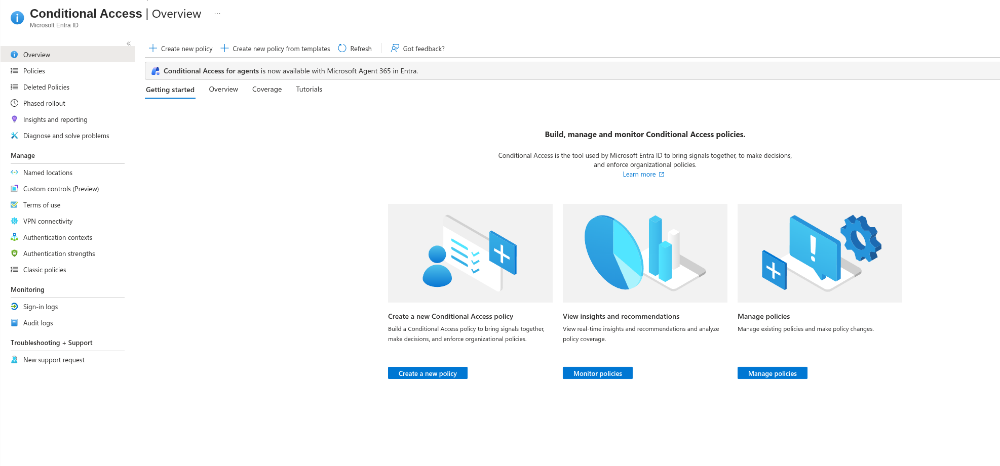
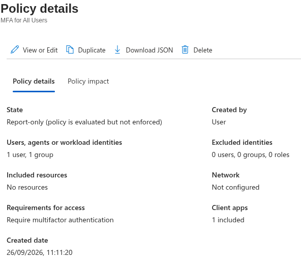
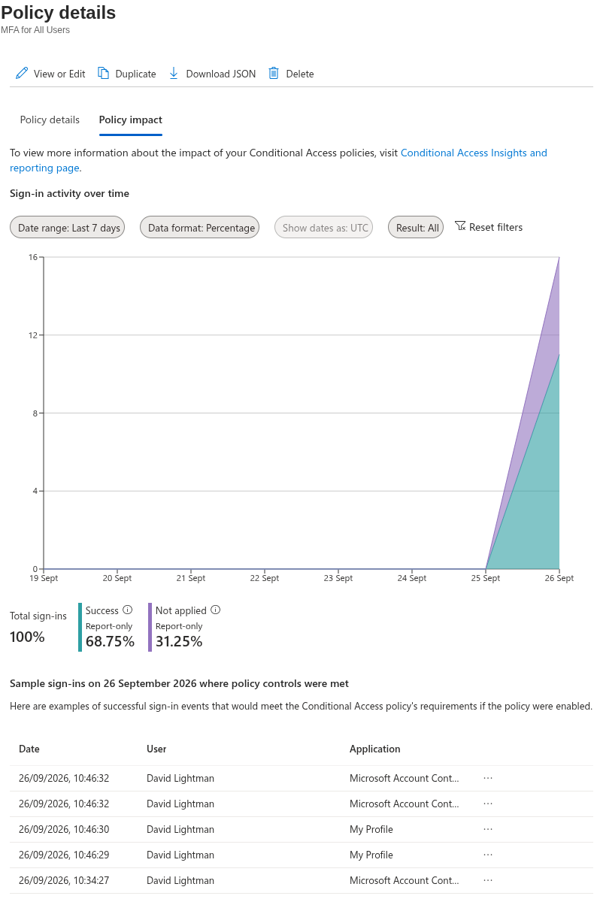
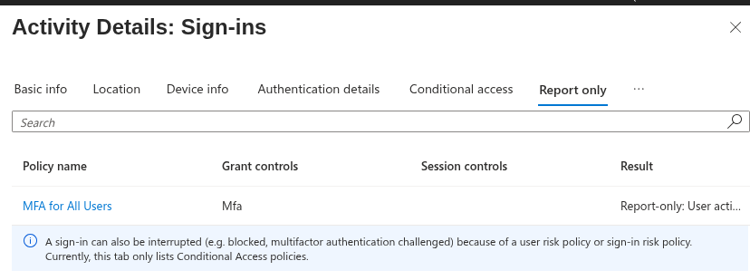
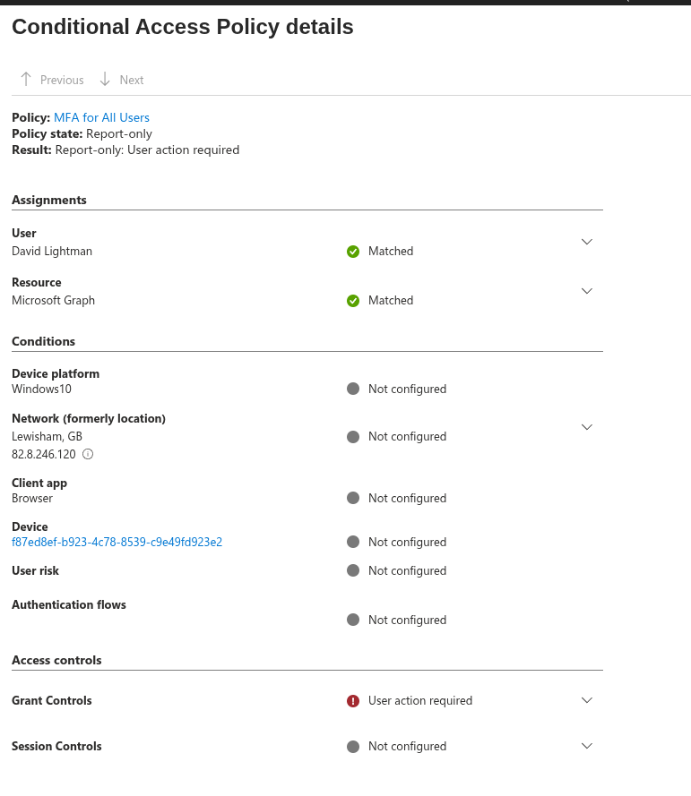

# Conditional Access Policies

By default, organisations on Entra are protected by **Security Defaults**. This can be viewed via **Admin Center → Identity → Overview → Properties → Manage Security Defaults**. These protect an organisation automatically from the moment of sign-up. When I tried to sign in as David Lightman to his Azure portal, this is why MFA was required.

If needed, customised protections can be configured instead.

## Creating a Custom Conditional Access Policy

I decided to set up a new policy using Conditional Access in the Entra Admin Center, under the Identity section:

**Identity → Conditional Access → Create new policy**

I created an **"MFA for All Users"** policy, but for the users assignment I initially scoped it to David Lightman and the `EL_General` security group only, to allow for testing with a small sample size. The policy was initially saved in **Report-only** mode.

I then logged in as a user from the defined group (David Lightman) to test. No MFA prompt showed as expected, since a Report-only policy evaluates but never enforces.

!!! note "Security Defaults and custom Conditional Access policies don't run side by side"
    Turning off Security Defaults on Entra automatically turns on the Default Microsoft Conditional Access policies (Microsoft's own baseline set) in its place. The two systems aren't meant to be layered — it's one or the other.

## Verifying Report-Only Results

Since no prompt appears in Report-only mode, I needed another way to confirm the policy was actually evaluating correctly. There were a few places I could check:

**1. Policy Impact, from the policy itself**

**Identity → Conditional Access → Policies → (the created policy) → Policy impact**

This shows a graph of logs where the policy was successfully applied versus not applied. Clicking into either the success or not-applied section of the chart shows a sample of individual sign-in logs.

**2. Conditional Access sign-in logs**

**Identity → Conditional Access → Sign-in logs** (under the Monitoring tab) → click a log entry to bring up the Activity Details screen → select **Report-only** (or **Conditional Access**, for policies in an "On" state).

**3. Sign-in logs, drilled down per policy**

**Identity → Monitoring & health → Sign-in logs** → click a log entry to bring up the Activity Details screen → select **Report-only** (or **Conditional Access**, for policies in an "On" state) → click on a policy to drill down into its individual result.

!!! success "Report-only mode confirmed working"
    The drill-down showed the policy correctly evaluating against the test sign-in, without enforcing MFA — exactly the behaviour Report-only mode is meant to provide.

## Enabling the Policy

After confirming the policy evaluated correctly in Report-only mode, I turned the MFA policy fully **On**. Logging in again as the same test user, I was prompted for MFA this time.

---

## Final Validation Summary

| Test | Result |
|---|---|
| Security Defaults enforcing MFA by default | ✅ Confirmed (triggered on David Lightman's initial sign-in) |
| Custom Conditional Access policy created, scoped to a small test group | ✅ Done |
| Report-only mode: no MFA prompt shown | ✅ Expected behaviour, confirmed |
| Report-only evaluation confirmed via Policy Impact | ✅ YES |
| Report-only evaluation confirmed via sign-in log drill-down | ✅ YES |
| Policy switched to On, MFA prompt enforced | ✅ YES |

---

## Key Takeaways

* **Security Defaults and custom Conditional Access policies are mutually exclusive, not layered.** Disabling Security Defaults doesn't leave a gap. Microsoft's own Default Conditional Access policies switch on to replace it.
* **Report-only mode has no visible sign-in effect by design**, so confirming it's actually working requires checking the logs rather than the sign-in experience itself.
* **A top-level "Not applied" isn't the same as "Report-only: Not applied."** The distinction matters: a plain "Not applied" points to a scoping problem (wrong user, group, app or condition), while a "Report-only:" prefixed result confirms the policy is evaluating correctly and simply not enforcing yet.
* **Policy Impact and the sign-in log drill-down are complementary, not redundant** — Policy Impact gives the aggregate picture across many sign-ins, while drilling into an individual sign-in log confirms the exact per-policy result for one test at a time.
