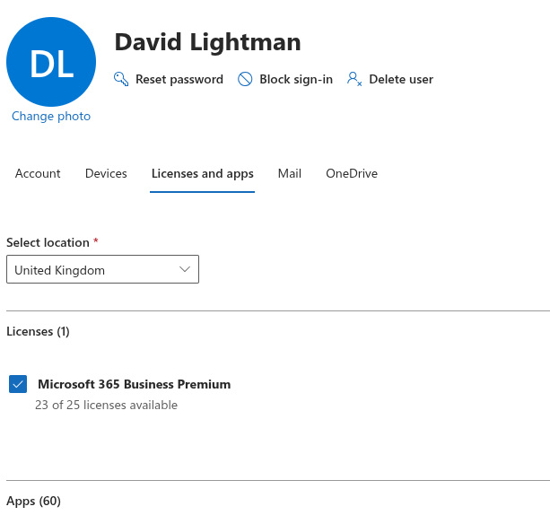
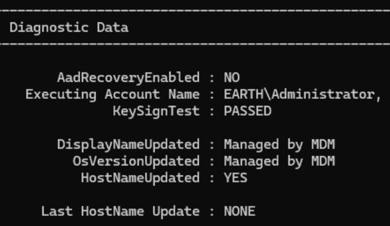
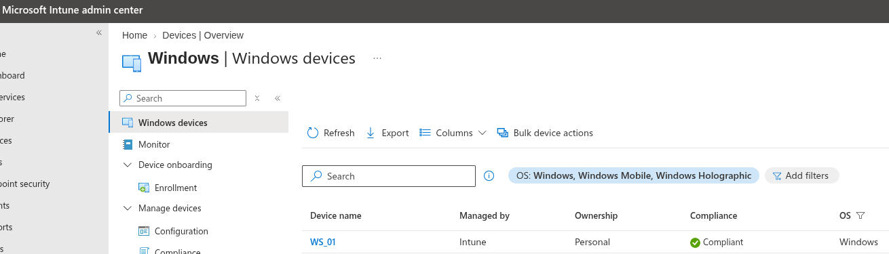

# Device Enrolment

With WS_01 now hybrid joined, I wanted to enrol the device onto Intune for device management. (Join gets it into Entra, enrolment gets it under Intune's control.)

## 1. Confirm MDM Auto-Enrolment Is Turned On for the Tenant

* I did this via: **Intune admin center → Devices → Enrollment → Automatic Enrollment**.
* I set **MDM user scope** to **All** (this is what tells Windows to auto-enrol hybrid-joined and Azure AD joined devices into Intune).
* I confirmed that the MDM discovery URL and terms-of-use URLs were populated (should be automatic once Intune is licensed).

## 2. Confirm Licensing Is Actually Assigned

* I signed in as David Lightman on WS_01, so I went to the M365 admin center and gave him a licence for M365 (I had 25 licences to distribute). The M365 licence meant that David's account now had an Intune-capable licence assigned.



## 3. Attempted to Trigger Enrolment Manually

Rather than wait for the scheduled sync interval, I tried to trigger the enrolment task directly:

```powershell
Start-ScheduledTask -TaskName "\Microsoft\Windows\EnterpriseMgmt\Schedule #1"
```

```text
Start-ScheduledTask : The system cannot find the file specified.
```

!!! note "Not a misconfiguration — the task simply didn't exist yet"
    This scheduled task folder is only created once MDM enrolment has actually started at least once. Its absence told me enrolment genuinely hadn't fired yet, rather than pointing to a broken trigger.

## 4. Checked the Obvious Prerequisites First

Before digging further, I confirmed the basics were actually in place:

* `MdmUrl` under **Tenant Details** in `dsregcmd /status` — **blank**
* Licence assigned to the test user — **confirmed**
* MDM user scope — **confirmed set to All**

With the scope, licence and device join all in place but `MdmUrl` still blank, this pointed to enrolment not starting at all rather than a scoping problem.

## 5. Root Cause: Auto-Enrolment Rides the Same Silent Token Flow as PRT

MDM auto-enrolment on a hybrid-joined device runs through the same silent, background token acquisition (WAM/PRT) I'd already found broken for my UPN suffix (`earthlocal.com`/`earth.local`, unverified — see my [hybrid join](hybrid_join.md) notes). The enrolment task needs a token for the MDM enrolment service, acquired silently using the signed-in account's UPN, so it never had a real chance to succeed while PRT was blocked for that account.

!!! failure "Correction to an earlier assumption"
    I'd originally assumed PRT/SSO failing wouldn't block Intune enrolment, on the basis that enrolment depends on the device's Azure AD join state rather than user PRT. That's not correct for a hybrid-joined device specifically — device join gets the device *registered*, but *automatic* enrolment still depends on that same silent user-token flow succeeding.

## 6. Working Around It — Interactive Enrolment

The interactive browser sign-in flow (already proven to work for a verified identity via `myaccount.microsoft.com`) is a separate authentication path from the silent PRT one, and isn't blocked by the same issue.
So signing in to the workstation as Administrator:

* **Settings → Accounts → Access work or school → + Connect**
* Signed in interactively with a verified identity
* Sync completed successfully

## 7. Confirming Enrolment Succeeded

Two fields in `dsregcmd /status` flagged success without needing anything from Tenant Details:

```text
DisplayNameUpdated : Managed by MDM
OsVersionUpdated : Managed by MDM
```


`dsregcmd` only shows `Managed by MDM` on these fields once Intune has actually taken over responsibility for updating them — a genuine enrolment success marker, not just a status label.

I confirmed independently in two places:

* **Intune admin center → Devices → All devices** — WS_01 appears with a management state
* `MdmUrl` under **Tenant Details**, however, **stayed blank across four consecutive re-runs** of `dsregcmd /status`



!!! note "MdmUrl is stale, not a live indicator"
    Tenant Details appears to reflect the state captured at the *original* join handshake, before MDM was configured, and doesn't get refreshed by a later enrolment that happens through a different flow. `TenantName` stayed blank throughout for the same reason. The reliable confirmation of enrolment is the Intune admin center (cross-checked against Microsoft Graph, since the admin center's Devices blade had already shown itself to be unreliable once earlier in this project) plus the `Managed by MDM` diagnostic markers — not this field.

!!! success "Device enrolment confirmed"
    WS_01 shows as an enrolled, managed device in Intune. Achieved via the interactive "Connect" enrolment path rather than silent auto-enrolment, consistent with the same domain-verification limitation already documented and accepted for PRT/SSO in my hybrid join notes.

## 8. Testing Whether a GPO Would Fix Silent Enrolment

Before accepting the interactive workaround as final, I wanted to check whether the silent path could be fixed properly rather than worked around, I found that Microsoft's documented mechanism for silent MDM auto-enrolment on a **hybrid-joined** device (as opposed to a purely Azure AD joined one) could depend on a specific Group Policy setting, which I had never configured:

* **Computer Configuration → Policies → Administrative Templates → Windows Components → MDM → Enable automatic MDM enrollment using default Azure AD credentials** → **Enabled**
* Set to **User Credential**, since WS_01 has a normal interactive signed-in user (David Lightman) and I want policies/apps targeted at users, not just the device identity. **Device Credential** is the option for scenarios without an interactive user at enrolment time such as Autopilot self-deploying/white-glove mode, kiosk or shared devices, or ConfigMgr co-management triggering enrolment before sign-in.
* Linked the GPO to the OU containing WS_01's computer object, then ran `gpupdate /force` and confirmed via `gpresult /r` that it applied.

!!! note "Two separate blockers, not one"
    This GPO is genuinely necessary for a hybrid-joined device to even attempt silent enrolment. Without it, the device has no instruction to try. But it doesn't fix the underlying domain-verification problem: the silent attempt it enables still needs to acquire a token for the same unverified UPN suffix. These are two independent requirements, not two explanations for the same thing.

After applying the GPO, `MdmUrl` was still blank. This confirmed both blockers were genuinely stacked — the GPO fixed the "never even tries" half, but the "can't get a token" half remains, and is the actual reason it fails.

## 9. Forcing an Enrolment Attempt Directly

To rule out timing (waiting for the next scheduled interval) rather than a hard failure, I forced the enrolment attempt directly instead of waiting:

```powershell
Start-Process "$env:windir\system32\deviceenroller.exe" -ArgumentList "/c /AutoEnrollMDM" -Verb RunAs
```

`MdmUrl` was still blank afterward. However, checking the scheduled tasks this time showed something worth recording:

```powershell
Get-ScheduledTask -TaskPath "\Microsoft\Windows\EnterpriseMgmt\*"
```

```text
TaskPath                                       TaskName                          State
--------                                       --------                          -----
\Microsoft\Windows\EnterpriseMgmt\             Schedule created by enrollment... Ready
\Microsoft\Windows\EnterpriseMgmt\0EE83119-... OS Edition Upgrade event liste... Ready
\Microsoft\Windows\EnterpriseMgmt\0EE83119-... Passport for Work alert create... Ready
\Microsoft\Windows\EnterpriseMgmt\0EE83119-... Policy Manager Login Refresh S... Ready
\Microsoft\Windows\EnterpriseMgmt\0EE83119-... Provisioning initiated session    Ready
\Microsoft\Windows\EnterpriseMgmt\0EE83119-... PushLaunch                        Ready
\Microsoft\Windows\EnterpriseMgmt\0EE83119-... PushRenewal                       Ready
\Microsoft\Windows\EnterpriseMgmt\0EE83119-... Schedule #1 created by enrollm... Ready
\Microsoft\Windows\EnterpriseMgmt\0EE83119-... Schedule #2 created by enrollm... Ready
\Microsoft\Windows\EnterpriseMgmt\0EE83119-... Schedule #3 created by enrollm... Ready
\Microsoft\Windows\EnterpriseMgmt\0EE83119-... Schedule created by dm client ... Ready
\Microsoft\Windows\EnterpriseMgmt\0EE83119-... Schedule created by enrollment... Ready
\Microsoft\Windows\EnterpriseMgmt\0EE83119-... Schedule to run OMADMClient by... Ready
\Microsoft\Windows\EnterpriseMgmt\0EE83119-... Schedule to run OMADMClient by... Ready
\Microsoft\Windows\EnterpriseMgmt\0EE83119-... Win10 S Mode event listener cr... Ready
\Microsoft\Windows\EnterpriseMgmt\0EE83119-... Wsc Startup event listener cre... Disabled
```

!!! note "This is the full, real enrolment task set, but from the earlier interactive enrolment, not this attempt"
    This `EnterpriseMgmt` folder is now populated with the complete standard OMA-DM/Intune management task set (`PushLaunch`, `PushRenewal`, the `OMADMClient` schedules). Genuine evidence that management is actively running in the background, beyond just the `Managed by MDM` status markers. Since WS_01 was already enrolled via the interactive Connect flow, Windows most likely recognised the existing enrolment and didn't create a second one for this forced attempt, rather than this being fresh proof that the GPO-plus-device path succeeded independently. Properly isolating that would mean unenrolling WS_01 and retesting from clean which is not worth the disruption here, since the interactive path is already confirmed sufficient and the domain-verification blocker is documented and accepted either way.

---

## Final Validation Summary

| Test | Result |
|---|---|
| MDM user scope configured | ✅ Set to All |
| Licence assigned to test user | ✅ Confirmed |
| Silent MDM auto-enrolment | ❌ Fails — blocked by the same silent token flow as PRT |
| Interactive enrolment via Access work or school → Connect | ✅ Succeeded |
| Device shown as managed in Intune admin center | ✅ YES |
| `Managed by MDM` markers on device attributes | ✅ YES |
| `MdmUrl` in `dsregcmd /status` | ❌ Stays blank (stale field, not a reliable indicator) |
| GPO for silent auto-enrolment (User Credential) | ✅ Configured correctly, confirmed via `gpresult /r` |
| Silent enrolment after GPO + forced retry (`deviceenroller.exe`) | ❌ Still blocked — domain-verification limitation, not a GPO gap |
| Full `EnterpriseMgmt` scheduled task set present | ✅ YES — genuine ongoing management confirmed |

---

## Key Takeaways

* **Device join and device enrolment are two different things.** Hybrid Azure AD join gets a device registered in Entra; Intune enrolment is a separate step on top of that, and one can succeed without the other.
* **Silent MDM auto-enrolment and PRT share the same failure point.** A domain-verification problem that looks like it only affects SSO can also silently block Intune auto-enrolment on a hybrid-joined device, since both depend on the same background token acquisition.
* **A scheduled task that "doesn't exist" can be diagnostic information, not an error to fix.** The `EnterpriseMgmt` task folder is only created once enrolment has actually started and its absence confirmed where the process was stalling rather than indicating a broken command.
* **The interactive "Connect" flow is a genuine, separate path around a broken silent flow**, and worth trying whenever a background process depends on token acquisition that's already known to be blocked.
* **Not every `dsregcmd` field reflects live state.** `MdmUrl` and `TenantName` under Tenant Details stayed blank even after enrolment genuinely succeeded. They appear to reflect the original join handshake rather than being refreshed afterward. The Intune admin center, cross-checked against Graph, plus the `Managed by MDM` diagnostic markers, was the reliable signal.
* **A hybrid-joined device needs its own GPO to attempt silent enrolment at all.** This isn't automatic the way it is for a purely Azure AD joined device. But confirming the GPO applied correctly and *still* seeing `MdmUrl` blank was a clean way to isolate that two independent blockers existed, not one: the missing instruction to try (now fixed) and the broken token acquisition underneath it (still the accepted lab limitation).
