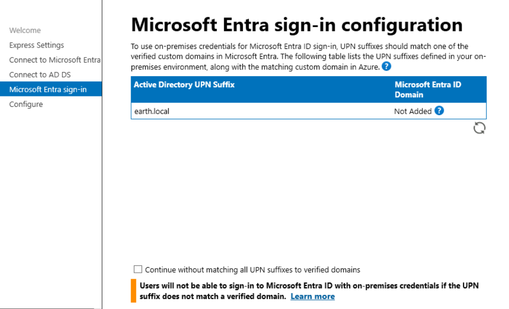
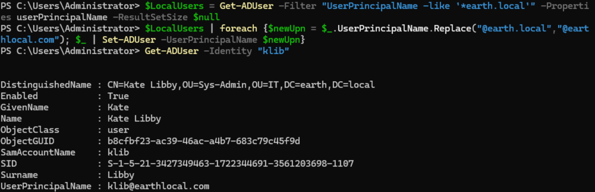
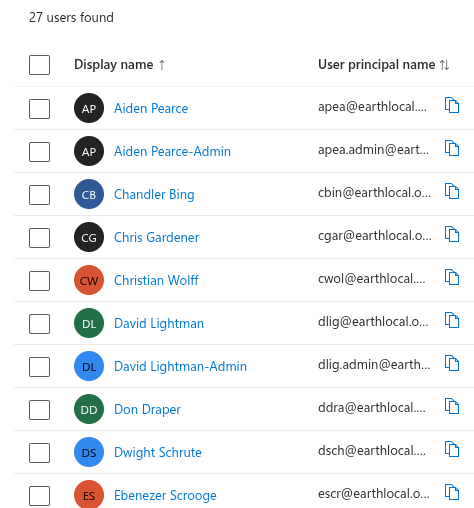
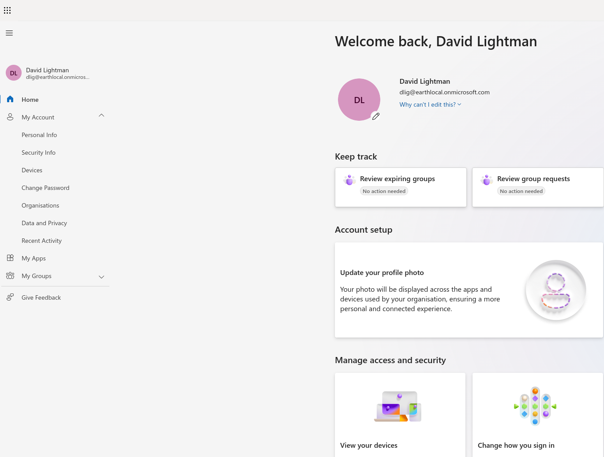
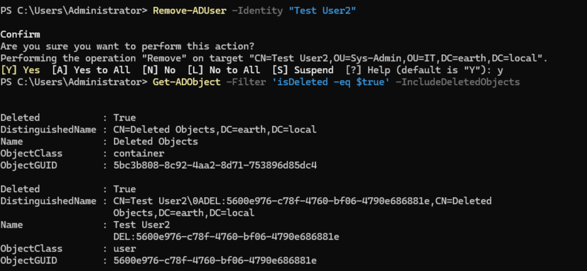
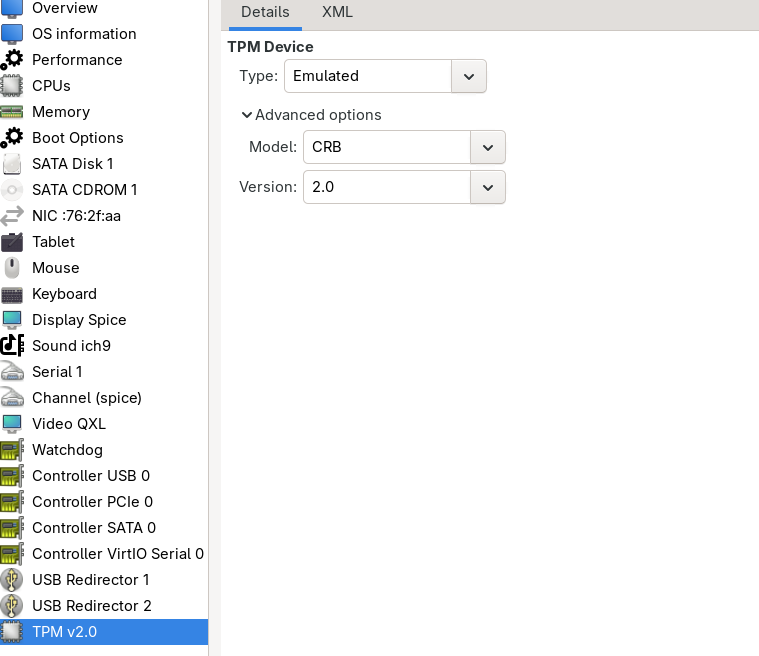
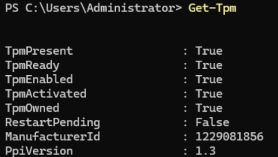

## Directory Synchronisation

Currently my domain is fully local, Active Directory only. I wanted to introduce some cloud and MDM concepts, so I signed up to Microsoft Entra and Intune.

What I needed to do first was something called Directory Synchronisation. This allows Active Directory and Entra ID to be synced. This can be achieved using **Microsoft Entra Connect**.

I downloaded the Microsoft Entra Connect agent and went through the installation process, choosing the **Express Installation** option. Once I reached the Microsoft Entra sign-in tab, I saw a message regarding Active Directory UPN Suffixes:

!!! warning "UPN suffix warning"
    Users would not be able to sign in to Microsoft Entra ID with on-prem credentials if the suffix does not match a verified domain.



Entra would add a suffix to the login, so to make the login smoother I decided to update the UPN from `earth.local` to [earthlocal.com](http://earthlocal.com), which would then be represented by Microsoft Entra as [earthlocal.onmicrosoft.com](http://earthlocal.onmicrosoft.com). I used the steps from [this Microsoft Learn article](https://learn.microsoft.com/en-us/microsoft-365/enterprise/prepare-a-non-routable-domain-for-directory-synchronization?view=o365-worldwide#what-if-i-only-have-a-local-on-premises-domain).

### Step 1: Add the new UPN suffix

- On the AD DS domain controller, in Server Manager, chose **Tools > Active Directory Domains and Trusts**.
- In the Active Directory Domains and Trusts window, right-clicked **Active Directory Domains and Trusts**, then chose **Properties**.
- On the **UPN Suffixes** tab, in the Alternative UPN Suffixes box, typed the new UPN suffix, then chose **Add > Apply**.

### Step 2: Change the UPN suffix for existing users

I did this using PowerShell:

```powershell
$LocalUsers = Get-ADUser -Filter "UserPrincipalName -like '*earth.local'" -Properties userPrincipalName -ResultSetSize $null
$LocalUsers | foreach {$newUpn = $_.UserPrincipalName.Replace("@earth.local","@earthlocal.com"); $_ | Set-ADUser -UserPrincipalName $newUpn}
```

I then ran `Get-ADUser -Identity "klib"` to verify the change had taken place for one of my users.



After this was done, I clicked **Install** from the Configure tab.

Once the install was complete, I checked my Microsoft Entra ID admin center and saw all my users were now showing.



!!! success "Directory synchronisation confirmed"
    All on-prem Active Directory users appeared correctly in the Microsoft Entra ID admin center, confirming Entra Connect had synced successfully with the updated UPN suffix.

## Sign-In Testing

I next wanted to do a sign-in test: signing in with one of the users into their new [My Account portal](https://myaccount.microsoft.com/), and also signing in locally as they were able to previously.

I signed in as David Lightman into WS_01. The login was no longer `@earth.local`, but rather `@earthlocal.com`. This was successful.

I then signed in to the Azure Portal as David using an `@earthlocal.onmicrosoft.com` suffix. I had to set up an authenticator app to complete the login, but after doing so, this was successful.



!!! success "Sign-in confirmed on-prem and cloud"
    David could sign in locally to WS_01 with the updated `@earthlocal.com` UPN, and separately sign in to the Azure Portal with the `@earthlocal.onmicrosoft.com` suffix after completing MFA setup. Both paths worked, confirming the hybrid identity was functioning correctly on both sides.

---

## AD Recycle Bin

Now that Entra Connect is syncing live, I wanted to enable the AD Recycle Bin. Without it, deleting an object in AD removes it in a way that is difficult to recover from, the object is tombstoned and most attributes are stripped rather than being cleanly restorable. With Entra Connect syncing, an accidental on-prem deletion doesn't just affect AD, it propagates to Entra ID too, so having a clean, one-command restore path is more valuable now, not less.

I enabled it via:

```powershell
Enable-ADOptionalFeature -Identity 'Recycle Bin Feature' -Scope ForestOrConfigurationSet -Target earth.local
```

### Testing

I deleted a test account, "Test User2", then confirmed it appeared in the Recycle Bin via:

```powershell
Get-ADObject -Filter 'isDeleted -eq $true' -IncludeDeletedObjects
```

Test User2 showed here as expected.

I restored the object via:

```powershell
Get-ADObject -Filter 'isDeleted -eq $true' -IncludeDeletedObjects | Where-Object {$_.Name -like "*Test User2*"} | Restore-ADObject
```

Confirmed the restore via:

```powershell
Get-ADUser -Identity "Test User2"
```

which returned the user normally, no longer showing as deleted.

!!! note "Recycle Bin restores more than a plain tombstone recovery"
    Unlike a plain tombstone-based recovery, an AD Recycle Bin restore returns the object to its original OU and restores attributes such as group membership, not just the bare object. Confirmed this by checking `Get-ADUser -Identity "Test User2" -Properties MemberOf` after the restore.

!!! success "AD Recycle Bin confirmed working"
    Test User2 was successfully deleted, located in the Recycle Bin, and restored with its original properties intact.

## Configuring a Virtual TPM

The Entra Connect installer suggested configuring TPM on the sync server to make the setup more secure. In a real deployment, the Entra Connect server is a genuinely high-value target, since compromising it can mean compromising both on-prem AD and cloud identity simultaneously, so TPM-backed protection for its stored credentials and sync keys is a real best practice. My lab's actual threat model is much lower, since nobody else has access to my host or VMs, but I wanted the hands-on experience and to represent the setup faithfully.

### Installing the vTPM emulator on Fedora

```bash
sudo dnf install swtpm swtpm-tools libtpms
```

`swtpm` is the software TPM emulator that KVM/QEMU uses to present a virtual TPM device to a guest.

### Adding the vTPM device to the VM

I Shut down the VM, since TPM devices can't be hot-added.

Added the device via virt-manager: **Show virtual hardware details → Add Hardware → TPM**, with:

- Model: **CRB**
- Version: **2.0**
- Backend: **Emulated**



Started the VM back up and confirmed Windows detected it:

```powershell
Get-Tpm
```


Confirmed `TpmPresent: True` and `TpmReady: True`.

### Confirming BitLocker availability

Since the server is Windows Server rather than a Windows client, the BitLocker PowerShell module wasn't installed by default:

```powershell
Get-BitLockerVolume
```
Produced an output of: 
!!! failure "Error"
    `Get-BitLockerVolume : The term 'Get-BitLockerVolume' is not recognized as the name of a cmdlet, function, script file, or operable program...`

Installed the missing feature:

```powershell
Install-WindowsFeature BitLocker -IncludeManagementTools
```

Restarted the server, then re-ran the `Get-BitLockerVolume` command successfully.

!!! success "vTPM confirmed working"
    The virtual TPM was successfully added, detected by Windows, and confirmed ready via `Get-Tpm`. The BitLocker module gap was a missing Windows feature rather than a TPM issue, resolved by installing the BitLocker feature and its management tools.
