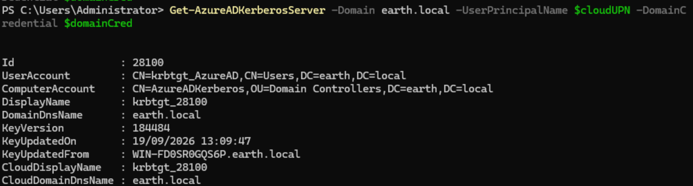
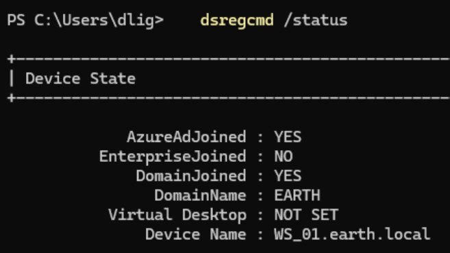

# Hybrid Azure AD Join — WS_01

With TPM support confirmed on the Entra Connect server and BitLocker validated via `Get-BitLockerVolume`, the next step was the hybrid-joining of a Windows 11 client to the tenant and confirming it via `dsregcmd /status`.

I used **WS_01** as my test client, since it was already domain-joined and had Entra Connect syncing its user objects.

---

## 1. Confirming Hybrid Join Prerequisites

Before triggering registration, I confirmed:

* Entra Connect had **Hybrid Azure AD join** configured under **Configure device options**.
* The Service Connection Point (SCP) had been written to AD, under the Device Registration Configuration container in the Configuration partition.

---

## 2. Triggering Registration

Hybrid join normally fires automatically at logon via a scheduled task. I triggered it manually to force an immediate attempt:

```powershell
Get-ScheduledTask -TaskName "Automatic-Device-Join" | Start-ScheduledTask
```

I then checked status:

```powershell
dsregcmd /status
```

This came back with `AzureAdJoined : NO`.

---

## 3. Diagnosing the Failure — Event Viewer

Rather than guessing, I went straight to the source logs:

**Applications and Services Logs → Microsoft → Windows → User Device Registration** (both Admin and Operational)

Running `dsregcmd /status /debug` alongside this gave a much more detailed picture than the plain status output. The relevant Diagnostic Data block showed:

```text
Kerberos Ticket Test : FAIL [0x80090303]
Registration Type : fallback_sync
Server ErrorSubCode : error_missing_device
Server Message : The device object by the given id (f87ed8ef-b923-4c78-8539-c9e49fd923e2) is not found.
Server Operation : DeviceRenew
```

!!! failure "Stale device state"
    WS_01 already had local registration state left over from an earlier partial join attempt. It was trying to **renew** that registration rather than perform a fresh join — but the corresponding device object didn't exist on the Entra side. This meant every retry was doomed until the stale local state was cleared.

Alongside this, the event log surfaced a second, more informative entry:

```text
The KDC proxy group policy has been configured successfully.
Kerberos endpoint: https://login.microsoftonline.com/<tenant-id>/kerberos
Kerberos realm: KERBEROS.MICROSOFTONLINE.COM
KdcProxyServer_Enabled: TRUE
```

followed by:

```text
Automatic registration failed at authentication phase. Unable to acquire Kerberos ticket.
Exit code: The specified target is unknown or unreachable
SPN: adrs/enterpriseregistration.windows.net
```

!!! note "Cloud Kerberos Trust, not classic hybrid join"
    This told me my environment is using **Cloud Kerberos Trust** — the modern hybrid join mechanism that authenticates via a KDC proxy to `login.microsoftonline.com` rather than requiring line-of-sight to a domain controller. The GPO had configured the proxy correctly and the client could reach the endpoint, but the ticket request itself failed. This is a different (and newer) mechanism than most older hybrid-join troubleshooting guides assume, and worth documenting as a deliberate distinction.

---

## 4. Root Cause: Missing Azure AD Kerberos Server Object

Cloud Kerberos Trust depends on a dedicated computer object in the on-prem AD forest that represents Azure AD as a trusted Kerberos realm. Without it, there is nothing on the Entra side to issue a TGT against, which produced the "specified target is unknown or unreachable" failure.

This object didn't exist yet, since it isn't created automatically by Entra Connect. It has to be created explicitly.

---

## 5. Creating the Azure AD Kerberos Server Object

From the DC, with RSAT and internet access available, I installed the required module:

```powershell
Install-Module -Name AzureADHybridAuthenticationManagement -AllowClobber
```

I then needed a credential object for my on-prem Domain Admin account. My first attempt failed:

```powershell
$domainCred = Get-Credential EARTH\Administrator
```

```text
Get-Credential : Cannot bind argument to parameter 'Credential' because it is null.
```

!!! warning "Get-Credential parameter binding"
    Passing the username as a bare positional argument can bind to the wrong parameter set on `Get-Credential`. Using `-UserName` explicitly resolves it:

```powershell
$domainCred = Get-Credential -UserName "EARTH\Administrator" -Message "Enter domain admin credentials"
```

With a working credential object, I created the Kerberos Server object:

```powershell
$cloudUPN = "<admin-upn>@<tenant>.onmicrosoft.com" #using my actual entra credentials.

Set-AzureADKerberosServer -Domain earth.local -UserPrincipalName $cloudUPN -DomainCredential $domainCred
```

and confirmed it:

```powershell
Get-AzureADKerberosServer -Domain earth.local -UserPrincipalName $cloudUPN -DomainCredential $domainCred
```


I then forced a sync cycle so the new object would replicate to Entra without waiting for the scheduled interval:

```powershell
Start-ADSyncSyncCycle -PolicyType Delta
```

---

## 6. Clearing Stale State and Retrying

With the Kerberos Server object in place, I cleared WS_01's stale local registration:

```powershell
dsregcmd /leave
```

and restarted the machine rather than just re-triggering the scheduled task, to make sure no leftover state carried over. The join task then ran automatically at the next domain-authenticated logon.

---

## 7. Confirming Success

```powershell
dsregcmd /status
```

```text
AzureAdJoined : YES
DomainJoined  : YES
DeviceAuthStatus : SUCCESS
TpmProtected : YES
KeySignTest : PASSED
```


!!! success "Hybrid join confirmed"
    WS_01 is now both domain-joined and Azure AD joined, with its device key backed by the TPM (`Microsoft Platform Crypto Provider`). This satisfied my Entra and Intune Checklist Phase 1.

---

## 8. A Separate Issue: PRT/SSO Failure

Although the device join succeeded, `dsregcmd /status` also showed the signed-in test user (`dlig@earthlocal.com`) failing to acquire a Primary Refresh Token:

```text
AzureAdPrt : NO
Attempt Status : 0xc00000d0
Server Error Code : invalid_request
Server Error Description : AADSTS90002: Tenant 'earthlocal.com' not found.
```

I re-tested this from a non-elevated session (the initial elevated run threw `ERROR_NO_SUCH_LOGON_SESSION`, since the default-account/WAM lookup needs a normal interactive logon context) and retried the sign-in to rule out a stale cached result. The error reproduced identically on a fresh attempt with a new correlation ID, confirming it wasn't a caching artifact.

!!! failure "Root cause: unverifiable custom domain"
    `earthlocal.com` is synced onto user UPNs via Entra Connect, but it is **not, and cannot be, a verified custom domain** in the tenant — verification requires proving ownership via a DNS TXT record, and I don't own real DNS for this domain. Realm discovery for PRT/SSO depends on the UPN's domain being verified, so this will fail for as long as the lab uses this suffix.
The test user that failed (`dlig@earthlocal.com`) was signed in under this unverified suffix. `onmicrosoft.com` is always verified by default (Microsoft owns it on the tenant's behalf), so a user signed in as `<user>@<tenant>.onmicrosoft.com` would get PRT/SSO working correctly. It isn't that SSO only ever works with `onmicrosoft.com` as a rule — a properly verified custom domain works identically — it's that in this lab, `onmicrosoft.com` is currently the *only* suffix with a verified domain behind it, so it's the only one that can complete realm discovery.

### Decision

This limitation doesn't block Intune enrollment, which depends on the device's Azure AD join state rather than user PRT/SSO. I've accepted this as a **known, documented limitation** of the lab rather than working around it, since a proper fix would require purchasing and verifying a real domain — a separate mini-project rather than something to solve mid-flow here. Device join success is what Phase 1 of the Intune Checklist required, and that's confirmed.

---

## Final Validation Summary

| Test | Result |
|---|---|
| Hybrid Azure AD Join (`AzureAdJoined`) | ✅ YES |
| Domain Join (`DomainJoined`) | ✅ YES |
| Device Auth Status | ✅ SUCCESS |
| TPM-backed device key | ✅ YES |
| Kerberos Ticket Test | ✅ PASS (after Kerberos Server object created) |
| User PRT / SSO | ❌ Fails — unverifiable custom domain (accepted limitation) |
| Device object present in Entra (verified via Graph) | ✅ YES — `trustType: ServerAd`, `isManaged: true` |
| Cloud-only sign-in at lock screen as workaround | ❌ Not a valid path on a hybrid-joined device (see correction below) |

---

## Key Takeaways

* **A successful join doesn't mean a successful renew.** Stale local registration state from a failed earlier attempt will keep trying to renew a device object that no longer exists server-side. `dsregcmd /leave` plus a full restart clears this cleanly.
* **Cloud Kerberos Trust is the modern hybrid join path**, authenticating through a KDC proxy to `login.microsoftonline.com` rather than requiring on-prem line-of-sight to a DC. It depends on an Azure AD Kerberos Server object (`Set-AzureADKerberosServer`) that Entra Connect does not create automatically.
* **`Get-Credential` parameter binding is easy to get wrong** — passing a username as a bare positional argument can silently bind to the wrong parameter set. `-UserName` avoids the ambiguity.
* **Device join and user PRT/SSO are separate concerns.** A device can be fully Azure AD joined and TPM-attested while the signed-in user still fails to get SSO, if the UPN's domain isn't verified in the tenant. For Intune enrollment purposes, the device join state is what matters.
* **Event Viewer beats `dsregcmd /status` alone for root-causing failures.** The status output tells you pass/fail; the User Device Registration event log tells you why.
* **The Entra admin center's Devices blade isn't reliable for verification.** It showed nothing for WS_01 despite the device being fully registered server-side (`trustType: ServerAd`). Querying Microsoft Graph directly (`GET /devices?$filter=displayName eq 'WS_01'`) confirmed the true state — worth treating as the authoritative check going forward rather than the portal UI.
* **Hybrid join and Azure AD join support different sign-in models.** A hybrid-joined (domain-joined) device is built around an on-prem account signing in via Kerberos with a PRT layered on top in the background — it isn't designed to accept arbitrary Azure AD credentials as an "Other user" cloud-only sign-in the way a pure Azure-AD-joined device is. A consistent "username or password incorrect" across multiple verified, browser-confirmed accounts was the signal that this was a logon-flow limitation, not a credential problem.
