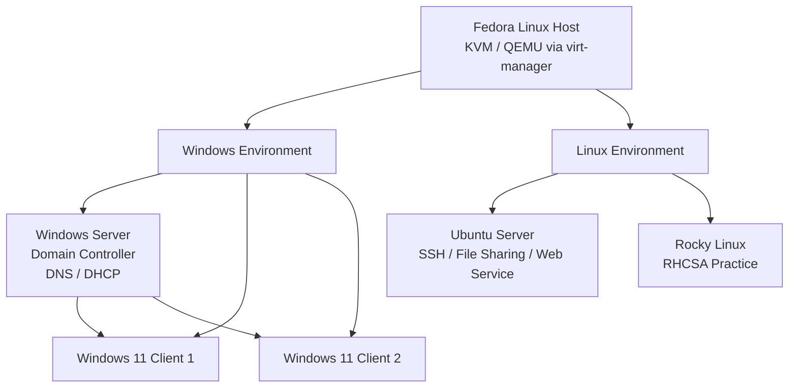

## Initial Lab Architecture

## What I Learned

Setting up KVM gave me a better understanding of the layers involved in Linux virtualisation.

Before building the lab, it would have been easy to think of virt-manager as simply “the virtual machine software.” Working through the setup showed me that the environment consists of several components:

- **KVM** provides kernel-level virtualisation.
- **QEMU** provides the virtual hardware presented to guest machines.
- **libvirt** provides the management layer.
- **virt-manager** provides a graphical interface for managing libvirt.
- **virsh** provides command-line management of the libvirt environment.

Understanding these layers became particularly important when I began troubleshooting virtual networking. Some problems that initially appeared to be Windows VM issues required investigation of the underlying libvirt network and bridge configuration.

The KVM setup therefore provided both the platform for the home lab and my first practical experience of managing and troubleshooting a Linux virtualisation stack.

## Next Step

With KVM/QEMU configured and virt-manager available, the next stage was to build the first major VM:

[Windows Server: Installation and Initial Configuration](../active-directory/windows_server.md)
