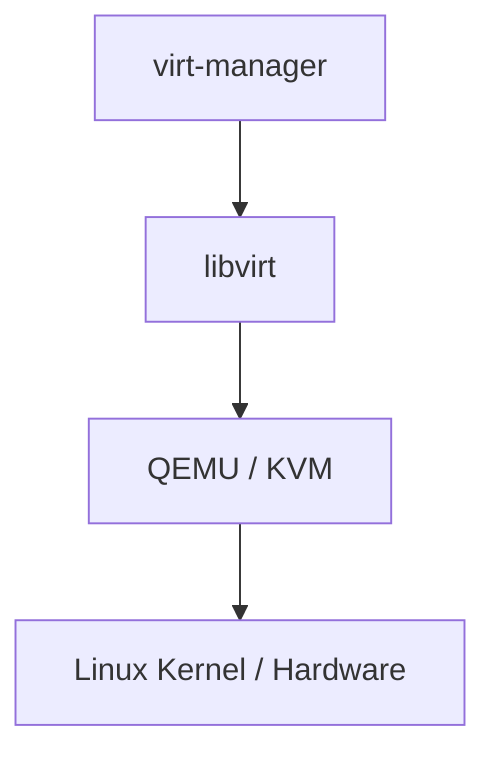
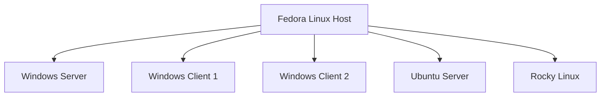

# KVM/QEMU and virt-manager Setup

This lab uses KVM/QEMU as the virtualisation platform on the Fedora host, with `libvirt` providing the management layer and `virt-manager` providing the graphical interface used to create and manage the virtual machines.

The initial KVM installation was based on the following guide:

[How to Install KVM on Fedora — ComputingForGeeks](https://computingforgeeks.com/how-to-install-kvm-on-fedora/)

I followed the installation process through Step 9 before switching to the graphical `virt-manager` interface for VM management.

---

## Virtualisation Stack

The virtualisation stack used by the lab is:

**virt-manager → libvirt → QEMU/KVM → Linux Kernel/Hardware**



This forms the virtualisation foundation on which the rest of the home lab is built.

---

## Step 1: Confirm CPU Virtualisation Support

Before installing KVM, check whether the processor exposes the required hardware virtualisation extensions.

```bash
grep -Ec '(vmx|svm)' /proc/cpuinfo
```

A non-zero result indicates that virtualisation extensions are available.

Additional CPU and virtualisation information can be checked with:

```bash
lscpu | grep -iE 'virtualization|hypervisor|model name'
```

---

## Step 2: Install the Virtualisation Packages

Fedora provides the main KVM virtualisation components through the `@virtualization` package group.

```bash
sudo dnf install -y @virtualization
```

Install `virt-manager` separately to provide the graphical VM management interface:

```bash
sudo dnf install -y virt-manager
```

---

## Step 3: Enable the libvirt Sockets

Fedora uses the modular libvirt architecture, with separate services handling QEMU, networking, storage and other virtualisation functions.

Enable the required sockets:

```bash
for SOCK in virtqemud.socket virtnetworkd.socket virtstoraged.socket \
    virtnodedevd.socket virtsecretd.socket \
    virtnwfilterd.socket virtinterfaced.socket; do
    sudo systemctl enable --now "$SOCK"
done
```

Check the main sockets used by the lab:

```bash
sudo systemctl is-active virtqemud.socket virtnetworkd.socket virtstoraged.socket
```

---

## Step 4: Validate the Host

Use `virt-host-validate` to check whether the host meets the requirements for QEMU/KVM virtualisation.

```bash
sudo virt-host-validate qemu
```

This checks areas such as hardware virtualisation support, KVM devices, networking and cgroup support.

---

## Step 5: Configure User Access to libvirt

Add the current user to the `libvirt` group:

```bash
sudo usermod -aG libvirt "$USER"
```

Activate the new group membership in the current shell:

```bash
newgrp libvirt
```

Check the current user's group memberships:

```bash
groups
```

Set the default libvirt connection to the system instance:

```bash
echo 'export LIBVIRT_DEFAULT_URI=qemu:///system' >> ~/.bashrc
source ~/.bashrc
```

This allows `virsh` commands to use the system libvirt instance without repeatedly specifying `--connect qemu:///system`.

---

## Step 6: Start the Default Virtual Network

Check the libvirt networks:

```bash
virsh net-list --all
```

Configure the default network to start automatically and start it:

```bash
virsh net-autostart default
virsh net-start default
```

Verify the network configuration:

```bash
virsh net-list --all
```

The default libvirt network provides a NAT-based virtual network that can be used by guest VMs.

---

## Step 7: Create the Storage Pool

Define the default storage pool for VM disk images:

```bash
virsh pool-define-as default dir --target /var/lib/libvirt/images
```

Configure it to start automatically:

```bash
virsh pool-autostart default
```

Start the storage pool:

```bash
virsh pool-start default
```

Verify the available storage pools:

```bash
virsh pool-list --all
```

---

## Step 8: Verify the Installation

Check the installed libvirt, virt-install and QEMU versions:

```bash
virsh version
virt-install --version
qemu-kvm --version | head -1
```

These commands provide a final check that the core components of the virtualisation stack are installed and accessible.

---

## virt-manager

After completing the command-line setup, I chose to use `virt-manager` as the primary interface for creating and managing the lab VMs.

Launch it with:

```bash
virt-manager &
```

From this point, VM creation and day-to-day management were performed primarily through the graphical interface.

---

## Initial Lab Plan

With the virtualisation platform in place, the initial plan was to host the following systems on Fedora:



This provided the starting foundation for the home lab, with the environment designed to expand as additional infrastructure and administration features were introduced.
