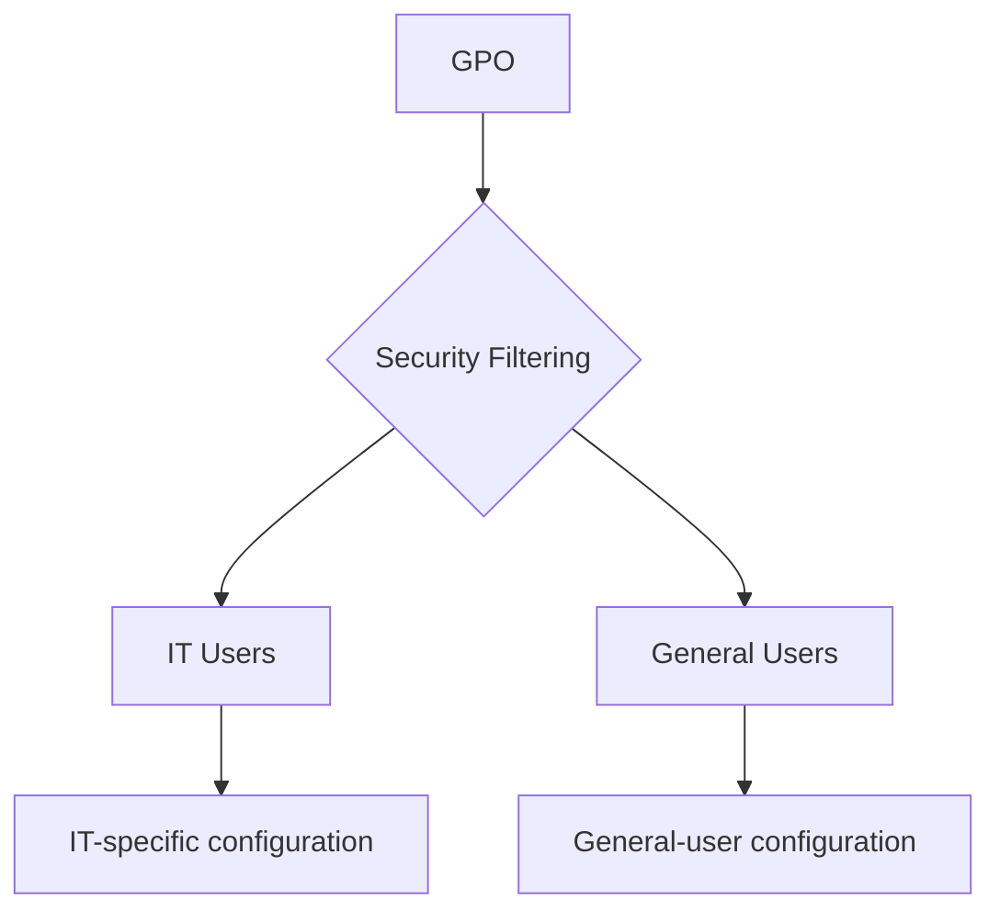
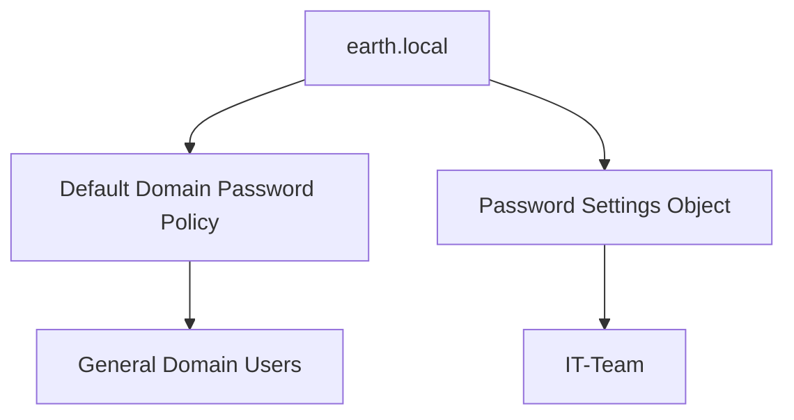
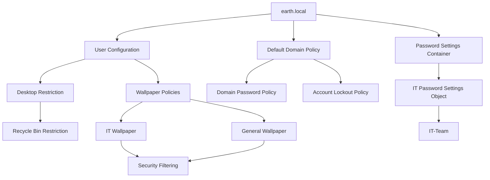

# Group Policy Management

With the initial Active Directory structure, users, and security groups in place, I began using Group Policy to apply different configurations to users in the `earth.local` domain.

The initial policies focused on:

- Desktop restrictions.
- Different desktop wallpapers for IT and general users.
- Security filtering.
- Domain password requirements.
- Account lockout.
- A more specific password policy for the IT team.

The policies were tested using the domain-joined Windows clients rather than simply assuming that configuration on the Domain Controller meant they were working correctly.

---

## Group Policy Management Console

I used the Group Policy Management Console to create and manage the policies.

To open it:

```powershell
gpmc.msc
```


---

# Desktop Restriction GPO

One of the first policies I created was a desktop restriction that removed the Recycle Bin icon for selected non-IT users.

The policy setting was located under:

```text
User Configuration
└── Policies
    └── Administrative Templates
        └── Desktop
            └── Remove Recycle Bin icon from desktop
```

I opened the policy setting and selected **Enabled**.


---

## Testing the Restriction

I booted `WS_01` and signed in as **Michael Scott** to test the policy.

Initially, the Recycle Bin was still visible.

I refreshed Group Policy using:

```powershell
gpupdate /force
```

After the policy refresh and a new sign-in, the restriction was applied successfully.


This provided my first practical test of applying a user configuration through Group Policy and then verifying the result from a domain-joined workstation.

---

# Wallpaper Group Policies

I next wanted to provide different desktop wallpapers depending on the type of user signing into the Windows clients.

The intention was to have:

- An **IT wallpaper** for IT users.
- A **non-IT wallpaper** for general users.

This required the wallpaper files to be accessible from the domain clients.

---

## Transferring the Wallpaper Files

The wallpaper files were stored on my Fedora host, so I enabled OpenSSH Server on the Windows Server to make transferring the files easier.

I started the SSH service:

```powershell
Start-Service sshd
```

I then configured it to start automatically:

```powershell
Set-Service -Name sshd -StartupType Automatic
```

And checked the service:

```powershell
Get-Service sshd
```

### SSH Firewall Issue

The initial SSH connection hung.

During troubleshooting, I found that the automatically created SSH firewall rule was associated with the **Private** profile, while the Domain Controller was operating with the **Domain** network profile.

I corrected the firewall configuration so that SSH traffic could reach the server from the appropriate network context.

!!! failure "Initial SSH connection"
    The SSH service itself was running, but the connection still failed because the firewall rule did not match the active network profile.

!!! success "Resolution"
    After correcting the firewall scope, I was able to transfer the wallpaper files from the Fedora host to the Windows Server.

---

# Creating the Wallpaper GPO

The wallpaper setting was configured through:

```text
User Configuration
└── Policies
    └── Administrative Templates
        └── Desktop
            └── Desktop
                └── Desktop Wallpaper
```

I enabled the setting and initially entered the path to the wallpaper file.

---

## Initial Wallpaper Failure

When I tested the policy using **Ross Geller**, the wallpaper appeared black.

The problem was the path I had configured.

I had referenced a file stored locally on the Domain Controller.

That path was valid from the server itself, but not from the Windows client.

!!! failure "Local file path"
    The wallpaper GPO initially referenced a local path on the Domain Controller.

    The Windows client could not retrieve the image from that path, so the expected wallpaper was not displayed.

This meant the wallpaper needed to be stored somewhere the client systems could access over the network.

---

# Creating a Wallpaper Network Share

I created a folder on the Domain Controller for files that needed to be accessible by the clients:

```text
C:\Users\Administrator\Shares
```

I placed the wallpaper images inside the folder and then shared the folder over the network.

Read access was provided for the users that needed to retrieve the files.


This also reinforced that **share permissions and NTFS permissions are separate controls** and both need to permit the required access.

---

## Switching to a UNC Path

I updated the wallpaper GPO to reference the file using its network UNC path instead of a local server path.

Before testing the policy again, I verified from the client that the wallpaper file could actually be reached.

For example:

```powershell
Test-Path "\\WIN-FD0SR0GQS6P\Shares\ws_wallpaper.jpg"
```

The test returned:

```text
True
```


This gave me a simple way to separate a **file-access problem** from a **Group Policy problem**.

If `Test-Path` could not access the file, there would be little value troubleshooting the GPO itself first.

---

## Verifying the General-User Wallpaper

Once the UNC path was configured, I refreshed Group Policy again:

```powershell
gpupdate /force
```

I signed out and then signed back into Ross Geller's account.

The non-IT wallpaper now appeared correctly.


---

## Verifying the IT Wallpaper

I repeated the wallpaper process for the IT users.

I then signed in as **Kate Libby** and confirmed that the IT-specific wallpaper was displayed.


At this point, the lab could apply different visual configurations depending on the user.

---

# Security Filtering

I later refined how the policies were targeted.

Rather than relying only on where a user's account was located within the OU structure, I used **Security Filtering** to control which users could apply each GPO based on security-group membership.

Conceptually, the design was:



This allowed the policy scope and the user organisational structure to be treated separately.

---

## Verifying Applied Policies with gpresult

I used `gpresult` to verify exactly which policies were being applied to each account:

```powershell
gpresult /r
```

I ran the command while signed in as different users rather than relying only on visible changes such as the desktop wallpaper.


This helped confirm that the intended GPOs were applying without unwanted overlap between the user groups.

---

# Password Policy and Account Lockout

After working with desktop configuration, I moved on to password and account-lockout policies.

I wanted to create:

1. A domain-wide password policy.
2. An account-lockout policy.
3. A separate, stronger password policy for the IT team.

---

## Domain Password Policy

The domain-level password configuration was edited through the **Default Domain Policy**.

The path was:

```text
Default Domain Policy
└── Computer Configuration
    └── Policies
        └── Windows Settings
            └── Security Settings
                └── Account Policies
                    └── Password Policy
```


For testing purposes, I deliberately made the domain-wide password requirements relatively weak.

!!! note
    The weaker password requirements were intentional for the lab so that I could easily demonstrate the difference between the default domain policy and a more restrictive Password Settings Object.

---

## Account Lockout Policy

Under the same **Account Policies** section, I configured an account-lockout policy.

The lockout threshold was configured for:

```text
3 invalid logon attempts
```


This allowed me to deliberately lock a test account and verify both the lockout behaviour and the administrative recovery process.

---

# Fine-Grained Password Policy for IT

I wanted the IT users to have a stronger password policy than the general domain users.

For this I created a **Password Settings Object (PSO)** rather than another GPO.

I opened Active Directory Administrative Center using:

```powershell
dsac.exe
```

I then navigated to:

```text
earth.local
└── System
    └── Password Settings Container
```

From there:

```text
Right-click
→ New
→ Password Settings
```

I configured the Password Settings Object and set its precedence to `1`.

I then used **Directly Applies To** and selected the `IT-Team` security group.


The intended password-policy relationship was therefore:



---

# Testing the IT Password Policy

To verify the new PSO, I used **Kate Libby**.

In Active Directory Users and Computers, I configured Kate's account so that she would have to change her password at the next logon.

I then signed out and attempted to sign back in.

When prompted for a new password, I entered: `password`

This was intentionally chosen because it would have satisfied the weaker domain policy I had configured for testing, but it did not satisfy the stronger IT password policy.

The password was rejected.


!!! success "PSO verified"
    The password being rejected for Kate demonstrated that the more specific IT Password Settings Object was taking effect rather than the weaker default domain password requirements.

---

# Testing the General Password Policy

I then signed in using **Patrick Bateman's** account to test the weaker domain-level password policy.

I changed Patrick's password to a four-character lowercase password.

The password was accepted.

This provided a direct contrast with Kate's account and helped demonstrate that the IT-specific password policy was not being applied to Patrick.

---

# Testing Account Lockout

I then deliberately entered Patrick's password incorrectly.

After **3 invalid attempts** the account became locked as designed.


Initially, I unlocked the account using Active Directory Users and Computers and confirmed that Patrick could sign in again.

I then repeated the test so that I could practise checking and managing account lockouts through PowerShell.

---

# Managing Account Lockout with PowerShell

After deliberately locking Patrick's account again, I checked his status with:

```powershell
Get-ADUser pbat -Properties LockedOut
```

`LockedOut` returned:

```text
True
```


This confirmed from Active Directory itself that the account was locked.

---

## Unlocking the Account

I then unlocked Patrick's account using:

```powershell
Unlock-ADAccount pbat
```

After unlocking it, I checked the state again:

```powershell
Get-ADUser pbat -Properties LockedOut
```

This time:

```text
LockedOut : False
```


Finally, I signed back into Patrick's account as an additional verification that the account was usable again.

---

# Cross-Client GPO Verification

`WS_02` was added to the domain after the initial Group Policies had already been created.

After joining it to `earth.local`, I signed in through **Other user** using a general-user account and confirmed that the expected non-IT wallpaper appeared.

I then used both Windows clients for additional policy testing.

On `WS_02`, I refreshed policy while testing different users:

```powershell
gpupdate /force
```

I also ran:

```powershell
gpresult /r
```

on `WS_01` and `WS_02` to verify policy application independently.

This provided an additional check that the policies worked across more than one domain-joined workstation rather than only on the original test client.

---

# Final Group Policy Structure

At this stage, the Group Policy and password-policy configuration could be summarised as:



---

# Key Learning

This stage moved the lab beyond simply creating users and computers in Active Directory and into centrally managing their behaviour.

The most useful lessons were:

- A GPO should be **tested from the client**, not assumed to work because it exists in Group Policy Management.
- `gpupdate /force` is useful when testing policy changes without waiting for the normal refresh cycle.
- `gpresult /r` provides evidence of which policies actually apply to a user.
- A file referenced by a user policy must be accessible from the client that needs it.
- Testing a UNC path independently with `Test-Path` helps separate file-access problems from Group Policy problems.
- Security Filtering can be used to scope policies according to security-group membership.
- Fine-Grained Password Policies use **Password Settings Objects**, rather than normal GPOs.
- Password and account-lockout policies should be verified using test accounts.
- PowerShell provides a quick way to check and change account-lockout state.

The troubleshooting around the wallpaper was particularly useful because the GPO itself was not initially the problem. The policy referenced a resource that the client could not access.

By testing each layer independently: **policy application, network path, file access, and user context** — I was able to identify the actual cause rather than repeatedly changing the GPO.
