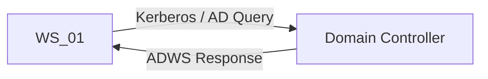
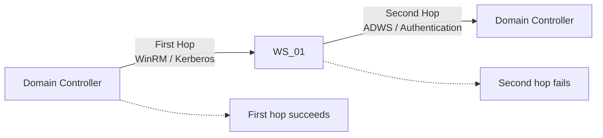
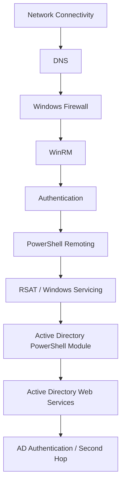
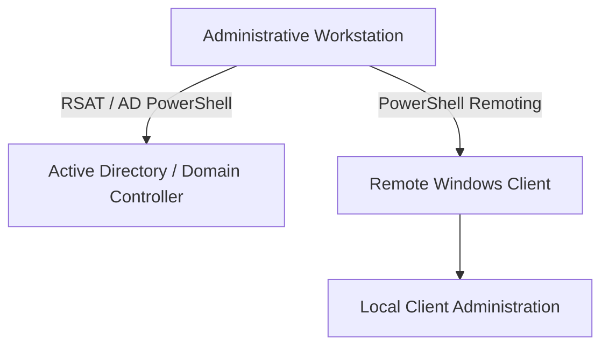

# PowerShell Remoting, RSAT & AD Administration

After configuring the Active Directory delegation structure, I wanted to test remote administration of the Windows clients and begin using PowerShell Remoting.

This developed into a useful troubleshooting exercise involving:

- PowerShell Remoting and WinRM
- Windows Firewall
- DNS and hostname resolution
- Kerberos authentication
- Remote Server Administration Tools (RSAT)
- Active Directory PowerShell
- Active Directory Web Services (ADWS)
- The PowerShell Remoting second-hop problem

Rather than changing multiple components in response to an initial error, I worked through each layer individually to identify where the failure was occurring.

---

## Step 1: Enable PowerShell Remoting and WinRM

I enabled PowerShell Remoting and WinRM on the Windows workstations through Group Policy.

In Group Policy Management:

```text
Computer Configuration
└── Policies
    └── Administrative Templates
        └── Windows Components
            └── Windows Remote Management (WinRM)
                └── WinRM Service
                    └── Allow remote server management through WinRM
```

I enabled the policy and configured the **IPv4 filter** as:

```text
*
```

### Restricting WinRM Through Windows Firewall

I also created a firewall rule controlling which systems could initiate WinRM connections to the workstations.

The rule was configured through:

```text
Computer Configuration
└── Policies
    └── Windows Settings
        └── Security Settings
            └── Windows Defender Firewall with Advanced Security
                └── Inbound Rules
```

I created a new predefined rule for:

```text
Windows Remote Management
```

The connection was allowed, but I then edited the **Windows Remote Management (HTTP-In)** rule and restricted its scope.

Under **Remote IP address**, I selected:

```text
These IP addresses
```

and added the IP address of my Domain Controller.

This meant that the workstations would accept WinRM connections from the Domain Controller rather than allowing WinRM access from any machine.

I verified the firewall rule with:

```powershell
Get-NetFirewallRule -DisplayName "Windows Remote Management*" |
    Select DisplayName, Enabled
```

### Testing PowerShell Remoting

From the Domain Controller, I tested both workstations:

```powershell
Invoke-Command -ComputerName WS_01, WS_02 -ScriptBlock {
    Get-Service WinRM
}
```

The command executed successfully on both clients, confirming that PowerShell Remoting was functioning.

!!! success "PowerShell Remoting confirmed"
    Remote commands could now be executed against both `WS_01` and `WS_02` from the Domain Controller.

---

## Step 2: Attempt RSAT Installation

I wanted to install **Remote Server Administration Tools (RSAT)** on both Windows clients so that Active Directory could also be administered from the workstations.

My initial approach attempted to install all available RSAT components remotely:

```powershell
Invoke-Command -ComputerName WS_01, WS_02 -ScriptBlock {
    Get-WindowsCapability -Name RSAT* -Online |
        Add-WindowsCapability -Online
}
```

The operation failed with:

<div class="error-message">
Access is denied.
</div>

At first, this appeared to indicate either a permissions problem or an issue with PowerShell Remoting.

Rather than immediately changing permissions or the WinRM configuration, I began testing each layer independently.

---

## Step 3: Verify the Administrative Context

Before assuming that `Access is denied` meant the account lacked sufficient permissions, I verified the administrative context being used.

The account was:

```text
EARTH\Administrator
```

I confirmed that it was a member of:

```text
EARTH\Domain Admins
```

I also checked the local **Administrators** group on both workstations and confirmed that `EARTH\Domain Admins` was a member.

This indicated that the failure was unlikely to be caused by basic account or group membership.

The investigation could therefore move further down the stack rather than changing Active Directory permissions unnecessarily.

!!! tip "Troubleshooting principle"
    An `Access is denied` message does not automatically identify which security layer rejected an operation. Verify the account context before changing permissions.

---

## Step 4: Verify WinRM and Network Configuration

I next verified that the network and WinRM layers were functioning correctly.

### WinRM Service

I checked the WinRM service:

```powershell
Get-Service WinRM
```

WinRM was running.

### WinRM Listener

I inspected the listener configuration:

```powershell
winrm enumerate winrm/config/listener
```

The listener was configured for HTTP on port `5985`, was enabled, and was listening on the workstation.

### PowerShell Session Configuration

I checked the available PowerShell remoting endpoints:

```powershell
Get-PSSessionConfiguration
```

The standard `microsoft.powershell` endpoint was available.

### Network Profile

I verified the workstation's network profile:

```powershell
Get-NetConnectionProfile
```

The network was correctly identified as:

```text
DomainAuthenticated
```

### DNS Resolution

I then tested name resolution:

```powershell
Resolve-DnsName WS_01
```

The workstation name correctly resolved through the domain DNS infrastructure.

### WinRM Connectivity

Finally, I tested WinRM directly:

```powershell
Test-WSMan 192.168.150.100
```

This successfully returned WS-Management information.

At this stage, the basic network path and WinRM service were functioning correctly.

---

## Step 5: Identify the IP Address vs Hostname Issue

During testing, I initially attempted PowerShell Remoting using the workstation's **IP address**.

This produced an authentication problem.

Within the domain environment, I instead tested the connection using the computer's hostname:

```powershell
Invoke-Command -ComputerName WS_01 -ScriptBlock {
    hostname
    Get-Service WinRM
}
```

This succeeded.

I also tested the fully qualified domain name:

```powershell
Invoke-Command -ComputerName WS_01.earth.local -ScriptBlock {
    hostname
    Get-Service WinRM
}
```

This also succeeded.

The successful hostname and FQDN tests confirmed that PowerShell Remoting itself was working correctly when using the domain identity of the workstation.

!!! note "Kerberos and hostnames"
    This became important later in the investigation. The domain's Kerberos authentication uses service identities associated with hostnames. Using the domain computer name therefore provided the appropriate authentication path for the remoting tests.

---

## Step 6: Isolate the RSAT Installation Problem

With PowerShell Remoting confirmed as functional, I returned to the RSAT installation problem.

Rather than continuing to modify WinRM, I first checked whether the Active Directory RSAT capability was installed:

```powershell
Invoke-Command -ComputerName WS_01, WS_02 -ScriptBlock {
    Get-WindowsCapability -Online |
        Where-Object Name -like "Rsat.ActiveDirectory*"
}
```

Both clients reported the capability as:

```text
State : NotPresent
```

Instead of attempting to install every RSAT component again through the remote session, I installed only the Active Directory capability required for the lab.

I ran the following from an **elevated local PowerShell session on each workstation**:

```powershell
Add-WindowsCapability -Online `
    -Name "Rsat.ActiveDirectory.DS-LDS.Tools~~~~0.0.1.0"
```

`WS_01` took considerably longer to complete than `WS_02`.

After installation, I verified the capability remotely:

```powershell
Invoke-Command -ComputerName WS_01, WS_02 -ScriptBlock {
    Get-WindowsCapability -Online |
        Where-Object Name -like "Rsat.ActiveDirectory*"
}
```

Both clients now reported:

```text
State : Installed
```

!!! tip "Lesson learned"
    The original `Access is denied` error did not necessarily mean that Domain Admin permissions or WinRM were incorrectly configured.

    Testing the installation locally separated the **Windows servicing/RSAT installation operation** from the **PowerShell Remoting infrastructure**.

    If an operation fails through remote execution, testing the same operation locally in an elevated session can help determine whether the problem is the remote execution context or the operation itself.

---

## Step 7: Verify the Active Directory PowerShell Module

With RSAT installed, I verified that the Active Directory PowerShell module was available on both clients:

```powershell
Invoke-Command -ComputerName WS_01, WS_02 -ScriptBlock {
    Get-Module -ListAvailable ActiveDirectory
}
```

The module was present.

I then moved to `WS_01` and tested Active Directory functionality **directly from the workstation**.

### Domain Controller Discovery

```powershell
Get-ADDomainController -Discover
```

The workstation successfully discovered the Domain Controller.

### Active Directory Query

I then queried the Administrator account:

```powershell
Get-ADUser -Identity "Administrator"
```

This succeeded.

I also explicitly specified the Domain Controller:

```powershell
Get-ADUser -Identity "Administrator" `
    -Server "WIN-FD0SR0GQS6P.earth.local"
```

This also succeeded.

These tests established that the workstation could successfully use the Active Directory PowerShell module to communicate with the domain.

At this point I had independently confirmed that:

- RSAT was installed.
- The Active Directory PowerShell module was available.
- DNS was functioning.
- Domain Controller discovery worked.
- Domain authentication worked.
- Active Directory Web Services was reachable.
- Active Directory queries worked when executed directly from the workstation.

The remaining problem was therefore more specific than a general Active Directory or network failure.

---

## Step 8: Investigate the Remaining Remote AD Query Failure

The important difference appeared when I ran an Active Directory query **through PowerShell Remoting**.

From the Domain Controller:

```powershell
Invoke-Command -ComputerName WS_01 -ScriptBlock {
    Get-ADUser -Identity "Administrator" `
        -Server "WIN-FD0SR0GQS6P.earth.local"
}
```

This failed with:

<div class="error-message">
ADServerDownException<br>
Unable to contact the server
</div>

However, the same `Get-ADUser` operation worked when executed directly on `WS_01`.

This distinction became central to the investigation.

### Verify Active Directory Web Services

I confirmed that Active Directory Web Services was listening on TCP port `9389`:

```powershell
Get-NetTCPConnection -LocalPort 9389 -State Listen
```

I then tested connectivity from the workstations:

```powershell
Test-NetConnection WIN-FD0SR0GQS6P -Port 9389
```

Connectivity succeeded.

This showed that the underlying network path from the workstation to the Domain Controller was available.

### Inspect the Authentication Context

I confirmed that the PowerShell Remoting session was running as:

```text
EARTH\Administrator
```

I then examined the Kerberos tickets:

```powershell
klist
```

The remote session had a Kerberos ticket for the first connection to `WS_01`.

At this point the distinction became clearer:

```text
Domain Controller → WS_01
```

was working.

The command executing on `WS_01`, however, then needed to access another network service on the Domain Controller.

That introduced a **second authentication hop**.

---

## Step 9: Confirm the PowerShell Remoting Second-Hop Problem

Testing established an important difference between executing the Active Directory query directly and executing it through a remote PowerShell session.

### Direct Administration

When the command was executed directly from `WS_01`:



This worked.

### Administration Through PowerShell Remoting

When the same operation originated on the Domain Controller, entered a PowerShell Remoting session on `WS_01`, and then attempted to query Active Directory:



The first hop was:

```text
DC → WinRM → WS_01
```

This succeeded.

The second operation required:

```text
DC → WinRM → WS_01 → ADWS → DC
```

This failed.

The credentials used to authenticate the original PowerShell Remoting connection were not automatically available for authentication to the second network service.

This identified the issue as the **PowerShell Remoting second-hop problem**.

!!! info "What the failure actually proved"
    The failure was not evidence that Active Directory itself was broken.

    Direct AD queries from `WS_01` worked, network connectivity to the Domain Controller worked, and the first PowerShell Remoting hop worked.

    The failure occurred specifically when the remotely executing command attempted to authenticate to another network service.

---

## Step 10: Final Architecture and Troubleshooting Lesson

This exercise became a useful example of why infrastructure problems should be investigated in layers rather than treating the first error message as the root cause.

The investigation moved through the following areas:



A successful test at one layer did not automatically prove that the next layer would work.

The troubleshooting also highlighted the distinction between several concepts that can initially appear to be the same permissions problem:

- Active Directory permissions
- Local Windows administrator permissions
- WinRM access
- PowerShell Remoting authentication
- Kerberos authentication and delegation
- RSAT installation
- Active Directory delegated permissions

These are separate administrative and security layers.

---

## Final Lab Approach

For this lab, I decided to use **RSAT and the Active Directory administration tools directly from the administrative workstations** when managing Active Directory.

PowerShell Remoting can still be used for administrative operations that execute directly against the remote Windows clients.



I chose to keep the second-hop issue documented as a troubleshooting and learning exercise rather than changing the lab's security configuration simply to make the remote AD query work.

This preserved the working security model while documenting an important distinction between **remote command execution** and **credential delegation across multiple systems**.

---

## Key Takeaways

This troubleshooting exercise reinforced several important lessons:

- Error messages should be treated as a starting point for investigation rather than proof of a particular root cause.
- Administrative permissions, WinRM access and Kerberos authentication are separate layers.
- Testing locally can help isolate a failure from the remote execution mechanism.
- Hostnames and domain identity matter when using Kerberos-based authentication.
- Successful network connectivity does not guarantee successful authenticated access to an application-layer service.
- A successful first PowerShell Remoting hop does not automatically provide credentials for a second network hop.
- Infrastructure troubleshooting is more effective when each layer is tested independently.
